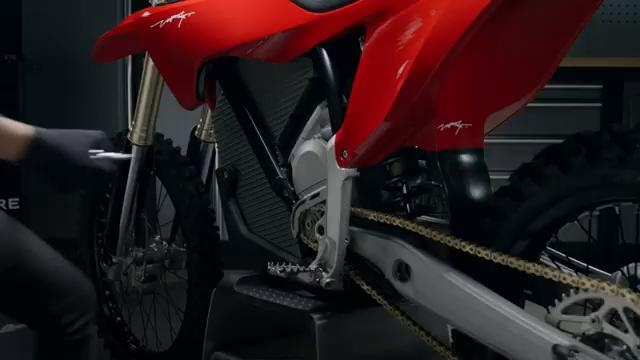
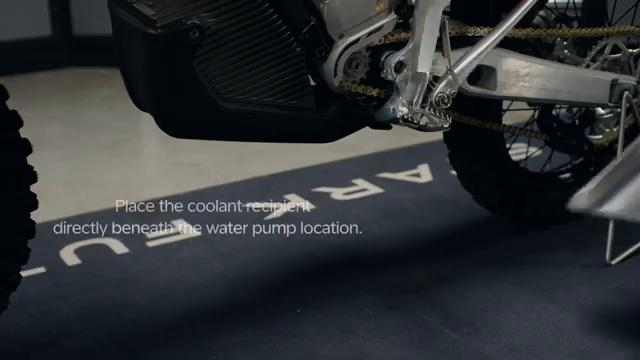
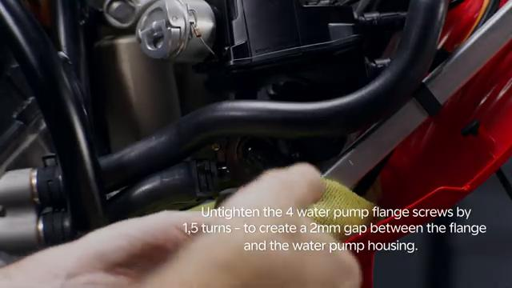
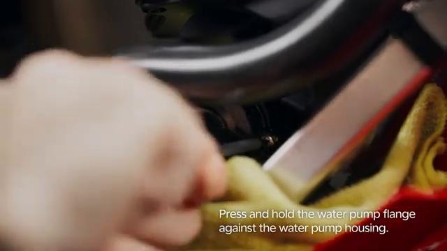
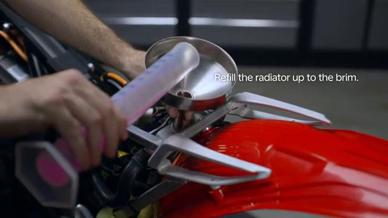
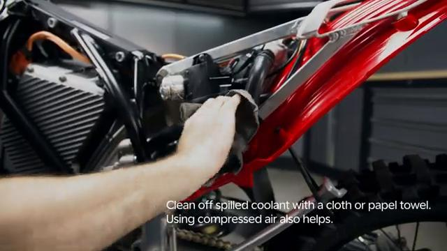
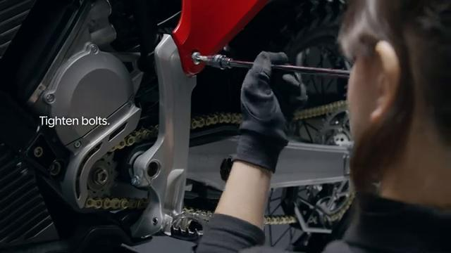
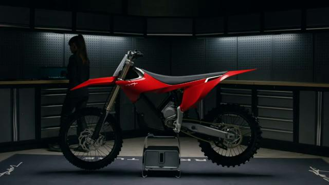

# Bleeding the Cooling System - Stark VARG

Source video: `Bleeding the Cooling System - Stark VARG` by Stark Future Official

Applicable models: `MX`

## Scope

This guide follows the same step-by-step workshop structure as the MX tutorials, but it is derived as a visual sequence from the official Stark Future ASMR video. Because the source video does not provide usable captions or narration, the procedure is documented through curated screenshots and concise action guidance.

## Preparation

- Place the bike on a stable stand or work area before starting the procedure.
- Prepare the correct tools for the fasteners, clips, brackets, and components shown in the video.
- Keep removed hardware organized in sequence so reassembly follows the same order as the video.
- Have a torque wrench ready for any tightening steps that specify a torque value.

## Procedure

### 1. Prepare access to the cooling system

Place the bike on a stable stand and remove the spoiler assembly to reach the cooling system service points.

### 2. Position a container for drained coolant

Place a suitable container under the bike before opening the cooling system so drained coolant is captured cleanly.

### 3. Open the cooling system service points

Wrap an absorbent cloth around the water pump area, remove the radiator cap, and loosen the four water pump flange screws 1.5 turns to create an even gap.

### 4. Drain and refill the coolant circuit

Press and hold the water pump flange against the housing while coolant flows and trapped air is expelled.

### 5. Cycle the system to purge trapped air

Turn the bike on so the water pump runs, then check through the radiator cap opening that coolant is flowing and refill the radiator to the brim.

### 6. Top off and close the cooling system

Torque all four water pump flange screws to **1.3 Nm**, tighten the radiator cap to **5 Nm**, and clean off any spilled coolant.

### 7. Reinstall the removed bodywork

Reinstall the spoiler assembly and any other removed bodywork in the same order used during access.

### 8. Check for leaks and correct level

Confirm the water pump runs smoothly, check for leaks around the water pump and radiator cap, and confirm the coolant level remains correct before riding.

## Torque Summary

| Component | Torque |
| --- | ---: |
| Tighten the water pump flange screws | 1.3 Nm |
| Tighten the radiator cap | 5 Nm |

Verified torque items:

- Tighten the water pump flange screws: **1.3 Nm** from Stark technical manual `10.003.05 Bleeding cooling system`.
- Tighten the radiator cap: **5 Nm** from Stark technical manual `10.003.05 Bleeding cooling system`.

## Critical Checks Before Riding

- Confirm the serviced component is fully seated and all fasteners are tightened in the correct order.
- Recheck all torque-critical hardware before riding.
- Make sure all routed cables, clips, brackets, and surrounding parts are returned to their original positions.
- Inspect the bike visually for any missing hardware before returning it to service.
