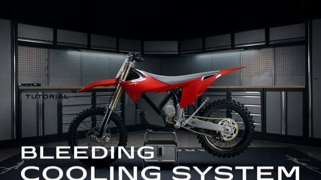
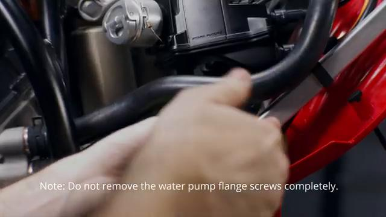
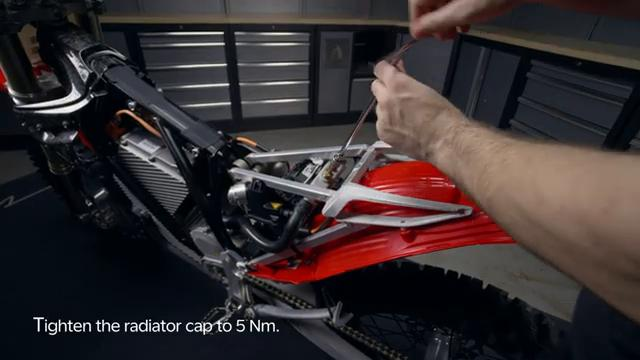
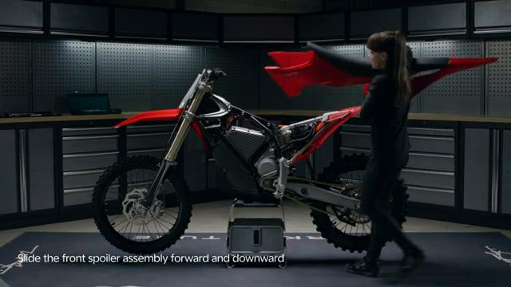
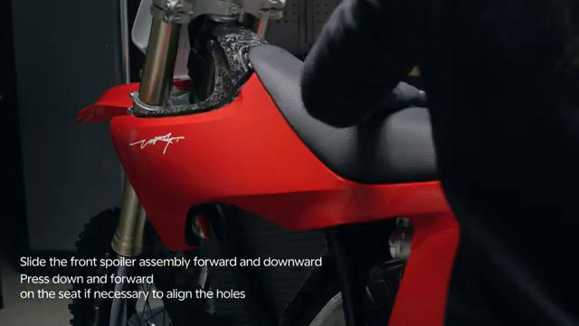

# Bleeding the Cooling System - Stark VARG

Source video: `Bleeding the Cooling System - Stark VARG` by Stark Future Official

Applicable models: `MX`

## Scope

This guide follows the original Stark Future video overlay sequence for the procedure shown in the original MX tutorial video. Each step below is aligned to the instruction text shown on screen.

## Preparation

- Place the bike on a stable stand or work area before starting the procedure.
- Prepare the correct tools for the fasteners, clips, brackets, and components shown in the video.
- Keep removed hardware organized in sequence so reassembly follows the same order as the video.
- Follow the torque values shown in the original Stark tutorial video wherever the video displays a torque on screen.

## Procedure

### 1. Bleeding cooling system

Bleeding cooling system.

### 2. Remove the water pump

Remove the water pump.

### 3. Tighten the radiator cap

Tighten the radiator cap.

### 4. Slide the front spoiler assembly forward and downward

Slide the front spoiler assembly forward and downward.

### 5. Slide the front spoiler assembly forward and downward press down and forward on the seat if necessary to align the holes

Slide the front spoiler assembly forward and downward press down and forward on the seat if necessary to align the holes.

## Critical Checks Before Riding

- Confirm the serviced components are fully seated and all fasteners are tightened in the correct order.
- Recheck all torque-critical hardware before riding.
- Make sure all routed cables, clips, brackets, and surrounding parts are returned to their original positions.
- Inspect the bike visually for any missing hardware before returning it to service.
