# Gear Oil Change - Stark VARG

Source video: `Gear Oil Change - Stark VARG` by Stark Future Official

Applicable models: `MX`

## Scope

This guide follows the original Stark Future video overlay sequence for the procedure shown in the original MX tutorial video. Each step below is aligned to the instruction text shown on screen.

## Preparation

- Place the bike on a stable stand or work area before starting the procedure.
- Prepare the correct tools for the fasteners, clips, brackets, and components shown in the video.
- Keep removed hardware organized in sequence so reassembly follows the same order as the video.
- Follow the torque values shown in the original Stark tutorial video wherever the video displays a torque on screen.

## Procedure

### 1. Ensure the bike is not hot

Ensure the bike is not hot.

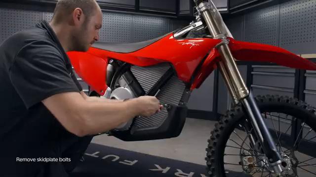

### 2. Remove the skid plate

Remove the skid plate. Refer to: 05.041.01 Remove and install skid plate ↗.

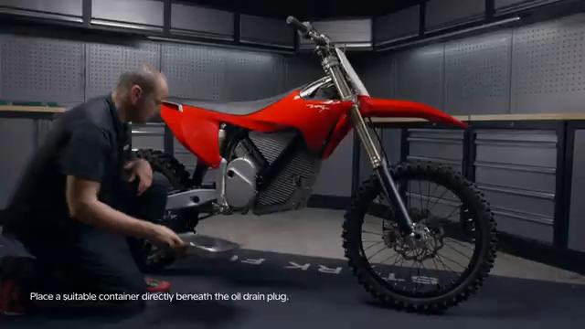

### 3. Place a suitable container directly beneath the oil drain plug

Place a suitable container directly beneath the oil drain plug.

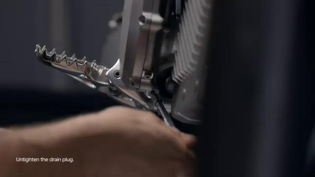

### 4. Untighten the drain plug

Untighten the drain plug.

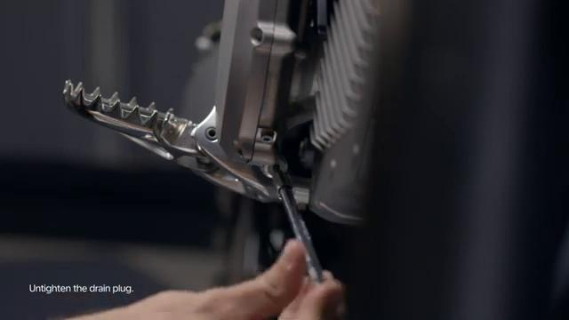

### 5. Untighten the right motor cover metal cap

Untighten the right motor cover metal cap. Lean the bike slightly to the right to help drain most of the used oil.

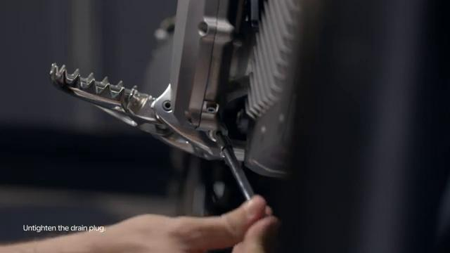

### 6. Pour a bit of clean oil in through the metal cap opening to help flush the old oil

Pour a bit of clean oil in through the metal cap opening to help flush the old oil.

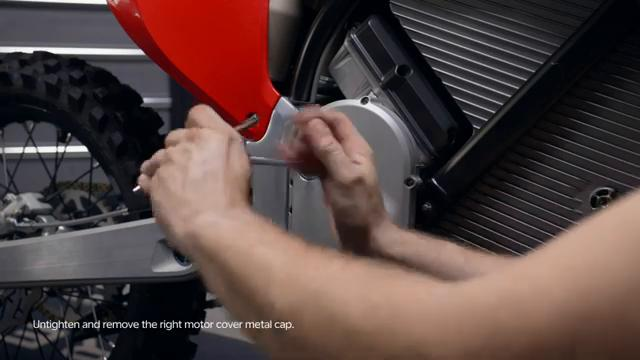

### 7. Fit a new washer to the drain plug

Fit a new washer to the drain plug.

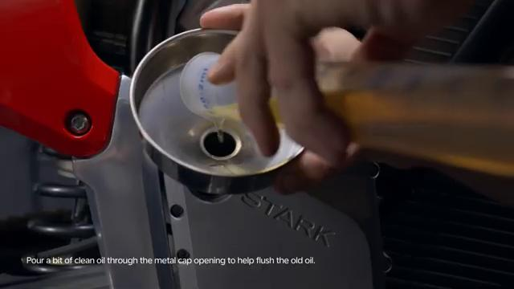

### 8. Tighten drain plug to 15 Nm

Tighten drain plug to 15 Nm.

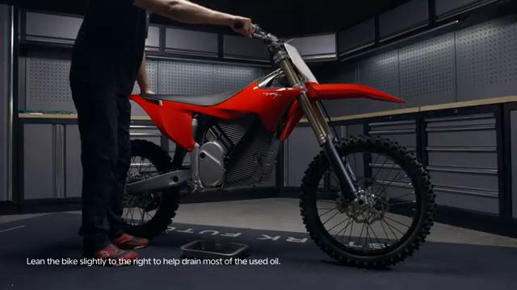

### 9. Remove oil level bolt

Remove oil level bolt.

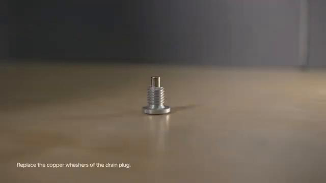

### 10. Ensure the bike is leveled

Ensure the bike is leveled.

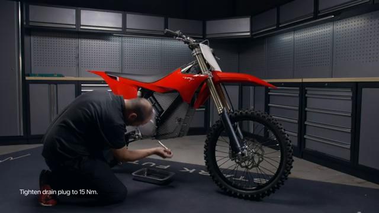

### 11. Fill in new oil until it starts to come out from the level bolt opening

Fill in new oil until it starts to come out from the level bolt opening.

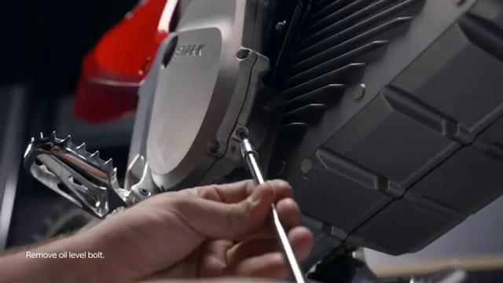

### 12. Fit a new washer to the level bolt

Fit a new washer to the level bolt.

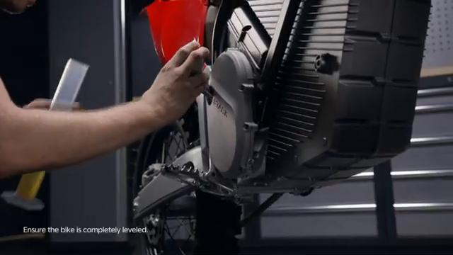

### 13. Tighten the level bolt to 5 Nm

Tighten the level bolt to 5 Nm.

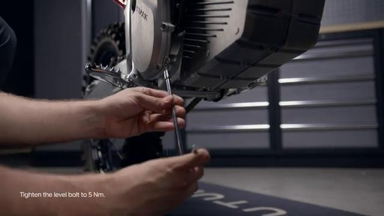

### 14. Tighten the right motor cover metal cap to 5 Nm

Tighten the right motor cover metal cap to 5 Nm.

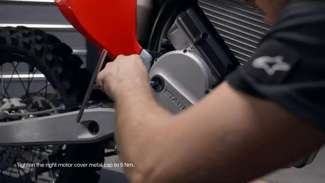

### 15. Clean any oil residue on the motor housing

Clean any oil residue on the motor housing.

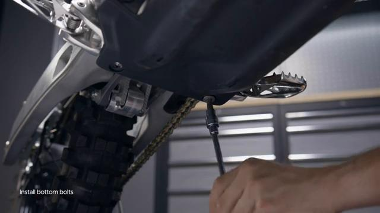

### 16. Install the skid plate

Install the skid plate. Refer to: 05.041.01 Remove and install skid plate Remove and install skid plate ↗.↗. Dispose of the used oil following your local regulatory requirements. is permitted only with the express written permission.

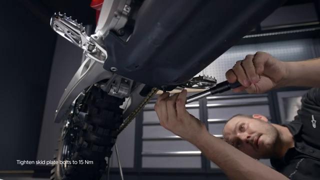

## Torque Summary

| Component | Torque |
| --- | ---: |
| Tighten drain plug | 15 Nm |
| Tighten the level bolt | 5 Nm |
| Tighten the right motor cover metal cap | 5 Nm |

Verified torque items:

- Tighten drain plug: **15 Nm** from the original Stark Future tutorial video text overlay.
- Tighten the level bolt: **5 Nm** from the original Stark Future tutorial video text overlay.
- Tighten the right motor cover metal cap: **5 Nm** from the original Stark Future tutorial video text overlay.

## Critical Checks Before Riding

- Confirm the serviced components are fully seated and all fasteners are tightened in the correct order.
- Recheck all torque-critical hardware before riding.
- Make sure all routed cables, clips, brackets, and surrounding parts are returned to their original positions.
- Inspect the bike visually for any missing hardware before returning it to service.
