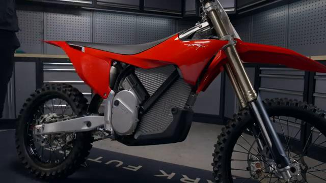
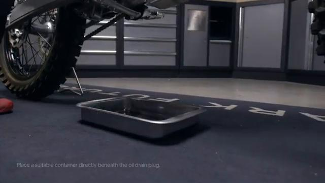
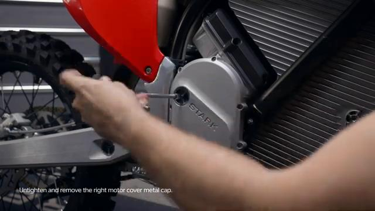
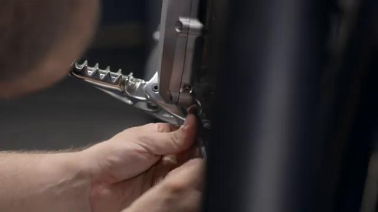
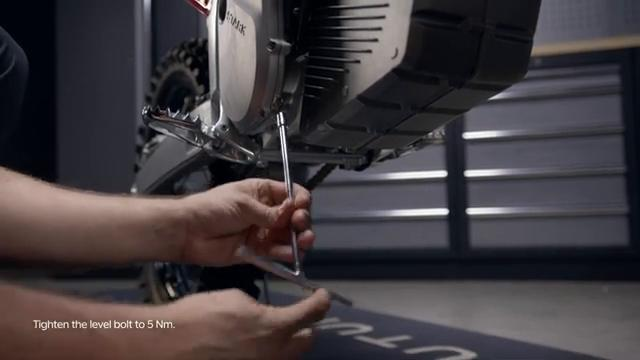
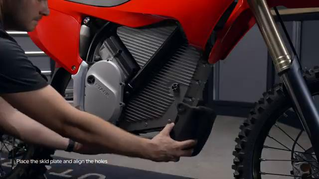

# Gear Oil Change - Stark VARG

Source video: `Gear Oil Change - Stark VARG` by Stark Future Official

Applicable models: `MX`

## Scope

This guide follows the same step-by-step workshop structure as the MX tutorials, but it is derived as a visual sequence from the official Stark Future ASMR video. Because the EX video does not provide usable captions or narration, the procedure is documented through curated screenshots and concise action guidance.

## Preparation

- Place the bike on a stable stand or work area before starting the procedure.
- Prepare the correct tools for the fasteners, clips, brackets, and components shown in the video.
- Keep removed hardware organized in sequence so reassembly follows the same order as the video.
- Have a torque wrench ready for any tightening steps that specify a torque value.

## Procedure

### 1. Prepare access to the gear oil service points

Place the bike on a stable stand and remove any cover or guard shown in the video that blocks the gear oil fill and drain points.

### 2. Position a container under the drain point

Place a suitable drain container under the bike before removing the gear oil drain hardware.

### 3. Open the fill and drain points

Loosen the fill and drain hardware shown in the video so the old gear oil can drain fully.

### 4. Drain the old gear oil

Allow the old oil to drain completely while monitoring the drain container and the service opening.

### 5. Reinstall the drain hardware

Reinstall the drain hardware shown in the video once draining is complete and the mating surfaces are ready for assembly.

### 6. Refill with fresh gear oil

Fill the system with the oil type and level indicated by the procedure shown in the video.

### 7. Close the fill point and clean the area

Reinstall the fill hardware and wipe any spilled oil from the surrounding parts.

### 8. Reinstall removed parts and inspect for leaks

Reinstall any removed guards or covers and check the service area for leaks before returning the bike to use.

## Critical Checks Before Riding

- Confirm the serviced component is fully seated and all fasteners are tightened in the correct order.
- Recheck all torque-critical hardware before riding.
- Make sure all routed cables, clips, brackets, and surrounding parts are returned to their original positions.
- Inspect the bike visually for any missing hardware before returning it to service.
