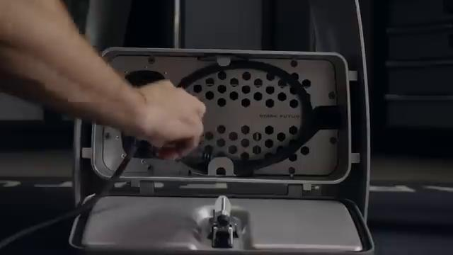
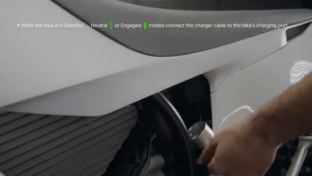
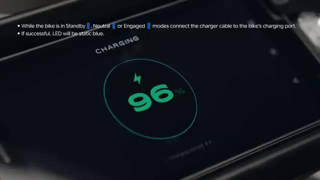
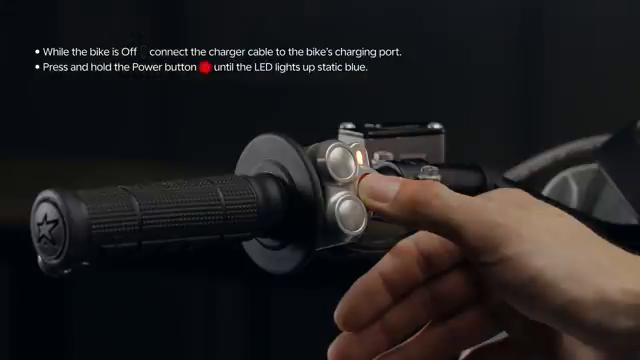
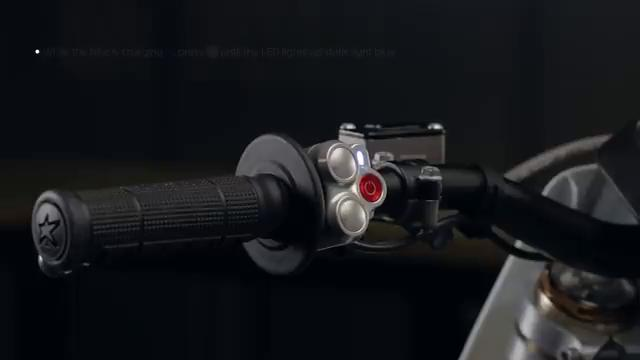
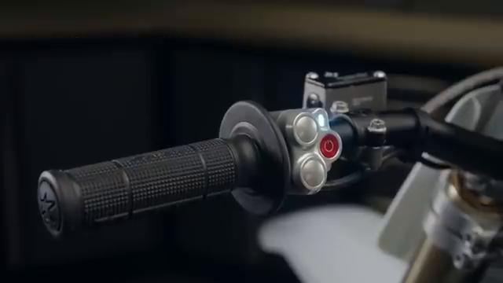

# How to CHARGE the Stark VARG

Source video: `How to CHARGE the Stark VARG` by Stark Future Official

Applicable models: `MX`

## Scope

This guide follows the same step-by-step workshop structure as the MX tutorials, but it is derived as a visual sequence from the official Stark Future ASMR video. Because the EX video does not provide usable captions or narration, the procedure is documented through curated screenshots and concise action guidance.

## Preparation

- Place the bike on a stable stand or work area before starting the procedure.
- Prepare the correct tools for the fasteners, clips, brackets, and components shown in the video.
- Keep removed hardware organized in sequence so reassembly follows the same order as the video.
- Have a torque wrench ready for any tightening steps that specify a torque value.

## Procedure

### 1. Prepare the bike and charger

Place the bike in a stable position and inspect the charger, cable, and charging port before connecting anything.

### 2. Open or access the charging port

Expose the charging connection point shown in the video and make sure it is clean and unobstructed.

### 3. Connect the charger to the bike

Insert the charging connector carefully as shown so it seats fully without stressing the cable.

### 4. Connect power and begin charging

Supply power to the charger as shown and confirm the charging sequence starts on the bike or charger indicators.

### 5. Verify charging status

Check the visual charging indication shown in the video so you know the bike is actively charging.

### 6. Disconnect safely after charging

Once charging is complete, disconnect the charger in the same careful order shown and secure the port cover or cable routing.

## Critical Checks Before Riding

- Confirm the serviced component is fully seated and all fasteners are tightened in the correct order.
- Recheck all torque-critical hardware before riding.
- Make sure all routed cables, clips, brackets, and surrounding parts are returned to their original positions.
- Inspect the bike visually for any missing hardware before returning it to service.
