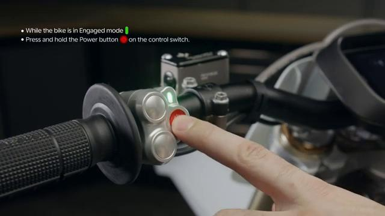
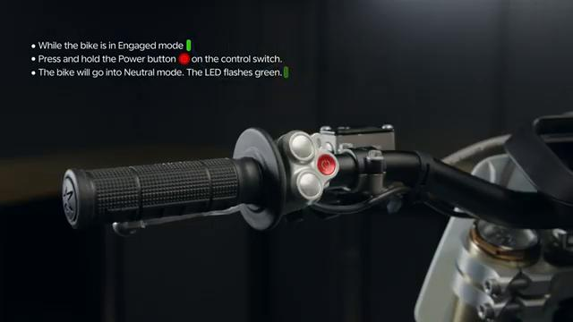

# How to DISENGAGE the Stark VARG

Source video: `How to DISENGAGE the Stark VARG` by Stark Future Official

Applicable models: `MX`

## Scope

This guide follows the same step-by-step workshop structure as the MX tutorials, but it is derived as a visual sequence from the official Stark Future ASMR video. Because the EX video does not provide usable captions or narration, the procedure is documented through curated screenshots and concise action guidance.

## Preparation

- Place the bike on a stable stand or work area before starting the procedure.
- Prepare the correct tools for the fasteners, clips, brackets, and components shown in the video.
- Keep removed hardware organized in sequence so reassembly follows the same order as the video.
- Have a torque wrench ready for any tightening steps that specify a torque value.

## Procedure

### 1. Bring the bike to a controlled stop

Hold the bike securely and keep it stable before disengaging the drive system.

### 2. Use the disengagement control

Operate the control shown in the video to move the bike out of the engaged state.

### 3. Disengage the drive system

Complete the disengagement action and wait for the bike to confirm the state change.

### 4. Verify the bike is no longer engaged

Check the display or status indication shown in the video to confirm the bike is safe to handle without drive engagement.

### 5. Prepare for shutdown or service

Once disengaged, continue with shutdown, charging, transport, or service as needed.

## Critical Checks Before Riding

- Confirm the serviced component is fully seated and all fasteners are tightened in the correct order.
- Recheck all torque-critical hardware before riding.
- Make sure all routed cables, clips, brackets, and surrounding parts are returned to their original positions.
- Inspect the bike visually for any missing hardware before returning it to service.
