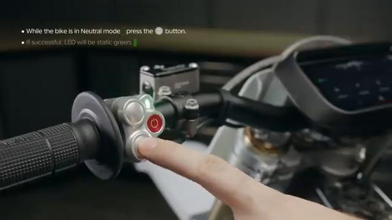
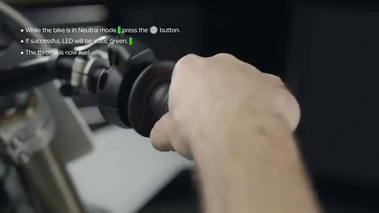
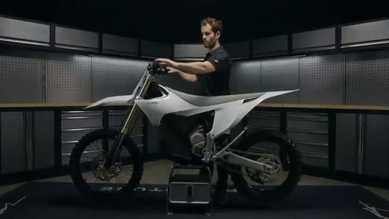

# How to ENGAGE the Stark VARG

Source video: `How to ENGAGE the Stark VARG` by Stark Future Official

Applicable models: `MX`

## Scope

This guide follows the same step-by-step workshop structure as the MX tutorials, but it is derived as a visual sequence from the official Stark Future ASMR video. Because the EX video does not provide usable captions or narration, the procedure is documented through curated screenshots and concise action guidance.

## Preparation

- Place the bike on a stable stand or work area before starting the procedure.
- Prepare the correct tools for the fasteners, clips, brackets, and components shown in the video.
- Keep removed hardware organized in sequence so reassembly follows the same order as the video.
- Have a torque wrench ready for any tightening steps that specify a torque value.

## Procedure

### 1. Prepare the bike for engagement

Hold the bike securely and confirm it has already been powered on before attempting to engage it.

### 2. Select the engagement control

Use the control sequence shown in the video to move the bike from powered-on standby into the engaged state.

### 3. Engage the drive system

Perform the engagement action exactly as shown and wait for the bike to confirm the new state.

### 4. Check the bike is engaged

Verify the display or status indication shown in the video so you know the bike is ready to ride.

### 5. Confirm the bike is stable before moving

Keep the bike controlled and stationary until you are ready to ride away safely.

## Critical Checks Before Riding

- Confirm the serviced component is fully seated and all fasteners are tightened in the correct order.
- Recheck all torque-critical hardware before riding.
- Make sure all routed cables, clips, brackets, and surrounding parts are returned to their original positions.
- Inspect the bike visually for any missing hardware before returning it to service.
