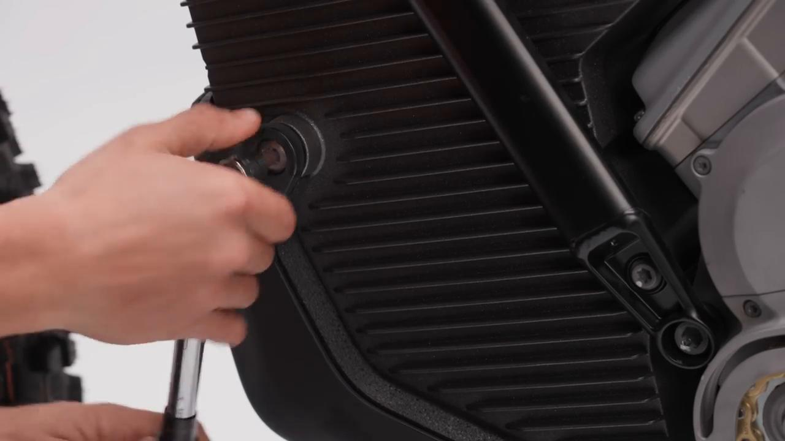
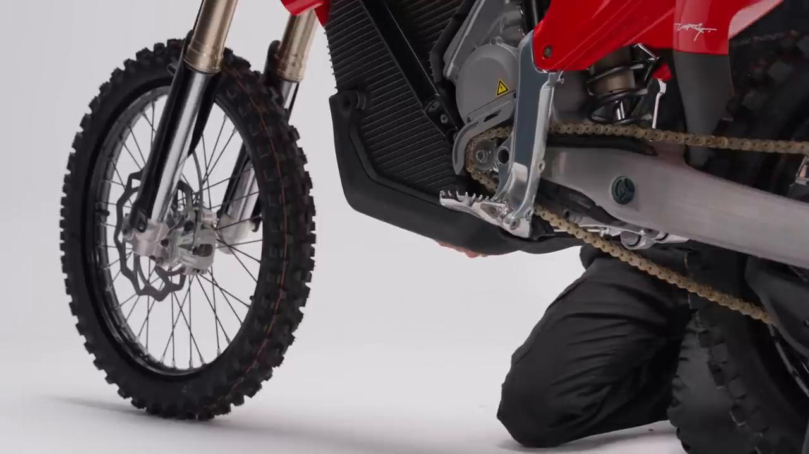
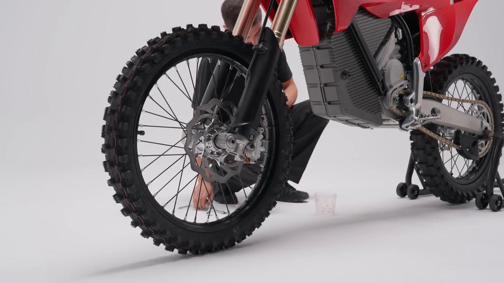
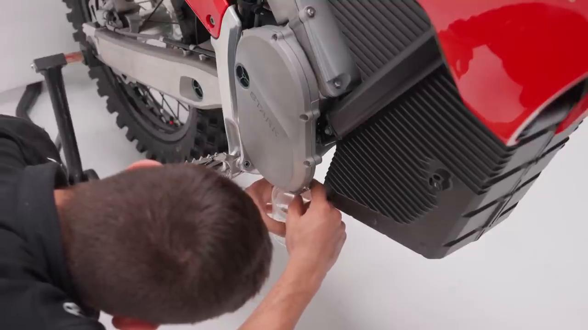
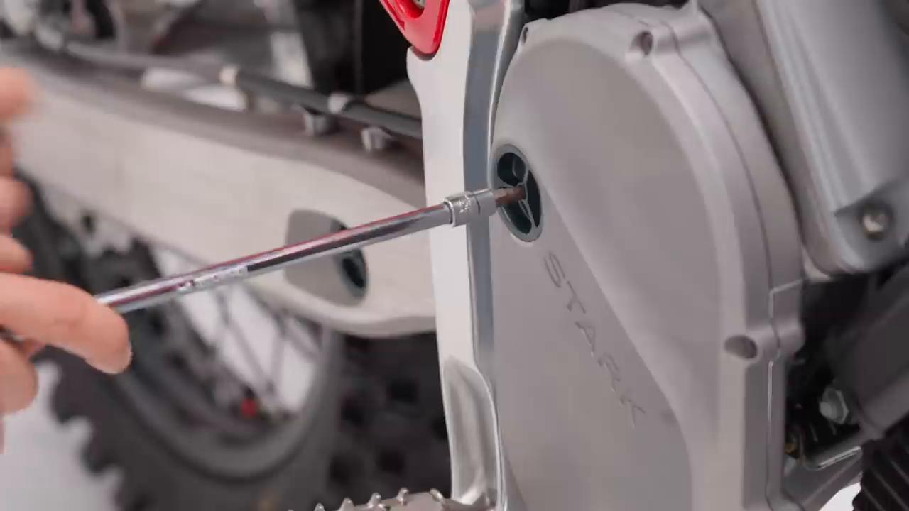
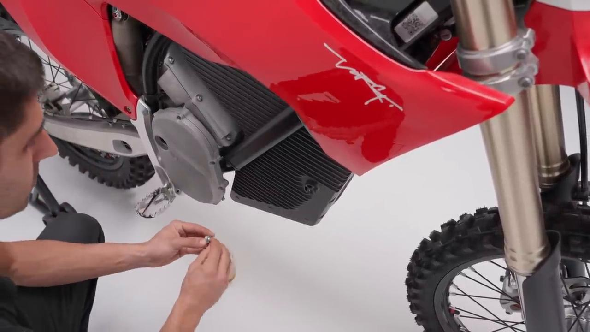
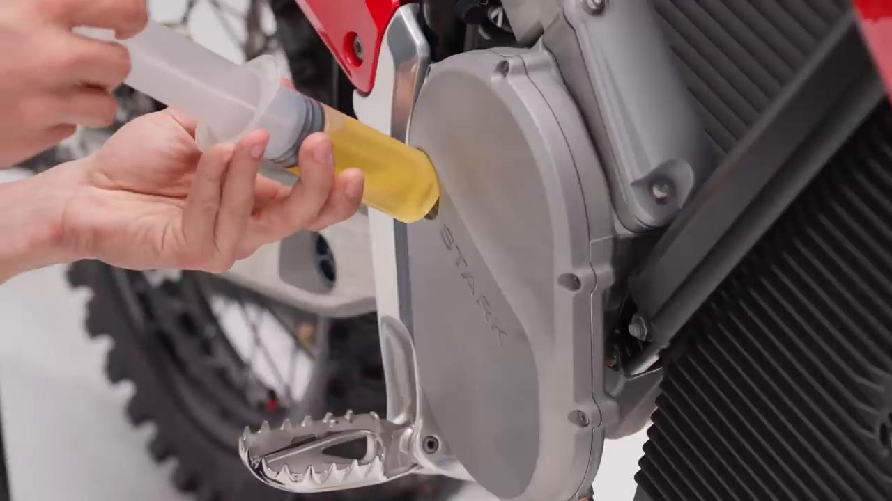
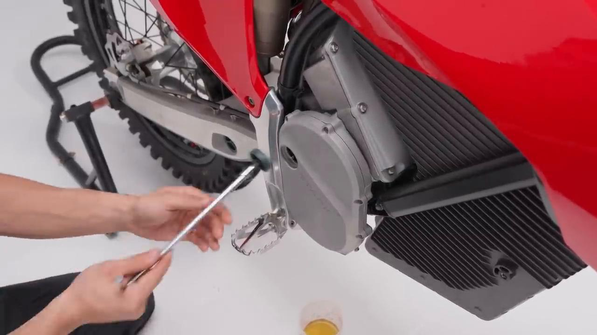
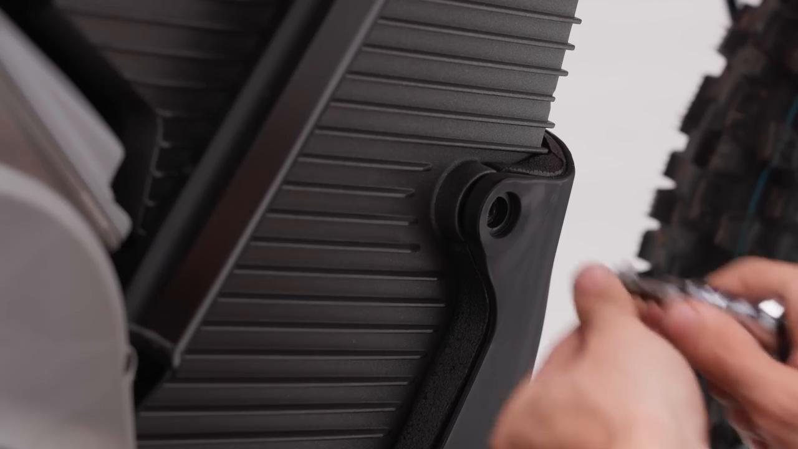

# How To Gear Oil Change - Stark VARG MX 1.2 / EX

Source video: `How To Gear Oil Change - Stark VARG MX 1.2` by Stark Future Official

Applicable models: `MX 1.2 / EX`

## Scope

This guide converts the official Stark Future tutorial video into a step-by-step workshop procedure. It documents each action shown in the video in sequence and pairs every step with a dedicated screenshot.

## Preparation

- Place the bike on a stable stand or work area before starting the procedure.
- Prepare the correct tools for the fasteners, clips, brackets, and components shown in the video.
- Keep removed hardware organized in sequence so reassembly follows the same order as the video.
- Have a torque wrench ready for any tightening steps that specify a torque value.

## Procedure

### 1. Remove the four skid plate screws

Remove the four skid plate screws

### 2. Carefully remove the skid plate from the battery

Carefully remove the skid plate from the battery.

### 3. Unscrew the oil drain plug

Unscrew the oil drain plug.

Carefully remove and dispose the copper washer.

### 4. Place a container underneath to collect the used oil

Place a container underneath to collect the used oil.

### 5. Unscrew the motor case side cap

Unscrew the motor case side cap.

### 6. Place a copper washer on the oil drain plug, then tighten it to 15 Nm

Place a copper washer on the oil drain plug, then tighten it to **15 Nm**.

### 7. Fill the transmission with 80 ml of SAE 75W-90 oil

Fill the transmission with 80 ml of SAE 75W-90 oil.

### 8. Tighten the motor case side cap to 5 Nm

Tighten the motor case side cap to **5 Nm**.

### 9. Place the skid plate into its position

Place the skid plate into its position.

### 10. Tighten the four skid plate bolts to 15 Nm

Tighten the four skid plate bolts to **15 Nm**.

## Torque Summary

| Component | Torque |
| --- | ---: |
| Place a copper washer on the oil drain plug, then tighten it | 15 Nm |
| Tighten the motor case side cap | 5 Nm |
| Tighten the four skid plate bolts | 15 Nm |

Video-sourced torque items:

- Place a copper washer on the oil drain plug, then tighten it: **15 Nm** from the official Stark tutorial video.
- Tighten the motor case side cap: **5 Nm** from the official Stark tutorial video.
- Tighten the four skid plate bolts: **15 Nm** from the official Stark tutorial video.

## Critical Checks Before Riding

- Confirm the serviced component is fully seated and all fasteners are tightened in the correct order.
- Recheck all torque-critical hardware before riding.
- Make sure all routed cables, clips, brackets, and surrounding parts are returned to their original positions.
- Inspect the bike visually for any missing hardware before returning it to service.
