# How to Rear Brake Calliper Maintenance Stark VARG MX 1.2

Source video: `How to Rear Brake Calliper Maintenance Stark VARG MX 1.2` by Stark Future Official

## Scope

This guide converts the official Stark Future tutorial video into a step-by-step workshop procedure. It documents each action shown in the video in sequence and pairs every step with a dedicated screenshot.

## Preparation

- Place the bike on a stable stand or work area before starting the procedure.
- Prepare the correct tools for the fasteners, clips, brackets, and components shown in the video.
- Keep removed hardware organized in sequence so reassembly follows the same order as the video.
- Have a torque wrench ready for any tightening steps that specify a torque value.

## Procedure

### 1. Unscrew the rear wheel shaft lock nut and press the shaft outwards

Unscrew the rear wheel shaft lock nut and press the shaft outwards.

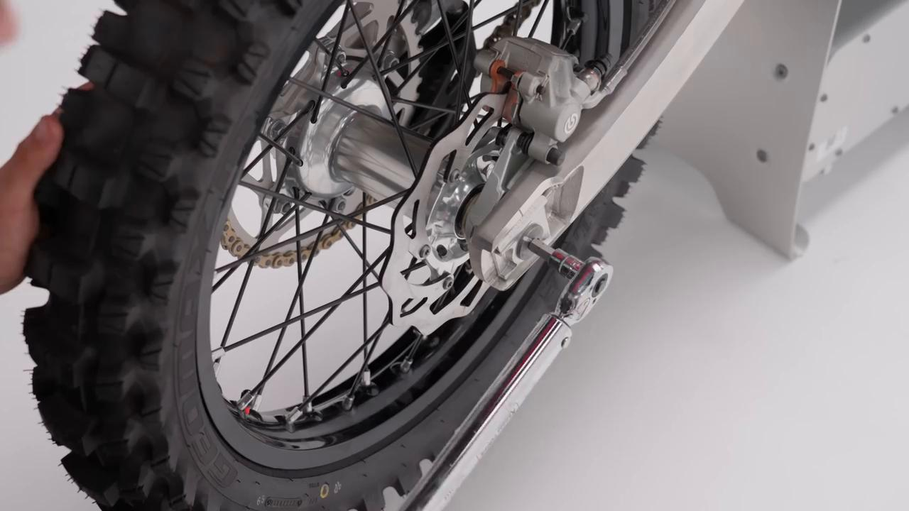

### 2. Remove the rear wheel shaft

Remove the rear wheel shaft.

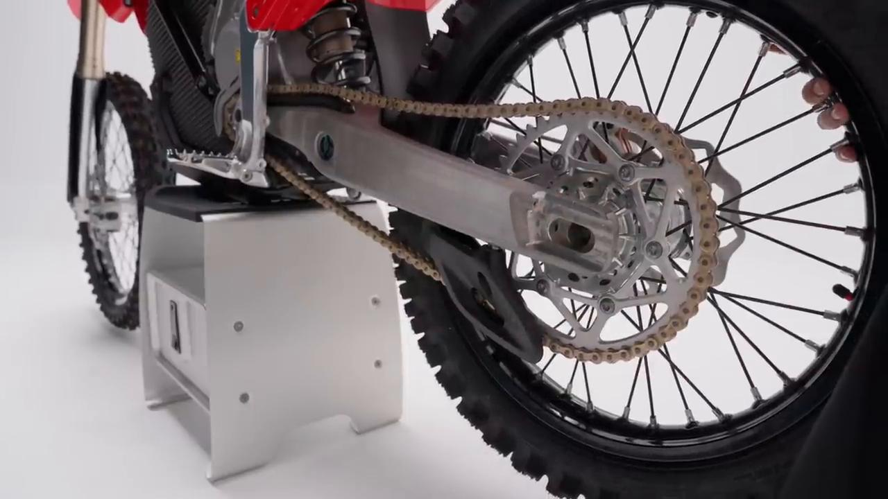

### 3. Carefully remove the rear wheel

Carefully remove the rear wheel.

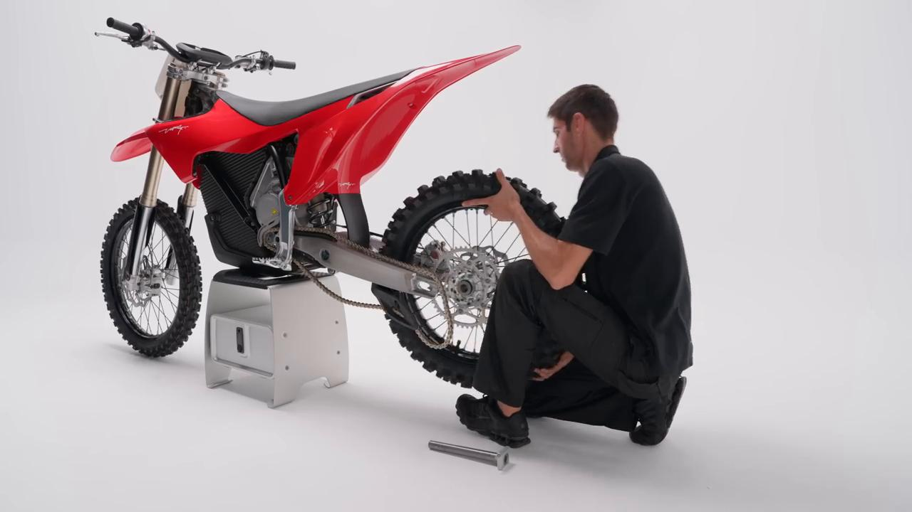

### 4. Remove the rear brake caliper brake pads

Remove the rear brake caliper brake pads.

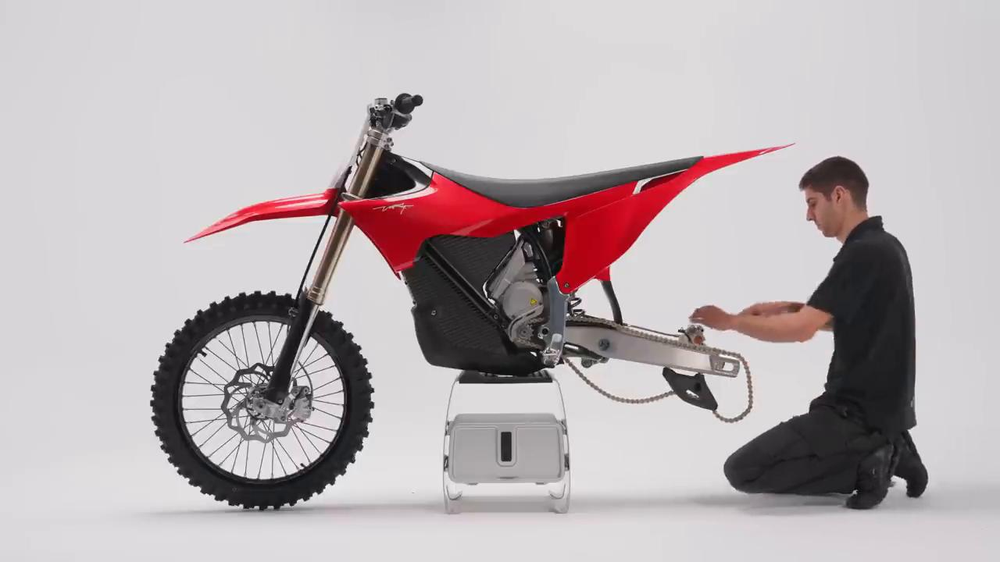

### 5. Remove the rear brake caliper from the swingarm and remove the mounting bracket

Remove the rear brake caliper from the swingarm and remove the mounting bracket.

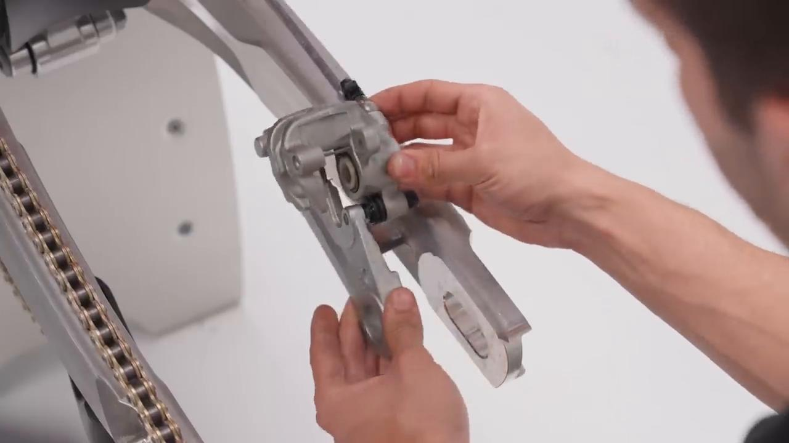

### 6. Thoroughly clean the entire caliper—especially the pins, guides, and rubber seals—using brake cleaner

Thoroughly clean the entire caliper—especially the pins, guides, and rubber seals—using brake cleaner.

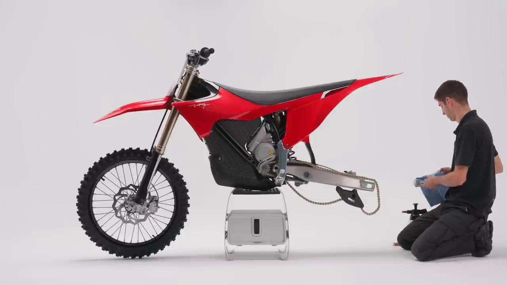

### 7. Apply grease to the mounting pins and to the inside of the guides and rubber seals

Apply grease to the mounting pins and to the inside of the guides and rubber seals.

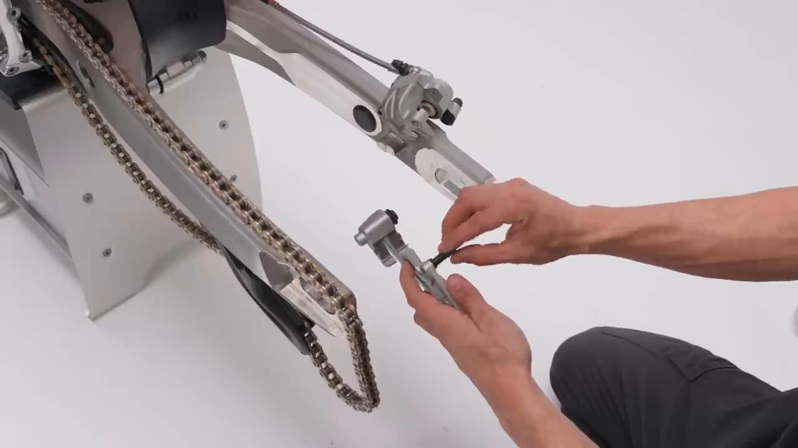

### 8. Insert the mounting bracket into the rear brake caliper

Insert the mounting bracket into the rear brake caliper.

Ensure the movement is smooth and free of resistance.

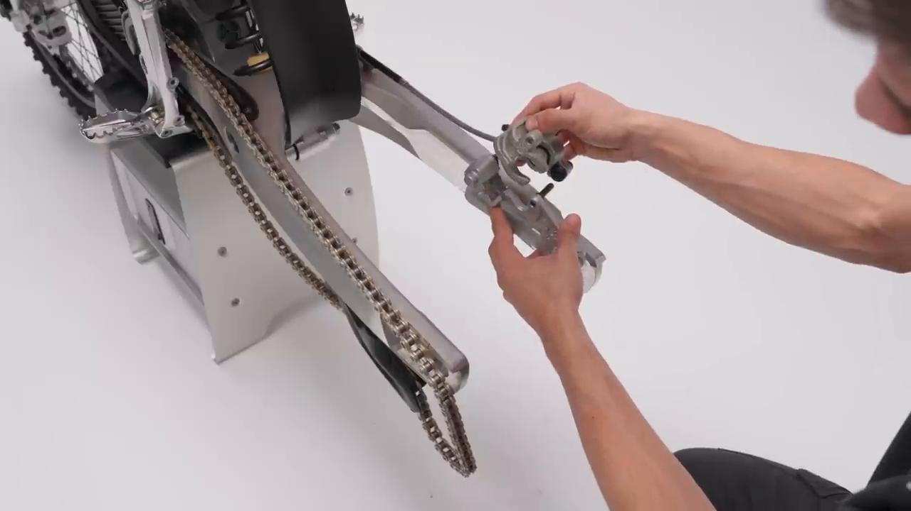

### 9. Install the rear brake caliper in position

Install the rear brake caliper in position.

The hose must be routed into the holder.

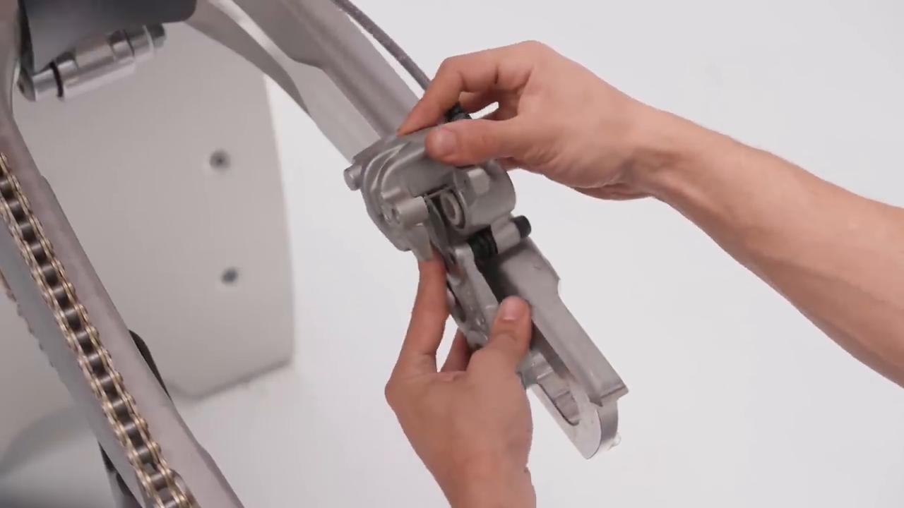

### 10. Install the brake pads into the rear brake caliper

Install the brake pads into the rear brake caliper.

Ensure the security clips are correctly positioned.

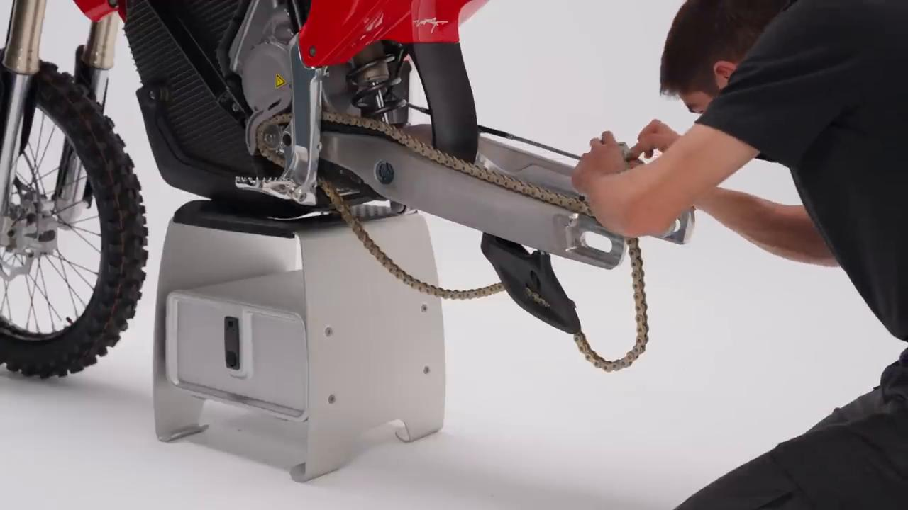

### 11. Carefully position the wheel and ensure it is aligned with the swingarm and rear brake caliper

Carefully position the wheel and ensure it is aligned with the swingarm and rear brake caliper.

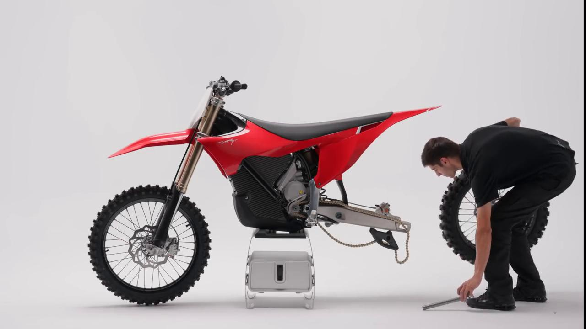

### 12. Install the chain onto the rear sprocket

Install the chain onto the rear sprocket.

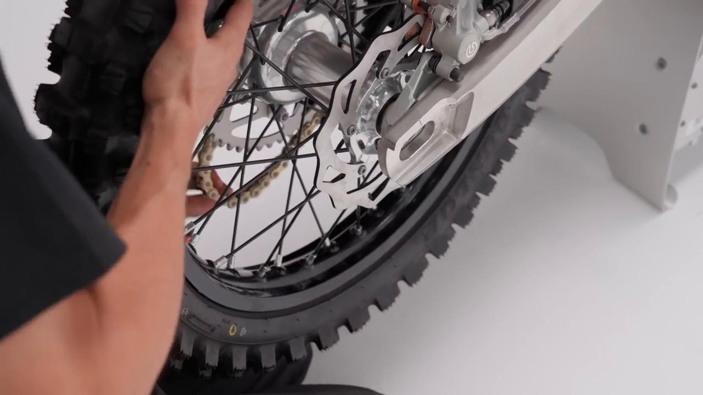

### 13. Install the rear wheel shaft and secure it with the lock nut after placing the chain tensioner

Install the rear wheel shaft and secure it with the lock nut after placing the chain tensioner.

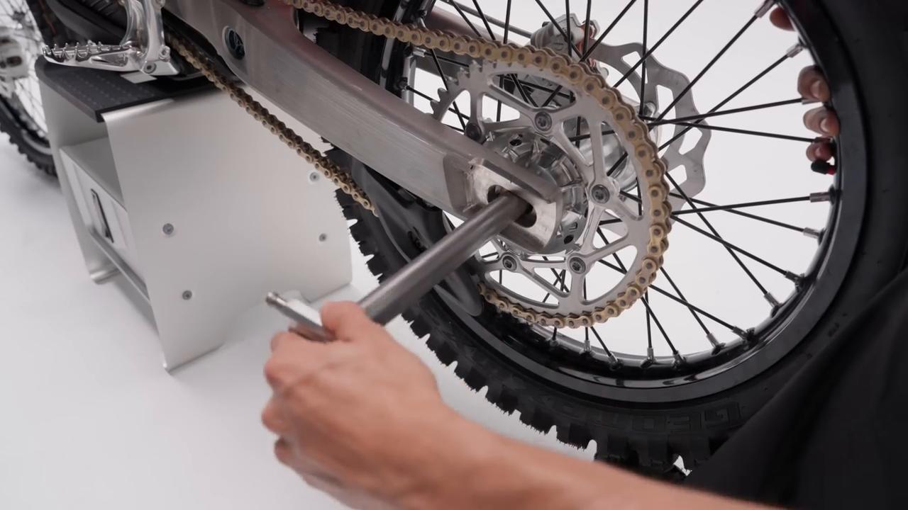

### 14. Ensure the chain is properly tensioned by placing a cloth between the chain and the rear sprocket

Ensure the chain is properly tensioned by placing a cloth between the chain and the rear sprocket.

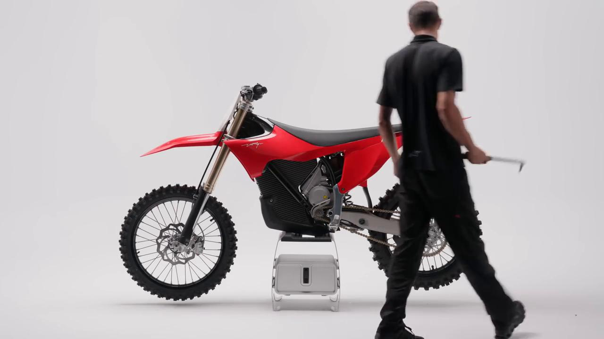

### 15. Tighten the rear wheel shaft lock nut to 80 Nm

Tighten the rear wheel shaft lock nut to **80 Nm**.

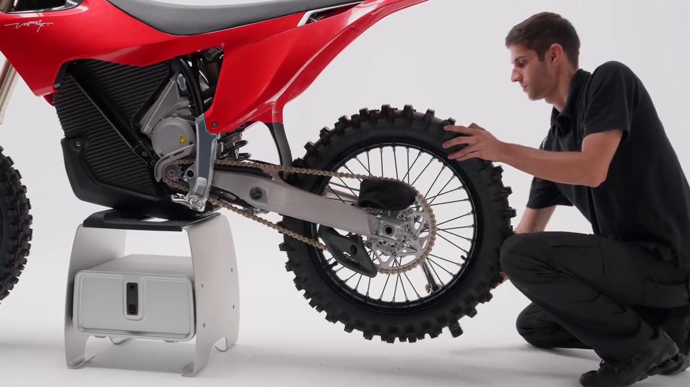

### 16. Check chain tension and brake system

Check chain tension and brake system.

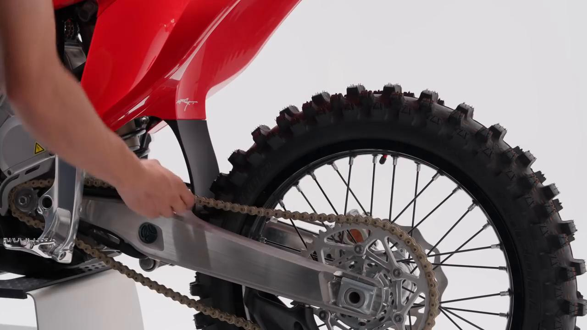

## Torque Summary

| Component | Torque |
| --- | ---: |
| Tighten the rear wheel shaft lock nut | 80 Nm |

Video-sourced torque items:

- Tighten the rear wheel shaft lock nut: **80 Nm** from the official Stark tutorial video.

## Critical Checks Before Riding

- Confirm the serviced component is fully seated and all fasteners are tightened in the correct order.
- Recheck all torque-critical hardware before riding.
- Make sure all routed cables, clips, brackets, and surrounding parts are returned to their original positions.
- Inspect the bike visually for any missing hardware before returning it to service.
