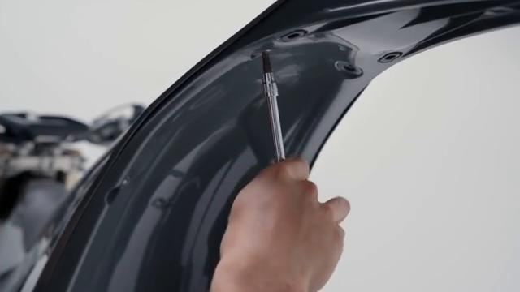
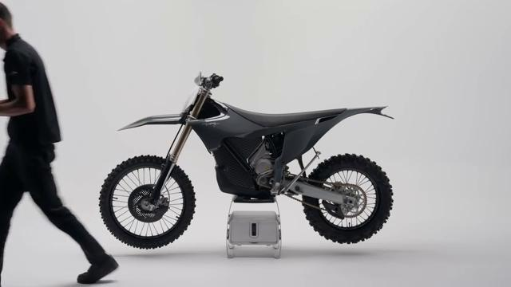
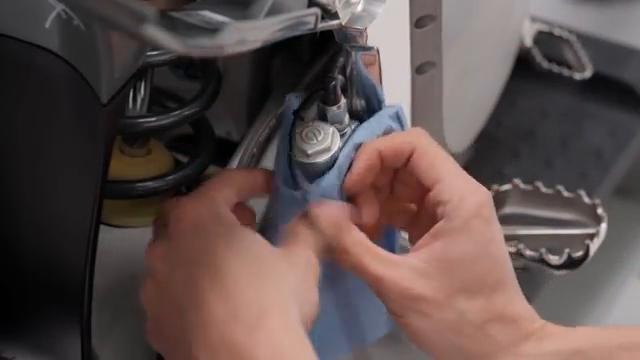
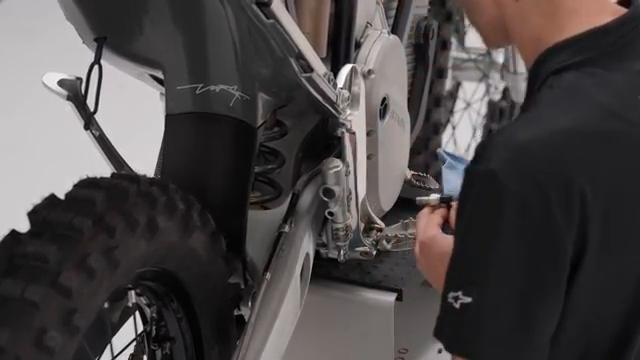
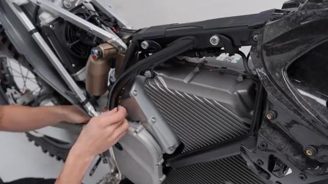
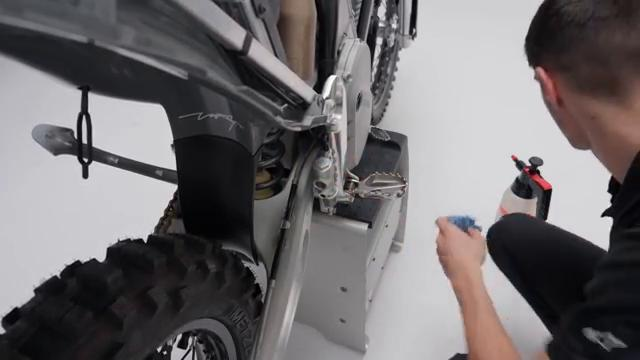
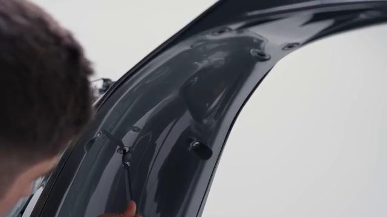
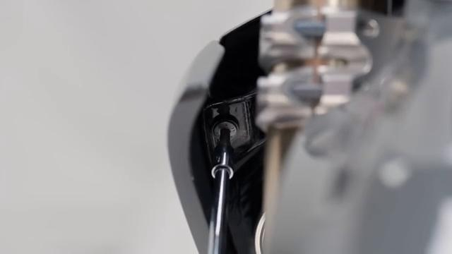
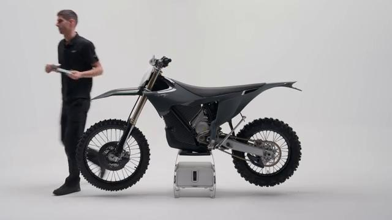

# How to remove and install the Foot Brake Sensor on your Stark VARG EX

Source video: `How to remove and install the Foot Brake Sensor on your Stark VARG EX` by Stark Future Official

Applicable models: `EX`

## Scope

This guide follows the same step-by-step workshop structure as the MX tutorials, but it is derived as a visual sequence from the official Stark Future ASMR video. Because the EX video does not provide usable captions or narration, the procedure is documented through curated screenshots and concise action guidance.

## Preparation

- Place the bike on a stable stand or work area before starting the procedure.
- Prepare the correct tools for the fasteners, clips, brackets, and components shown in the video.
- Keep removed hardware organized in sequence so reassembly follows the same order as the video.
- Have a torque wrench ready for any tightening steps that specify a torque value.

## Removal Procedure

### 1. Remove the fasteners or panels that block access to the Foot Brake Sensor

Remove the rear-fender or side-access hardware needed to expose the foot-brake-sensor lead on the right side of the bike.

Keep the removed hardware organized in sequence so the same covers and brackets can be returned during assembly.

### 2. Release the clips and routing points for the Foot Brake Sensor

Open the right-side access area and expose the foot-brake-sensor lead around the rear-brake-master-cylinder region.

Document the original routing so the same path and slack are restored during installation.

### 3. Disconnect the Foot Brake Sensor

Disconnect the foot-brake-sensor lead once the connector is exposed near the right-side frame area.

Release the connector lock first and avoid pulling on the wire itself.

### 4. Remove the retaining hardware for the Foot Brake Sensor

Remove the remaining fastener or retainer that secures the foot-brake sensor at its mounting point.

Support the component as the last fastener is removed so it does not drop or hang on the wiring.

### 5. Remove the Foot Brake Sensor from the bike

Remove the foot-brake sensor from the bike and pull the lead free along the original routing path.

Keep any washers, spacers, sleeves, or rubber mounts with the removed component for reassembly.

## Installation Procedure

### 6. Position the Foot Brake Sensor for installation

Position the foot-brake sensor at its mounting point and route the lead back through the original path on the right side of the bike.

Confirm that no cable is trapped behind the component before the fasteners are started.

### 7. Reconnect the Foot Brake Sensor and route the wiring correctly

Reconnect the foot-brake-sensor lead and return it to the original clips and guides along the frame.

Check that the wiring is clear of the chain, shock, brake pedal, and suspension travel before closing the access area.

### 8. Install the retaining hardware for the Foot Brake Sensor

Install the remaining sensor retainer or fastener and refit any access hardware removed to reach the connector.

Reinstall any removed clips, covers, or brackets after the main hardware is secure.

### 9. Verify the operation of the Foot Brake Sensor

Verify the foot-brake sensor is secure and that the brake-light function responds correctly.

Inspect the surrounding routing and hardware one more time before returning the bike to service.

## Critical Checks Before Riding

- Confirm the serviced component is fully seated and all fasteners are tightened in the correct order.
- Recheck all torque-critical hardware before riding.
- Make sure all routed cables, clips, brackets, and surrounding parts are returned to their original positions.
- Inspect the bike visually for any missing hardware before returning it to service.
