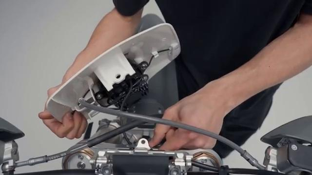
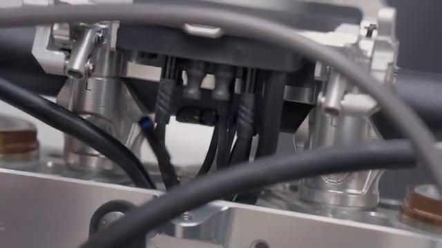
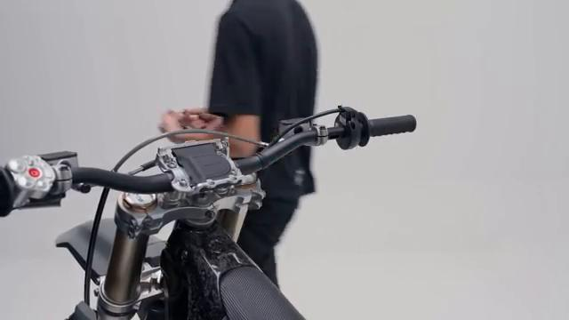
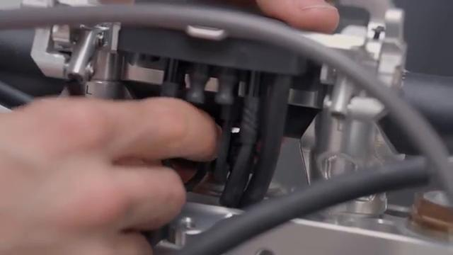
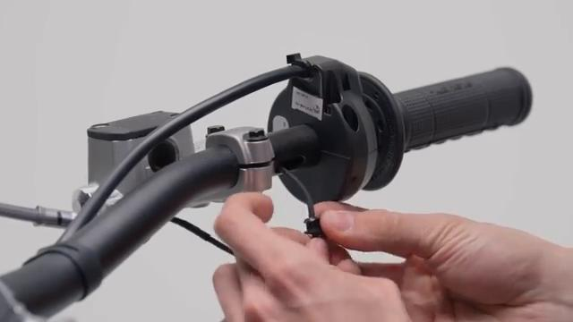
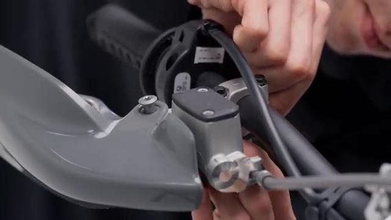
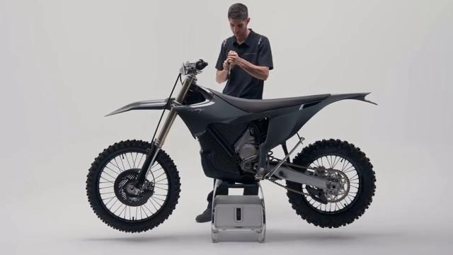
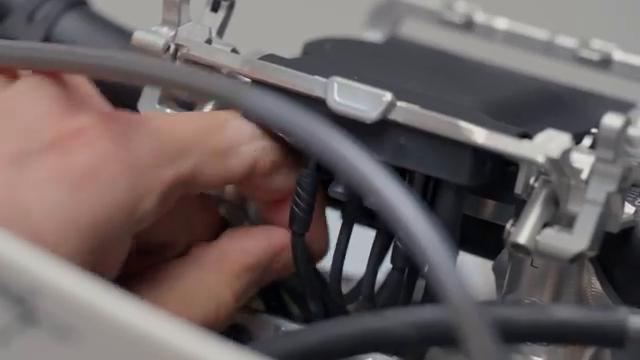
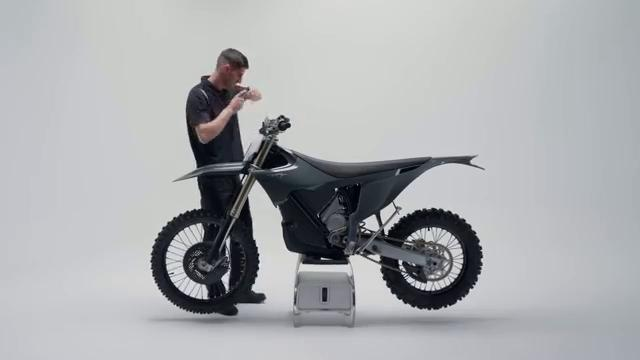

# How to remove and install the Front Brake Sensor on your Stark VARG EX

Source video: `How to remove and install the Front Brake Sensor on your Stark VARG EX` by Stark Future Official

Applicable models: `EX`

## Scope

This guide follows the same step-by-step workshop structure as the MX tutorials, but it is derived as a visual sequence from the official Stark Future ASMR video. Because the EX video does not provide usable captions or narration, the procedure is documented through curated screenshots and concise action guidance.

## Preparation

- Place the bike on a stable stand or work area before starting the procedure.
- Prepare the correct tools for the fasteners, clips, brackets, and components shown in the video.
- Keep removed hardware organized in sequence so reassembly follows the same order as the video.
- Have a torque wrench ready for any tightening steps that specify a torque value.

## Removal Procedure

### 1. Remove the fasteners or panels that block access to the Front Brake Sensor

Move the front mask or access panel aside as needed to expose the front-brake-sensor connector and handlebar routing.

Keep the removed hardware organized in sequence so the same covers and brackets can be returned during assembly.

### 2. Release the clips and routing points for the Front Brake Sensor

Release the front-brake-sensor lead from the clips and guides beneath the docking-station area and along the handlebar.

Document the original routing so the same path and slack are restored during installation.

### 3. Disconnect the Front Brake Sensor

Disconnect the front-brake-sensor connector once the harness slack is exposed.

Release the connector lock first and avoid pulling on the wire itself.

### 4. Remove the retaining hardware for the Front Brake Sensor

Free the remaining retainer or clip that secures the sensor lead at the front-brake master-cylinder area.

Support the component as the last fastener is removed so it does not drop or hang on the wiring.

### 5. Remove the Front Brake Sensor from the bike

Remove the front-brake sensor from the front-brake lever assembly and withdraw the lead cleanly.

Keep any washers, spacers, sleeves, or rubber mounts with the removed component for reassembly.

## Installation Procedure

### 6. Position the Front Brake Sensor for installation

Position the front-brake sensor back at the front-brake lever assembly and route the lead toward the original connector path.

Confirm that no cable is trapped behind the component before the fasteners are started.

### 7. Reconnect the Front Brake Sensor and route the wiring correctly

Reconnect the front-brake-sensor lead and return it to the original clips and guides under the access panel and along the handlebar.

Check that the wiring has enough slack for steering, suspension, and normal component movement.

### 8. Install the retaining hardware for the Front Brake Sensor

Install the remaining retainer or clip for the sensor lead and confirm the lead sits flush in its guides.

Reinstall any removed clips, covers, or brackets after the main hardware is secure.

### 9. Verify the operation of the Front Brake Sensor

Verify the front-brake sensor is seated correctly and that the brake-light function responds as expected.

Inspect the surrounding routing and hardware one more time before returning the bike to service.

## Critical Checks Before Riding

- Confirm the serviced component is fully seated and all fasteners are tightened in the correct order.
- Recheck all torque-critical hardware before riding.
- Make sure all routed cables, clips, brackets, and surrounding parts are returned to their original positions.
- Inspect the bike visually for any missing hardware before returning it to service.
