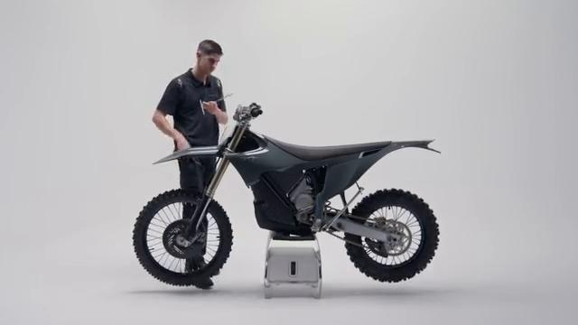
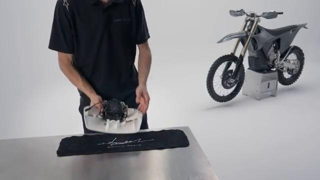
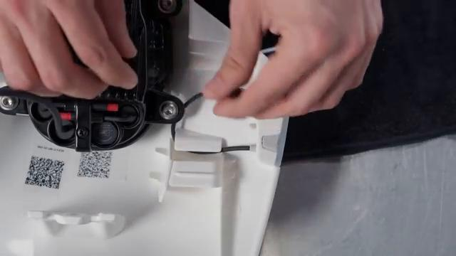
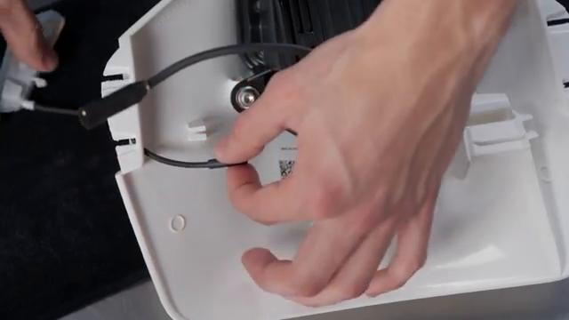
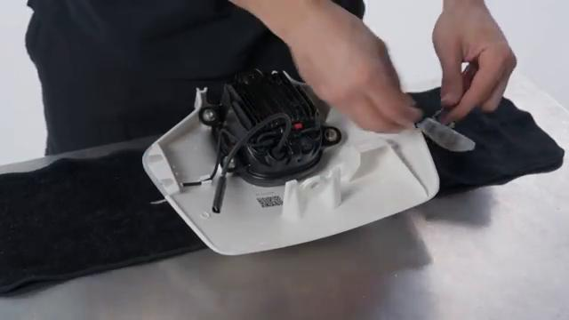
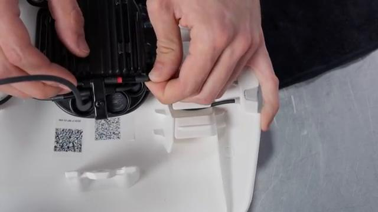
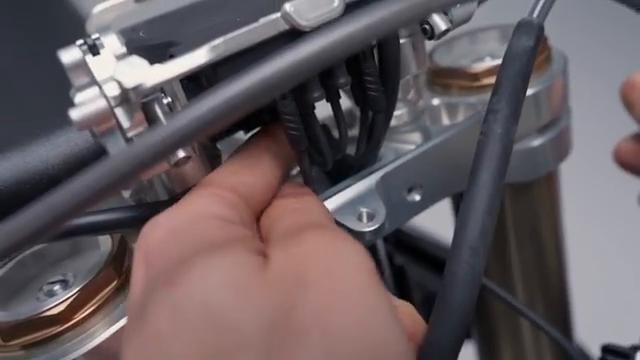
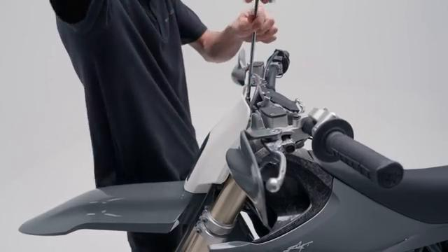
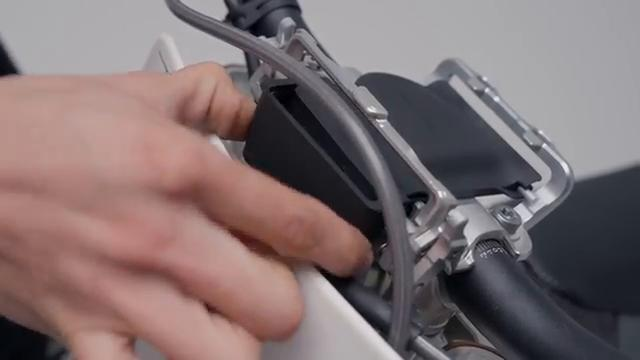

# How to remove and install the Front Indicators on your Stark VARG EX

Source video: `How to remove and install the Front Indicators on your Stark VARG EX` by Stark Future Official

Applicable models: `EX`

## Scope

This guide follows the same step-by-step workshop structure as the MX tutorials, but it is derived as a visual sequence from the official Stark Future ASMR video. Because the EX video does not provide usable captions or narration, the procedure is documented through curated screenshots and concise action guidance.

## Preparation

- Place the bike on a stable stand or work area before starting the procedure.
- Prepare the correct tools for the fasteners, clips, brackets, and components shown in the video.
- Keep removed hardware organized in sequence so reassembly follows the same order as the video.
- Have a torque wrench ready for any tightening steps that specify a torque value.

## Removal Procedure

### 1. Remove the fasteners or panels that block access to the Front Indicators

Remove the visible bolts, screws, or trim pieces that must come off before the Front Indicators can be reached.

Keep the hardware in removal order so the covers and brackets return to the same locations during assembly.

### 2. Release the clips and routing points for the Front Indicators

Free any clips, retainers, grommets, or brackets that hold the Front Indicators or its wiring in place.

Document the original routing so the cable or harness can be returned to the same path during installation.

### 3. Disconnect the Front Indicators

Separate the connector or electrical coupling for the Front Indicators exactly as shown in the video.

Avoid pulling on the wire itself while releasing the connector lock.

### 4. Remove the retaining hardware for the Front Indicators

Remove the bolts, screws, clips, or nuts that directly secure the Front Indicators to the bike.

Support the component as the last fastener is removed so it does not hang on the wiring.

### 5. Remove the Front Indicators from the bike

Lift, slide, or guide the Front Indicators clear of the mounting area once the connector and fasteners are released.

Keep any washers, spacers, sleeves, or rubber mounts with the component for reassembly.

## Installation Procedure

### 6. Position the Front Indicators for installation

Set the Front Indicators back into its mounting position and align it with the original locating points.

Confirm that no cable is trapped behind the component before the fasteners are started.

### 7. Reconnect the Front Indicators and route the wiring correctly

Reconnect the Front Indicators connector and return the harness to the same clips, guides, and brackets used before removal.

Check that the wiring has enough slack for steering or suspension movement where applicable.

### 8. Install the retaining hardware for the Front Indicators

Install the mounting hardware for the Front Indicators by hand first, then seat the part evenly against its mount.

Reinstall any removed clips, covers, or brackets after the main hardware is secure.

### 9. Verify the operation of the Front Indicators

Check that the Front Indicators is aligned correctly and confirm it operates as shown in the video.

Inspect the surrounding routing and hardware one more time before returning the bike to service.

## Critical Checks Before Riding

- Confirm the serviced component is fully seated and all fasteners are tightened in the correct order.
- Recheck all torque-critical hardware before riding.
- Make sure all routed cables, clips, brackets, and surrounding parts are returned to their original positions.
- Inspect the bike visually for any missing hardware before returning it to service.
