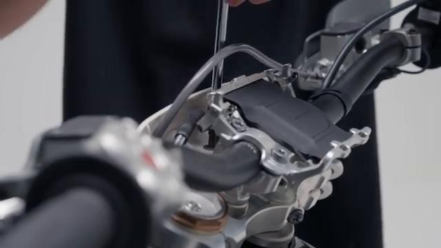
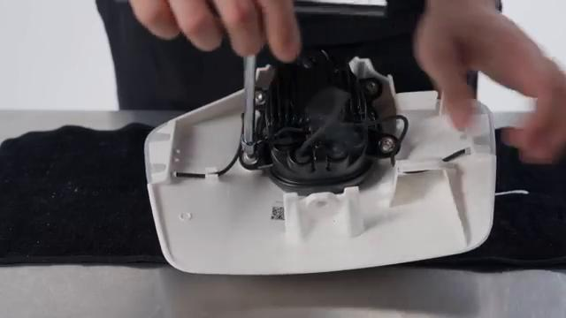
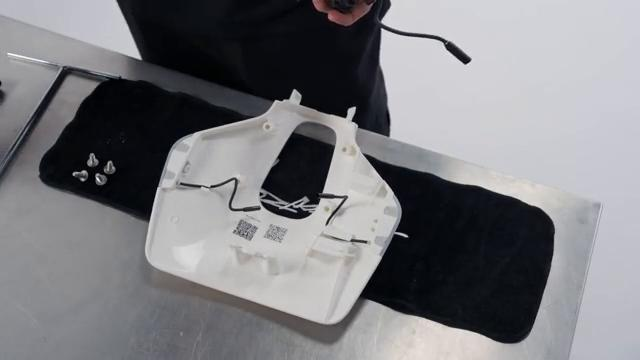
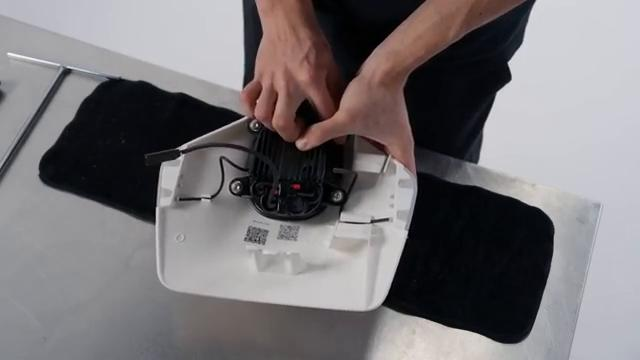
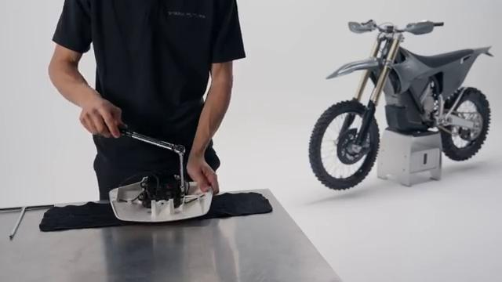
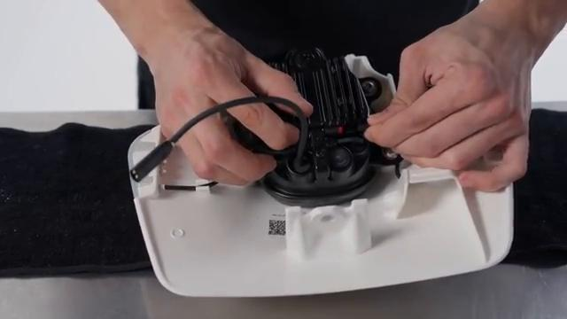
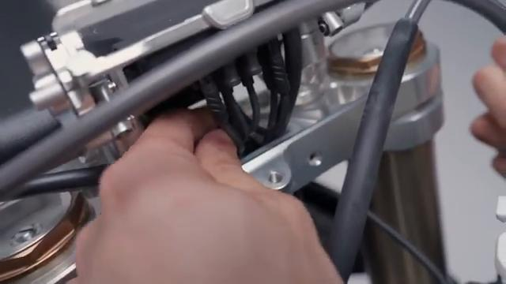
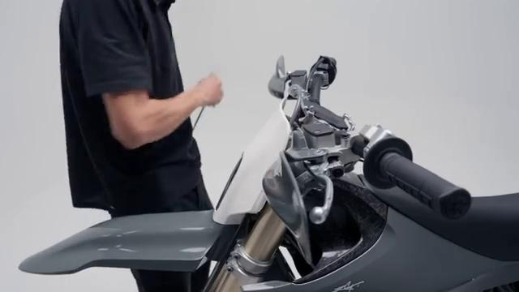
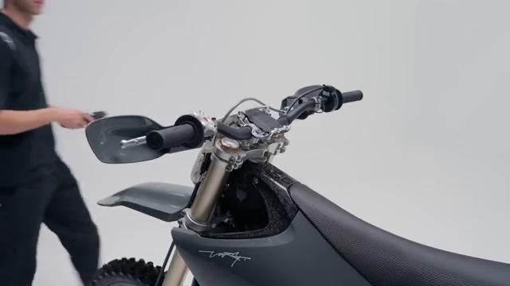

# How to remove and install the Head Light on your Stark VARG EX

Source video: `How to remove and install the Head Light on your Stark VARG EX` by Stark Future Official

Applicable models: `EX`

## Scope

This guide follows the same step-by-step workshop structure as the MX tutorials, but it is derived as a visual sequence from the official Stark Future ASMR video. Because the EX video does not provide usable captions or narration, the procedure is documented through curated screenshots and concise action guidance.

## Preparation

- Place the bike on a stable stand or work area before starting the procedure.
- Prepare the correct tools for the fasteners, clips, brackets, and components shown in the video.
- Keep removed hardware organized in sequence so reassembly follows the same order as the video.
- Have a torque wrench ready for any tightening steps that specify a torque value.

## Removal Procedure

### 1. Remove the fasteners or panels that block access to the Head Light

Remove the upper head-light-mask screws and lift the mask clear enough to access the rear of the assembly.

Keep the removed hardware organized in sequence so the same covers and brackets can be returned during assembly.

### 2. Release the clips and routing points for the Head Light

Release the head light wiring from the guides and clips on the back of the mask.

Document the original routing so the same path and slack are restored during installation.

### 3. Disconnect the Head Light

Disconnect the head light connector at the rear of the mask.

Release the connector lock first and avoid pulling on the wire itself.

### 4. Remove the retaining hardware for the Head Light

Remove the screws that secure the head light unit to the inside of the mask.

Support the component as the last fastener is removed so it does not drop or hang on the wiring.

### 5. Remove the Head Light from the bike

Lift the head light unit out of the mask once the connector and mounting screws are free.

Keep any washers, spacers, sleeves, or rubber mounts with the removed component for reassembly.

## Installation Procedure

### 6. Position the Head Light for installation

Set the head light unit back into the mask and align the mounting holes.

Confirm that no cable is trapped behind the component before the fasteners are started.

### 7. Reconnect the Head Light and route the wiring correctly

Reconnect the head light connector and return the harness to the clips and guides on the back of the mask.

Check that the wiring has enough slack for steering, suspension, and normal component movement.

### 8. Install the retaining hardware for the Head Light

Install the lamp screws by hand first, then tighten them evenly so the head light sits square in the mask.

Reinstall any removed clips, covers, or brackets after the main hardware is secure.

### 9. Verify the operation of the Head Light

Verify the head light sits flush in the mask and operates correctly before riding.

Inspect the surrounding routing and hardware one more time before returning the bike to service.

## Critical Checks Before Riding

- Confirm the serviced component is fully seated and all fasteners are tightened in the correct order.
- Recheck all torque-critical hardware before riding.
- Make sure all routed cables, clips, brackets, and surrounding parts are returned to their original positions.
- Inspect the bike visually for any missing hardware before returning it to service.
