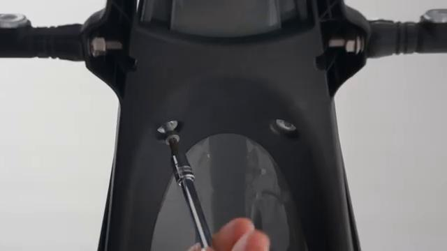
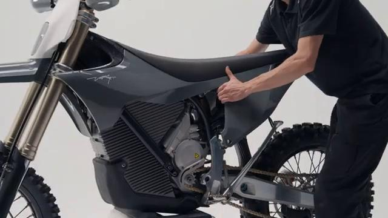
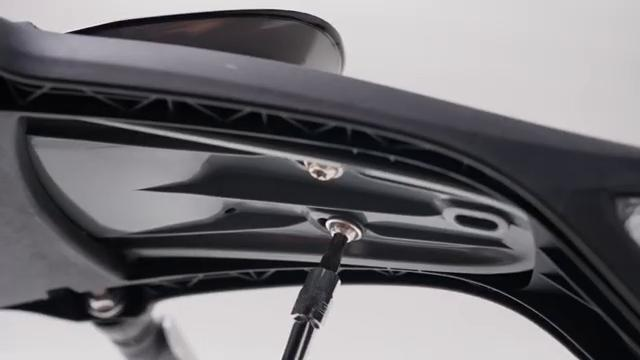
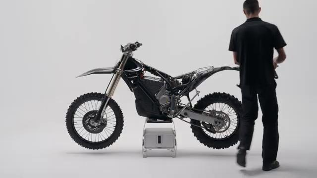
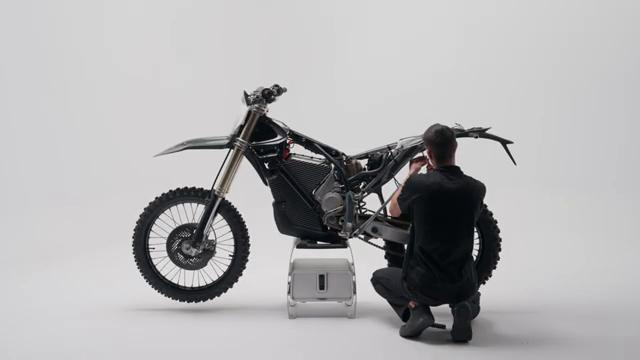
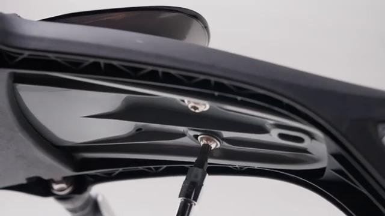
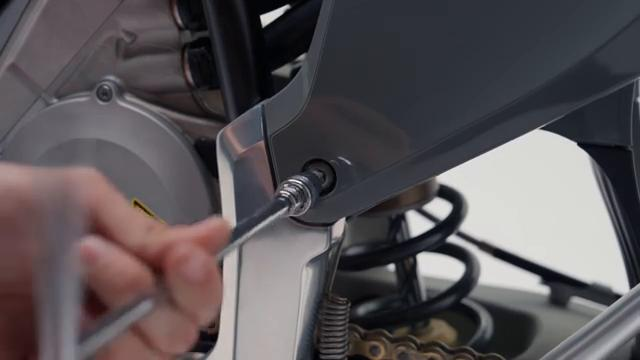
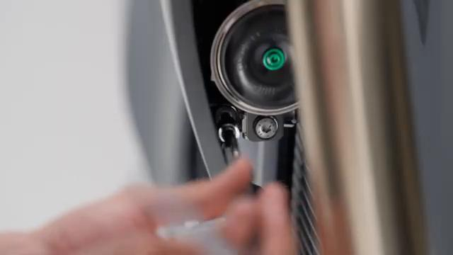
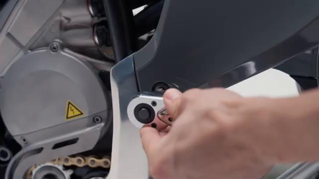

# How to remove and install the License Plate Holder on your Stark VARG EX

Source video: `How to remove and install the License Plate Holder on your Stark VARG EX` by Stark Future Official

Applicable models: `EX`

## Scope

This guide follows the same step-by-step workshop structure as the MX tutorials, but it is derived as a visual sequence from the official Stark Future ASMR video. Because the EX video does not provide usable captions or narration, the procedure is documented through curated screenshots and concise action guidance.

## Preparation

- Place the bike on a stable stand or work area before starting the procedure.
- Prepare the correct tools for the fasteners, clips, brackets, and components shown in the video.
- Keep removed hardware organized in sequence so reassembly follows the same order as the video.
- Have a torque wrench ready for any tightening steps that specify a torque value.

## Removal Procedure

### 1. Remove the fasteners or panels that block access to the License Plate Holder

Remove the underside rear-fender screws and any access fasteners needed to lower the rear extension and expose the holder wiring.

Keep the removed hardware organized in sequence so the same covers and brackets can be returned during assembly.

### 2. Release the clips and routing points for the License Plate Holder

Remove the side-access panel and continue opening the rear section until the license plate holder harness path is visible.

Document the original routing so the same path and slack are restored during installation.

### 3. Disconnect the License Plate Holder

Remove the underside fasteners shown in the rear extension and keep lowering the assembly until the holder harness and connector can be reached.

Release the connector lock first and avoid pulling on the wire itself.

### 4. Remove the retaining hardware for the License Plate Holder

Remove the remaining fasteners that secure the holder bracket to the rear extension while supporting the assembly.

Support the component as the last fastener is removed so it does not drop or hang on the wiring.

### 5. Remove the License Plate Holder from the bike

Withdraw the license plate holder from the rear extension and feed the harness out cleanly.

Keep any washers, spacers, sleeves, or rubber mounts with the removed component for reassembly.

## Installation Procedure

### 6. Position the License Plate Holder for installation

Position the license plate holder under the rear extension and route the harness back through the original opening.

Confirm that no cable is trapped behind the component before the fasteners are started.

### 7. Reconnect the License Plate Holder and route the wiring correctly

Reconnect the license plate holder harness and reinstall the access hardware that closes the rear section around it.

Check that the wiring is clear of the rear tire, chain path, and suspension travel before tightening the last fasteners.

### 8. Install the retaining hardware for the License Plate Holder

Install the holder fasteners by hand first, then seat the bracket evenly against the rear extension.

Reinstall any removed clips, covers, or brackets after the main hardware is secure.

### 9. Verify the operation of the License Plate Holder

Verify the license plate holder is secure and that the rear lighting wiring is routed cleanly.

Inspect the surrounding routing and hardware one more time before returning the bike to service.

## Critical Checks Before Riding

- Confirm the serviced component is fully seated and all fasteners are tightened in the correct order.
- Recheck all torque-critical hardware before riding.
- Make sure all routed cables, clips, brackets, and surrounding parts are returned to their original positions.
- Inspect the bike visually for any missing hardware before returning it to service.
