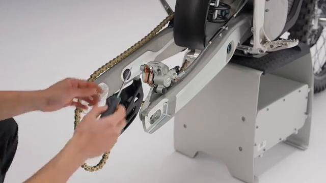
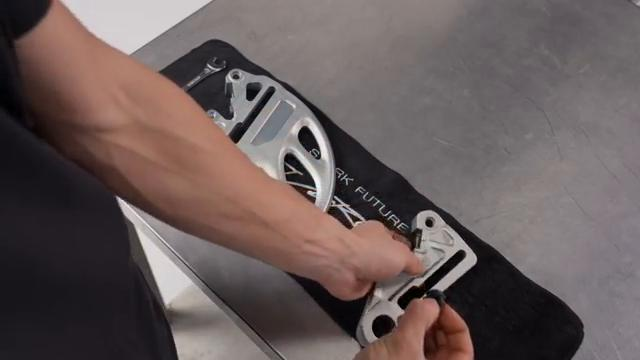
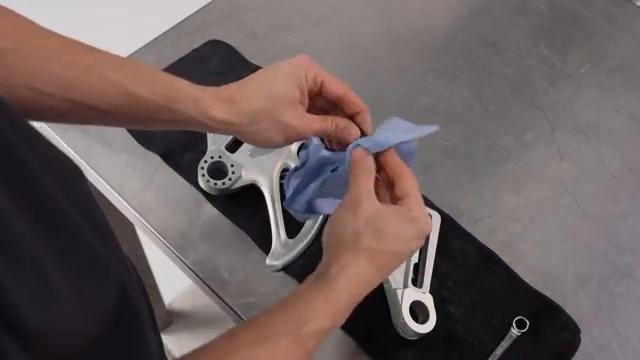
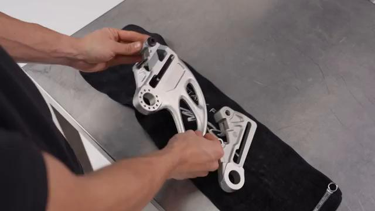
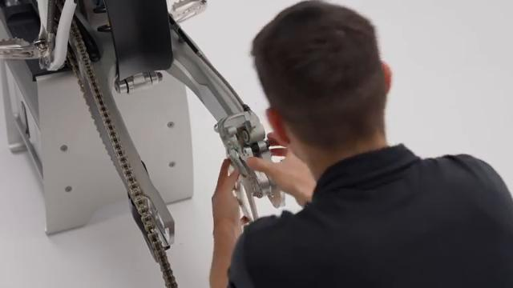
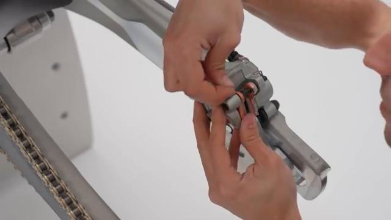
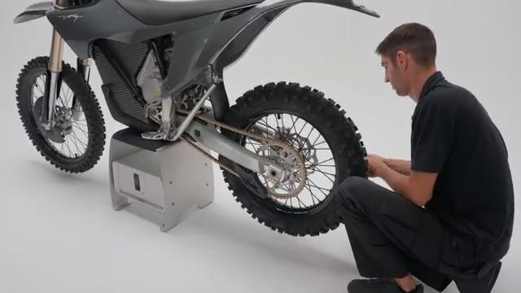

# How to remove and install the Rear Brake Disc Protector on your Stark VARG EX

Source video: `How to remove and install the Rear Brake Disc Protector on your Stark VARG EX` by Stark Future Official

## Scope

This guide follows the same step-by-step workshop structure as the MX tutorials, but it is derived as a visual sequence from the official Stark Future ASMR video. Because the EX video does not provide usable captions or narration, the procedure is documented through curated screenshots and concise action guidance.

## Preparation

- Place the bike on a stable stand or work area before starting the procedure.
- Prepare the correct tools for the fasteners, clips, brackets, and components shown in the video.
- Keep removed hardware organized in sequence so reassembly follows the same order as the video.
- Have a torque wrench ready for any tightening steps that specify a torque value.

## Removal Procedure

### 1. Remove the retaining hardware for the Rear Brake Disc Protector

Remove the visible bolts, screws, or clips that hold the Rear Brake Disc Protector in place.

Keep track of any washers, collars, or spacers as each fastener is removed.

### 2. Release any support piece attached to the Rear Brake Disc Protector

Remove any bracket, spacer, clamp, or secondary fastener that still retains the Rear Brake Disc Protector.

Note the hardware stack order so the same arrangement is used during assembly.

### 3. Remove the Rear Brake Disc Protector from its mounting position

Slide or lift the Rear Brake Disc Protector free once the retaining hardware is removed.

Inspect the mounting surfaces and the removed hardware before installation begins.

## Installation Procedure

### 4. Position the Rear Brake Disc Protector for installation

Place the Rear Brake Disc Protector back into its correct orientation on the bike.

Align the mounting holes and support points before any hardware is tightened.

### 5. Reinstall any spacer, bracket, or clip for the Rear Brake Disc Protector

Return each spacer, support piece, or clip to the same position used during removal.

Confirm the hardware stack is seated flat and centered before the main fasteners are installed.

### 6. Install the retaining hardware for the Rear Brake Disc Protector

Install the mounting fasteners for the Rear Brake Disc Protector and tighten them evenly while holding the part aligned.

Check that the part sits flush and does not interfere with nearby moving parts.

### 7. Verify the clearance and alignment of the Rear Brake Disc Protector

Inspect the completed fitment of the Rear Brake Disc Protector and confirm the surrounding area has proper clearance.

Make sure no hardware, clip, or support piece is missing before the bike is returned to service.

## Critical Checks Before Riding

- Confirm the serviced component is fully seated and all fasteners are tightened in the correct order.
- Recheck all torque-critical hardware before riding.
- Make sure all routed cables, clips, brackets, and surrounding parts are returned to their original positions.
- Inspect the bike visually for any missing hardware before returning it to service.
