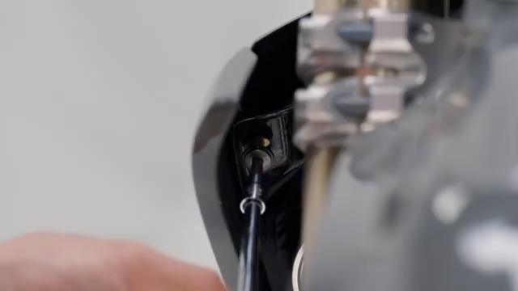
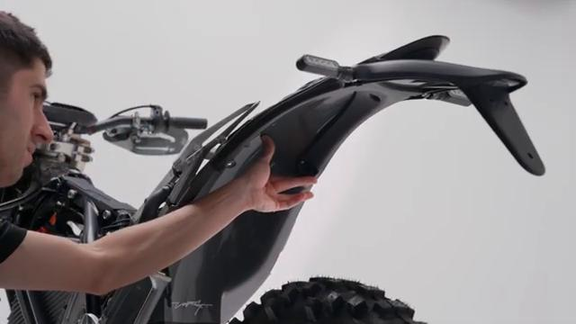
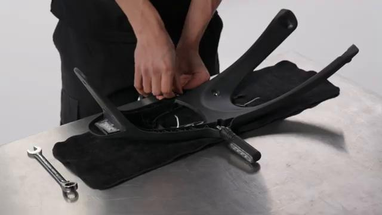
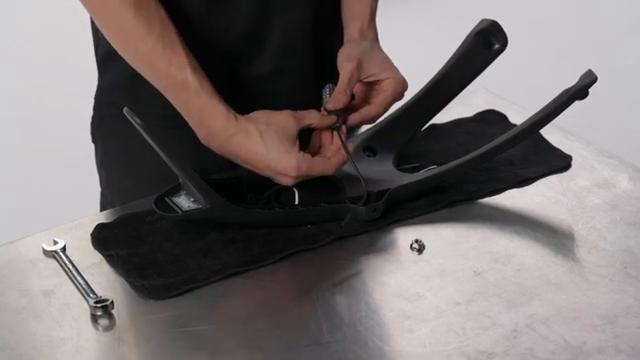
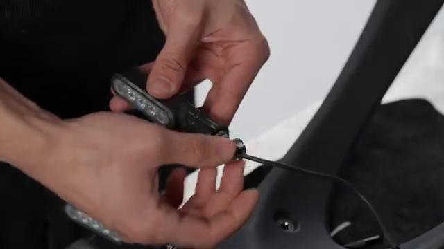
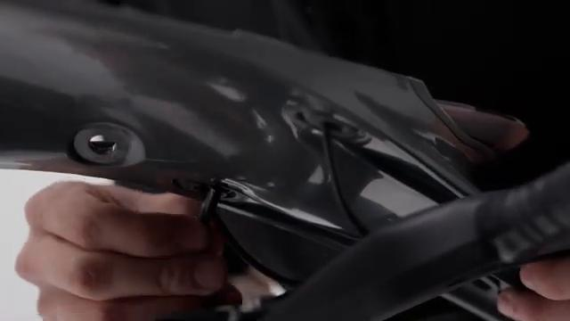
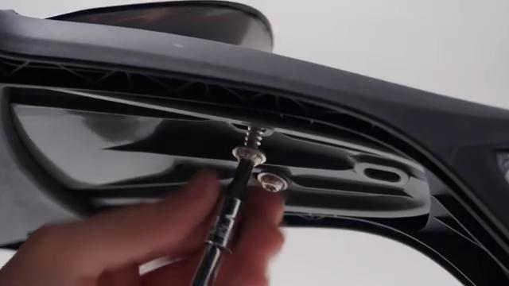
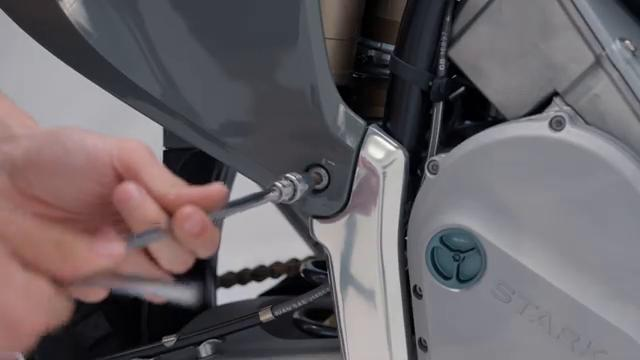
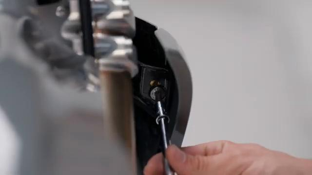

# How to remove and install the Rear Indicators on your Stark VARG EX

Source video: `How to remove and install the Rear Indicators on your Stark VARG EX` by Stark Future Official

Applicable models: `EX`

## Scope

This guide follows the same step-by-step workshop structure as the MX tutorials, but it is derived as a visual sequence from the official Stark Future ASMR video. Because the EX video does not provide usable captions or narration, the procedure is documented through curated screenshots and concise action guidance.

## Preparation

- Place the bike on a stable stand or work area before starting the procedure.
- Prepare the correct tools for the fasteners, clips, brackets, and components shown in the video.
- Keep removed hardware organized in sequence so reassembly follows the same order as the video.
- Have a torque wrench ready for any tightening steps that specify a torque value.

## Removal Procedure

### 1. Remove the fasteners or panels that block access to the Rear Indicators

Remove the rear-fender or tail-section access hardware needed to expose the rear-indicator wiring and mounting points.

Keep the removed hardware organized in sequence so the same covers and brackets can be returned during assembly.

### 2. Release the clips and routing points for the Rear Indicators

Release the rear-indicator leads from the clips and guides inside the rear-fender assembly.

Document the original routing so the same path and slack are restored during installation.

### 3. Disconnect the Rear Indicators

Disconnect the rear-indicator leads once the connectors are exposed inside the tail section.

Release the connector lock first and avoid pulling on the wire itself.

### 4. Remove the retaining hardware for the Rear Indicators

Remove the retaining hardware that secures the rear indicators to the tail section while supporting each indicator stalk.

Support the component as the last fastener is removed so it does not drop or hang on the wiring.

### 5. Remove the Rear Indicators from the bike

Withdraw the rear indicators from the tail section and feed their leads out cleanly.

Keep any washers, spacers, sleeves, or rubber mounts with the removed component for reassembly.

## Installation Procedure

### 6. Position the Rear Indicators for installation

Position each rear indicator back into the tail section and route the lead through the original opening.

Confirm that no cable is trapped behind the component before the fasteners are started.

### 7. Reconnect the Rear Indicators and route the wiring correctly

Reconnect the rear-indicator leads and return them to the original clips and guides inside the tail section.

Check that the wiring has enough slack for steering, suspension, and normal component movement.

### 8. Install the retaining hardware for the Rear Indicators

Install the indicator retaining hardware by hand first, then tighten it evenly while keeping each indicator aligned.

Reinstall any removed clips, covers, or brackets after the main hardware is secure.

### 9. Verify the operation of the Rear Indicators

Verify both rear indicators are aligned evenly and operate correctly.

Inspect the surrounding routing and hardware one more time before returning the bike to service.

## Critical Checks Before Riding

- Confirm the serviced component is fully seated and all fasteners are tightened in the correct order.
- Recheck all torque-critical hardware before riding.
- Make sure all routed cables, clips, brackets, and surrounding parts are returned to their original positions.
- Inspect the bike visually for any missing hardware before returning it to service.
