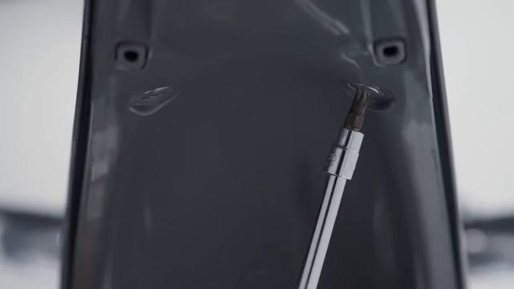
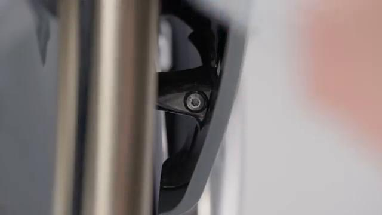
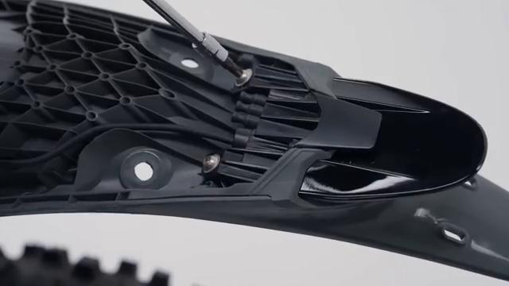
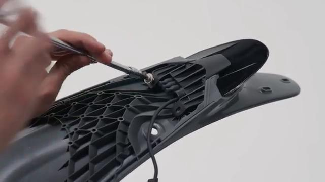
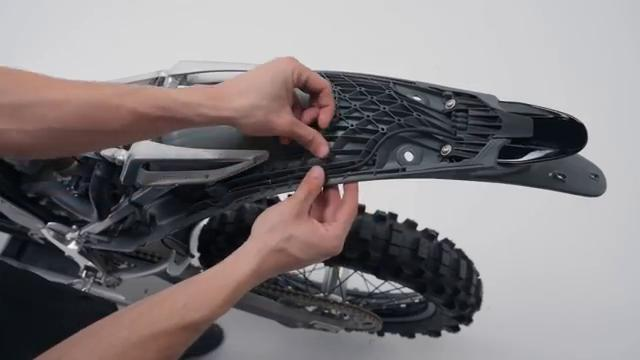
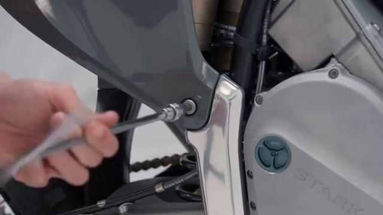
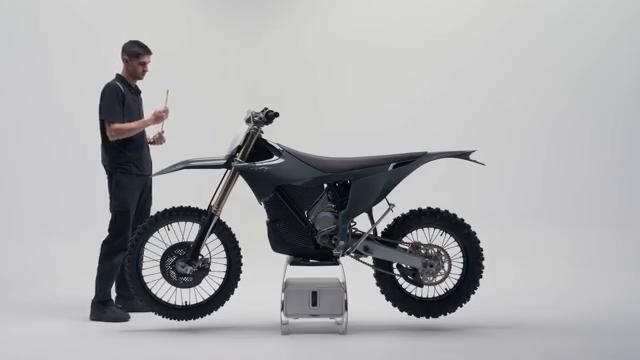
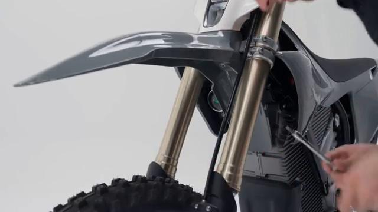
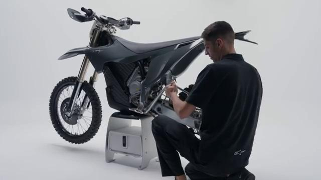

# How to remove and install the Tail Light on your Stark VARG EX

Source video: `How to remove and install the Tail Light on your Stark VARG EX` by Stark Future Official

Applicable models: `EX`

## Scope

This guide follows the same step-by-step workshop structure as the MX tutorials, but it is derived as a visual sequence from the official Stark Future ASMR video. Because the EX video does not provide usable captions or narration, the procedure is documented through curated screenshots and concise action guidance.

## Preparation

- Place the bike on a stable stand or work area before starting the procedure.
- Prepare the correct tools for the fasteners, clips, brackets, and components shown in the video.
- Keep removed hardware organized in sequence so reassembly follows the same order as the video.
- Have a torque wrench ready for any tightening steps that specify a torque value.

## Removal Procedure

### 1. Remove the fasteners or panels that block access to the Tail Light

Remove the underside rear-fender screws and any access hardware needed to expose the tail-light wiring and mounting screws.

Keep the removed hardware organized in sequence so the same covers and brackets can be returned during assembly.

### 2. Release the clips and routing points for the Tail Light

Remove the additional access fastener that frees the rear-fender section around the tail light.

Document the original routing so the same path and slack are restored during installation.

### 3. Disconnect the Tail Light

Remove the first tail-light mounting screw from the underside of the rear fender.

Release the connector lock first and avoid pulling on the wire itself.

### 4. Remove the retaining hardware for the Tail Light

Remove the screws that secure the tail light to the rear-fender assembly while supporting the light body.

Support the component as the last fastener is removed so it does not drop or hang on the wiring.

### 5. Remove the Tail Light from the bike

Remove the tail light from the rear fender and feed the lead out cleanly.

Keep any washers, spacers, sleeves, or rubber mounts with the removed component for reassembly.

## Installation Procedure

### 6. Position the Tail Light for installation

Position the tail light in the rear fender and route the lead back through the original opening.

Confirm that no cable is trapped behind the component before the fasteners are started.

### 7. Reconnect the Tail Light and route the wiring correctly

Reconnect the tail-light lead and return the harness to the original route before the rear-fender access area is fully closed.

Check that the wiring is clear of the rear tire and suspension travel before tightening the final access hardware.

### 8. Install the retaining hardware for the Tail Light

Install the tail-light screws by hand first, then tighten them evenly and refit any access hardware removed for the connector.

Reinstall any removed clips, covers, or brackets after the main hardware is secure.

### 9. Verify the operation of the Tail Light

Verify the tail light sits flush in the rear fender and operates correctly.

Inspect the surrounding routing and hardware one more time before returning the bike to service.

## Critical Checks Before Riding

- Confirm the serviced component is fully seated and all fasteners are tightened in the correct order.
- Recheck all torque-critical hardware before riding.
- Make sure all routed cables, clips, brackets, and surrounding parts are returned to their original positions.
- Inspect the bike visually for any missing hardware before returning it to service.
