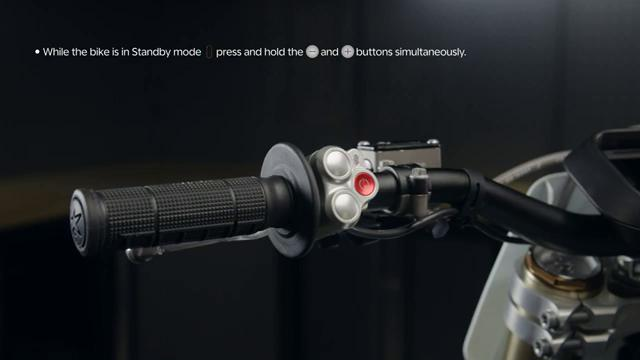
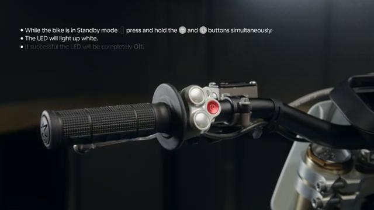
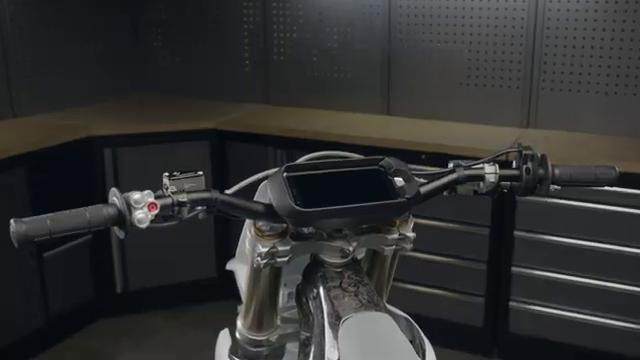

# How to SHUTDOWN the Stark VARG

Source video: `How to SHUTDOWN the Stark VARG` by Stark Future Official

Applicable models: `MX`

## Scope

This guide follows the same step-by-step workshop structure as the MX tutorials, but it is derived as a visual sequence from the official Stark Future ASMR video. Because the source video does not provide usable captions or narration, the procedure is documented through curated screenshots and concise action guidance.

## Preparation

- Place the bike on a stable stand or work area before starting the procedure.
- Prepare the correct tools for the fasteners, clips, brackets, and components shown in the video.
- Keep removed hardware organized in sequence so reassembly follows the same order as the video.
- Have a torque wrench ready for any tightening steps that specify a torque value.

## Procedure

### 1. Secure the bike before shutdown

Place the bike in a stable position and make sure the drive system is no longer engaged.

### 2. Initiate the shutdown sequence

Use the shutdown control sequence shown in the video rather than only a quick power toggle.

### 3. Wait for the bike to complete shutdown

Allow the bike electronics to finish the shutdown process fully before disconnecting anything or storing the bike.

### 4. Confirm the system is fully off

Check that the display and system indicators are no longer active once shutdown is complete.

## Critical Checks Before Riding

- Confirm the serviced component is fully seated and all fasteners are tightened in the correct order.
- Recheck all torque-critical hardware before riding.
- Make sure all routed cables, clips, brackets, and surrounding parts are returned to their original positions.
- Inspect the bike visually for any missing hardware before returning it to service.
