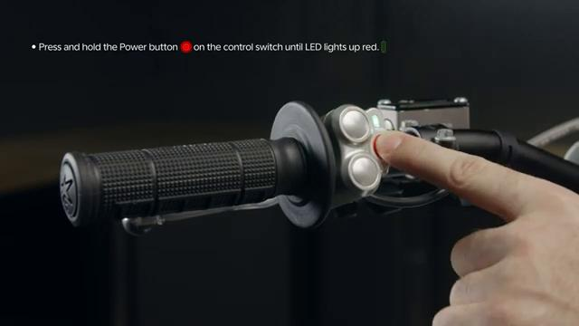
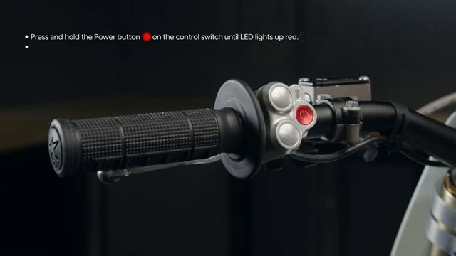
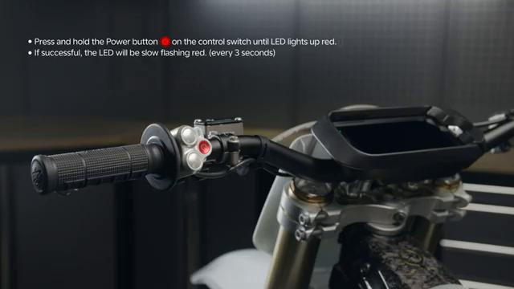

# How to TURN OFF the Stark VARG

Source video: `How to TURN OFF the Stark VARG` by Stark Future Official

Applicable models: `MX`

## Scope

This guide follows the same step-by-step workshop structure as the MX tutorials, but it is derived as a visual sequence from the official Stark Future ASMR video. Because the EX video does not provide usable captions or narration, the procedure is documented through curated screenshots and concise action guidance.

## Preparation

- Place the bike on a stable stand or work area before starting the procedure.
- Prepare the correct tools for the fasteners, clips, brackets, and components shown in the video.
- Keep removed hardware organized in sequence so reassembly follows the same order as the video.
- Have a torque wrench ready for any tightening steps that specify a torque value.

## Procedure

### 1. Stabilize the bike before powering down

Make sure the bike is stopped and secure before switching it off.

### 2. Locate the power-off control

Use the same control area shown in the video for the shutdown command.

### 3. Switch the bike OFF

Perform the power-off action shown and wait for the display and system indicators to power down.

### 4. Confirm the bike has shut off

Verify the bike display and active indicators are off before leaving the bike unattended.

## Critical Checks Before Riding

- Confirm the serviced component is fully seated and all fasteners are tightened in the correct order.
- Recheck all torque-critical hardware before riding.
- Make sure all routed cables, clips, brackets, and surrounding parts are returned to their original positions.
- Inspect the bike visually for any missing hardware before returning it to service.
