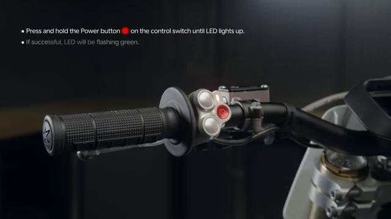

# How to TURN ON the Stark VARG

Source video: `How to TURN ON the Stark VARG` by Stark Future Official

Applicable models: `MX`

## Scope

This guide follows the same step-by-step workshop structure as the MX tutorials, but it is derived as a visual sequence from the official Stark Future ASMR video. Because the EX video does not provide usable captions or narration, the procedure is documented through curated screenshots and concise action guidance.

## Preparation

- Place the bike on a stable stand or work area before starting the procedure.
- Prepare the correct tools for the fasteners, clips, brackets, and components shown in the video.
- Keep removed hardware organized in sequence so reassembly follows the same order as the video.
- Have a torque wrench ready for any tightening steps that specify a torque value.

## Procedure

### 1. Stabilize the bike before power-up

Place the bike in a stable position and make sure the controls and surrounding area are clear before switching it on.

### 2. Locate the main power control

Use the control shown in the video to begin the startup sequence for the bike.

### 3. Switch the bike ON

Press the power control as shown and allow the bike electronics and display to boot fully.

### 4. Confirm the bike has powered up correctly

Check the display or system indicators shown in the video to confirm the bike is awake and ready for the next action.

### 5. Verify normal startup status

Make sure no warning state is shown and confirm the bike remains stable before riding or engaging drive.

## Critical Checks Before Riding

- Confirm the serviced component is fully seated and all fasteners are tightened in the correct order.
- Recheck all torque-critical hardware before riding.
- Make sure all routed cables, clips, brackets, and surrounding parts are returned to their original positions.
- Inspect the bike visually for any missing hardware before returning it to service.
