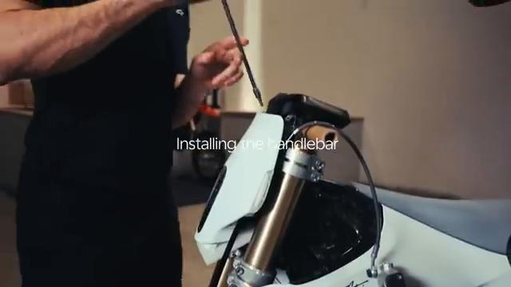
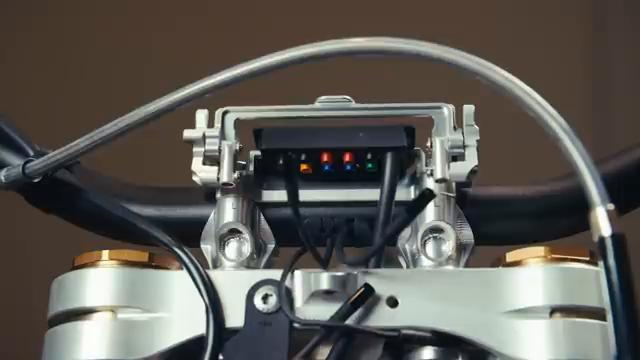
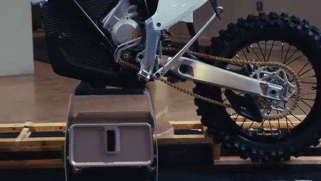
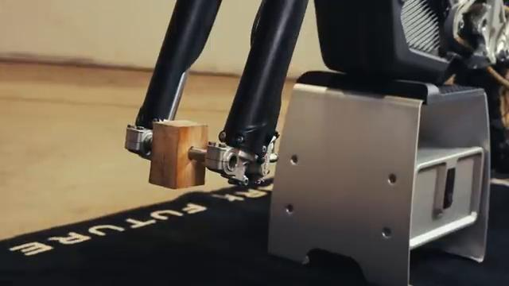
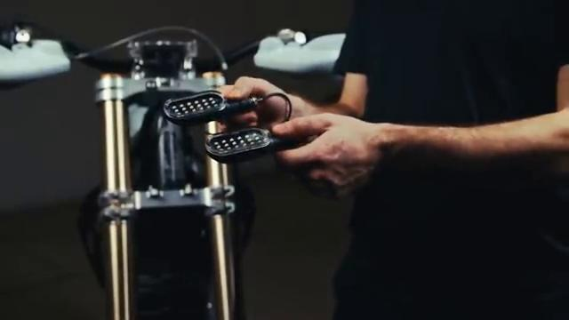
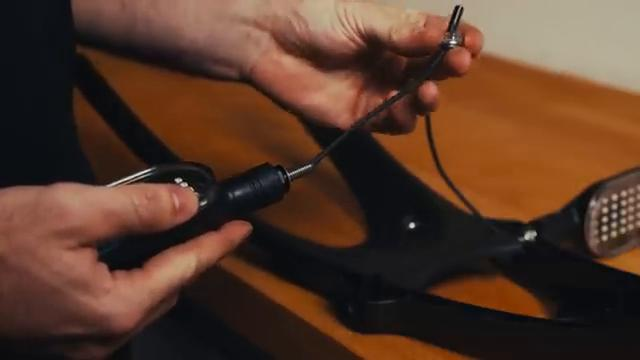
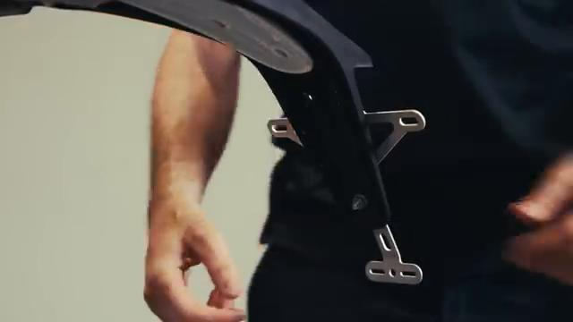

# How to unbox the Stark Varg EX

Source video: `How to unbox the Stark Varg EX` by Stark Future Official

## Scope

This guide follows the same step-by-step workshop structure as the MX tutorials, but it is derived as a visual sequence from the official Stark Future ASMR video. Because the EX video does not provide usable captions or narration, the procedure is documented through curated screenshots and concise action guidance.

## Preparation

- Place the bike on a stable stand or work area before starting the procedure.
- Prepare the correct tools for the fasteners, clips, brackets, and components shown in the video.
- Keep removed hardware organized in sequence so reassembly follows the same order as the video.
- Have a torque wrench ready for any tightening steps that specify a torque value.

## Procedure

### 1. Inspect the shipping package

Check the outer box, straps, and visible packaging condition before opening the crate.

Confirm the crate is stable and that all included parts remain secured before any hardware is removed.

### 2. Remove the outer packaging

Cut and remove the external wrapping, cover panels, and protective packing material shown in the video.

Keep the removed packing pieces clear of the bike so the remaining crate hardware is easy to access.

### 3. Release the crate fasteners and supports

Remove the shipping bolts, brackets, clips, and support pieces that hold the bike and loose parts inside the crate.

Set the shipping hardware aside separately from the service hardware used on the bike.

### 4. Remove the bike from the crate

Lift or roll the bike out of the crate exactly as shown once the shipping restraints are fully removed.

Support the bike carefully so no bodywork, guards, or controls are loaded during the move.

### 5. Install the supplied setup parts

Fit the included parts, guards, or accessories that are supplied separately in the crate.

Install each piece in the same order shown so the mounting hardware, spacers, and brackets stay matched correctly.

### 6. Secure the setup hardware

Install and tighten the visible fasteners for the newly fitted setup parts.

Make sure the parts sit flush and that no clip, washer, or spacer is omitted during assembly.

### 7. Complete the final setup inspection

Check that the bike is fully assembled, all packing materials are removed, and the controls move freely.

Verify the bike is ready for the next setup steps before riding or charging.

## Critical Checks Before Riding

- Confirm the serviced component is fully seated and all fasteners are tightened in the correct order.
- Recheck all torque-critical hardware before riding.
- Make sure all routed cables, clips, brackets, and surrounding parts are returned to their original positions.
- Inspect the bike visually for any missing hardware before returning it to service.
