# How to Unbox the Stark VARG MX

Source video: `How to Unbox the Stark VARG MX` by Stark Future Official

Applicable models: `MX`

## Scope

This guide follows the original Stark Future video overlay sequence for the procedure shown in the original MX tutorial video. Each step below is aligned to the instruction text shown on screen.

## Preparation

- Place the bike on a stable stand or work area before starting the procedure.
- Prepare the correct tools for the fasteners, clips, brackets, and components shown in the video.
- Keep removed hardware organized in sequence so reassembly follows the same order as the video.
- Follow the torque values shown in the original Stark tutorial video wherever the video displays a torque on screen.

## Procedure

### 1. Tighten the do following koved to 4 engr

Tighten the do following koved to 4 engr.

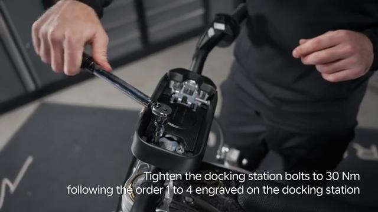

### 2. Tighten the front a bf bolts

Tighten the front a bf bolts.

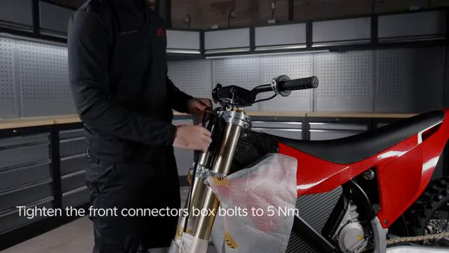

### 3. Tighten the front commectof bf bolts

Tighten the front commectof bf bolts.

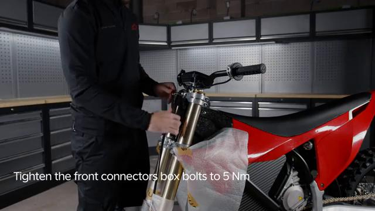

### 4. Tighten the front connect bpx bolts

Tighten the front connect bpx bolts.

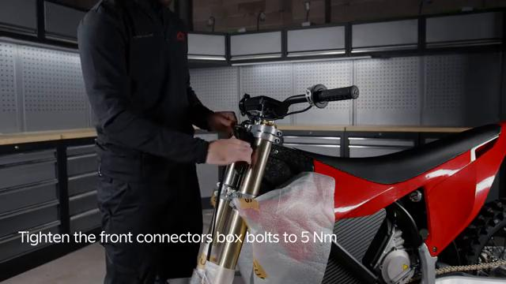

### 5. Ensure to install the charger with the front lid

Ensure to install the charger with the front lid.

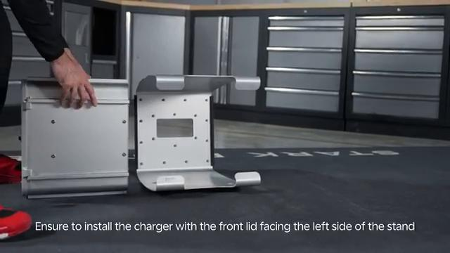

### 6. Charger with the voles

Charger with the voles.

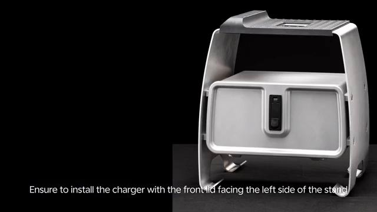

### 7. Tighten the right fork clamp

Tighten the right fork clamp.

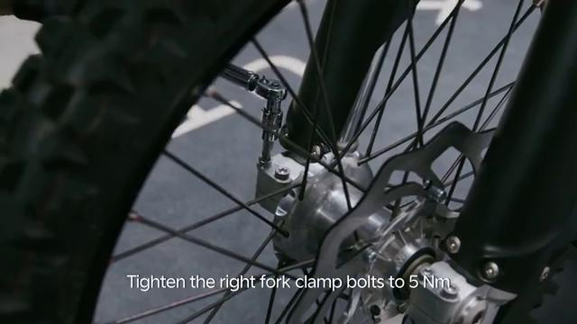

### 8. Loosen the right fork axle clamp

Loosen the right fork axle clamp.

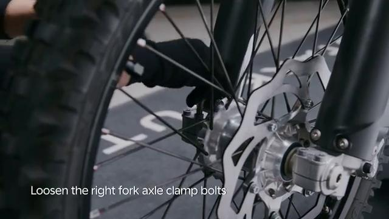

### 9. Tighten all f 2x on the nig

Tighten all f 2x on the nig.

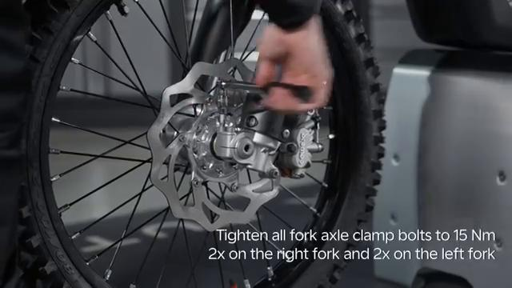

### 10. Tighten a pin

Tighten a pin.

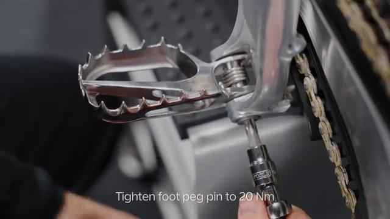

### 11. Tighten pin

Tighten pin.

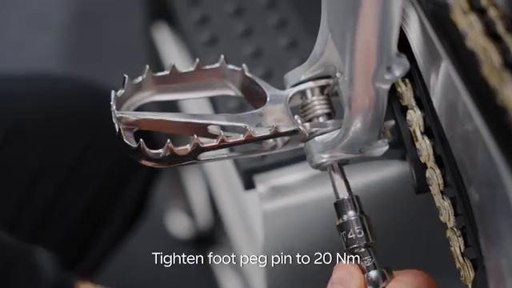

## Critical Checks Before Riding

- Confirm the serviced components are fully seated and all fasteners are tightened in the correct order.
- Recheck all torque-critical hardware before riding.
- Make sure all routed cables, clips, brackets, and surrounding parts are returned to their original positions.
- Inspect the bike visually for any missing hardware before returning it to service.
