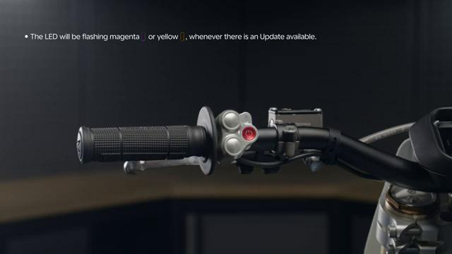
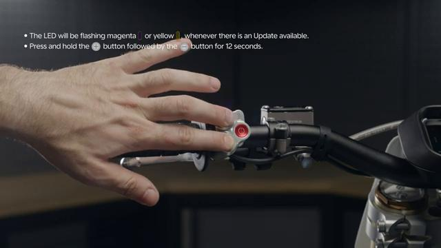
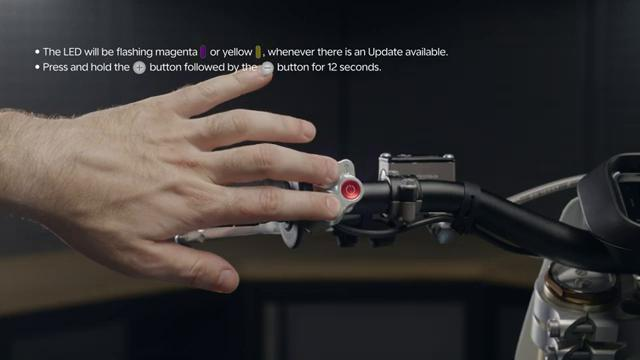
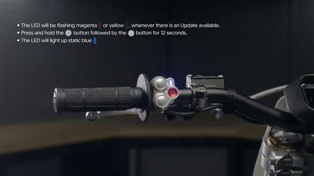
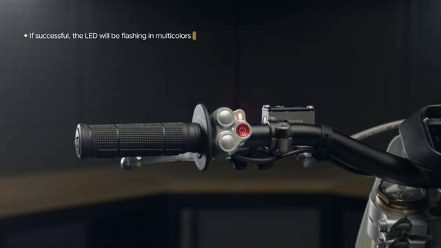
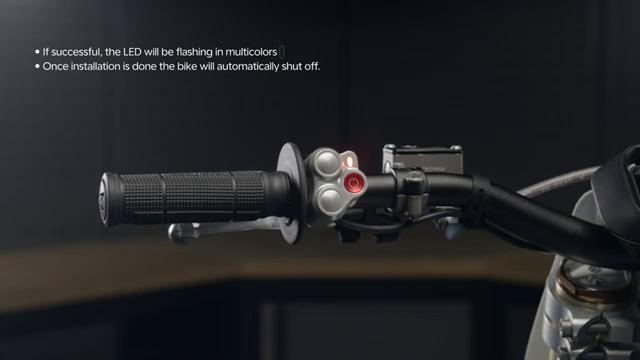

# How to UPDATE the Stark VARG Software

Source video: `How to UPDATE the Stark VARG Software` by Stark Future Official

Applicable models: `MX`

## Scope

This guide follows the same step-by-step workshop structure as the MX tutorials, but it is derived as a visual sequence from the official Stark Future ASMR video. Because the source video does not provide usable captions or narration, the procedure is documented through curated screenshots and concise action guidance.

## Preparation

- Place the bike on a stable stand or work area before starting the procedure.
- Prepare the correct tools for the fasteners, clips, brackets, and components shown in the video.
- Keep removed hardware organized in sequence so reassembly follows the same order as the video.
- Have a torque wrench ready for any tightening steps that specify a torque value.

## Procedure

### 1. Prepare the bike for a software update

Start with the bike stable, powered on, and ready for the update process shown in the video.

### 2. Access the software update screen or workflow

Open the update menu or control path shown in the video to check for available software updates.

### 3. Review the available update

Confirm the update shown on-screen before starting the installation process.

### 4. Start the software update

Begin the update exactly as shown and keep the bike powered and undisturbed while the software installs.

### 5. Wait for the update to complete

Allow the progress sequence to finish without interrupting power, controls, or connections.

### 6. Confirm the updated software status

Check the final screen or version/status indication shown in the video to verify the update completed successfully.

## Critical Checks Before Riding

- Confirm the serviced component is fully seated and all fasteners are tightened in the correct order.
- Recheck all torque-critical hardware before riding.
- Make sure all routed cables, clips, brackets, and surrounding parts are returned to their original positions.
- Inspect the bike visually for any missing hardware before returning it to service.
