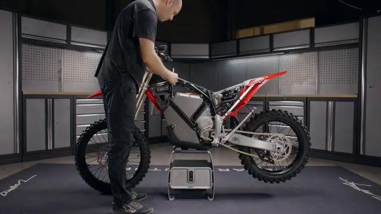
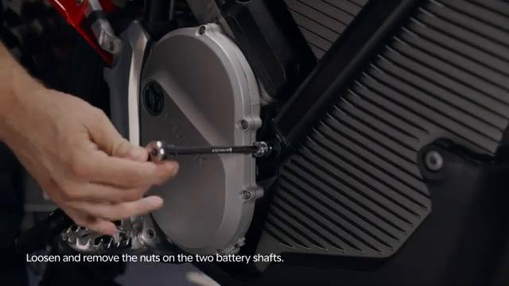
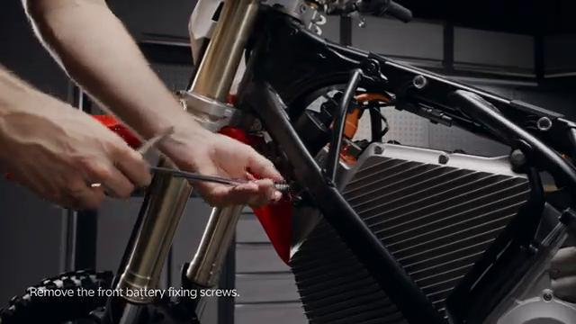
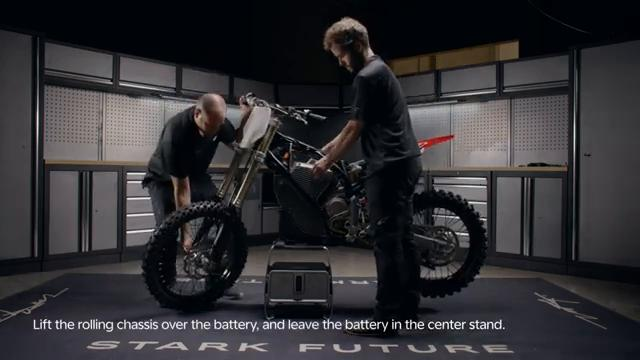
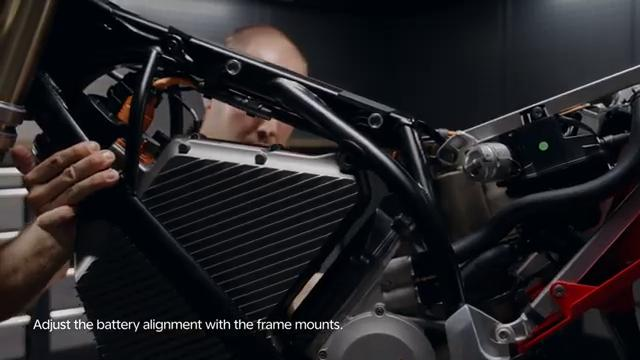
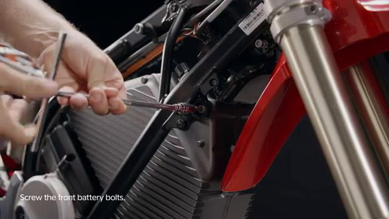
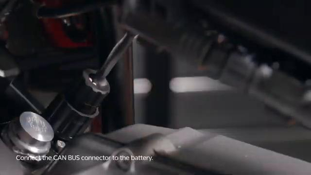

# Remove and Install Battery - Stark VARG

Source video: `Remove and Install Battery - Stark VARG` by Stark Future Official

Applicable models: `MX`

## Scope

This guide follows the same step-by-step workshop structure as the MX tutorials, but it is derived as a visual sequence from the official Stark Future ASMR video. Because the source video does not provide usable captions or narration, the procedure is documented through curated screenshots and concise action guidance.

## Preparation

- Place the bike on a stable stand or work area before starting the procedure.
- Prepare the correct tools for the fasteners, clips, brackets, and components shown in the video.
- Keep removed hardware organized in sequence so reassembly follows the same order as the video.
- Have a torque wrench ready for any tightening steps that specify a torque value.

## Removal Procedure

### 1. Prepare access to the Battery

Remove or move aside the surrounding part, cover, or hardware needed to reach the Battery.

Keep the removed fasteners organized in sequence so reassembly matches the video.

### 2. Remove the visible retaining hardware for the Battery

Remove the bolts, screws, nuts, or clips that directly secure the Battery.

Support the component as the last fastener is removed.

### 3. Release any bracket, clip, or coupling attached to the Battery

Free any bracket, clip, spacer, linkage, or connector that still ties the Battery to the bike.

Note the orientation of these supporting pieces before setting them aside.

### 4. Remove the Battery from the bike

Lift, slide, or guide the Battery out of its mounting position once the retaining hardware is removed.

Inspect the removed part and the mounting points before reassembly.

## Installation Procedure

### 5. Position the Battery for installation

Place the battery on the skid plate and position it firmly on the center of the stand.

With one person holding the battery steady, lift the bike back over the battery.

### 6. Reconnect or refit the support pieces for the Battery

Clean and grease the battery shafts, align the battery mounting holes with the frame, and insert the top and bottom shafts.

Tighten the skid plate side bolts to **15 Nm** before the battery is fully secured.

### 7. Install the retaining hardware for the Battery

Install the battery front mounting bolts and tighten them evenly once the battery is aligned in the frame.

Tighten the battery front mounting bolts to **40 Nm**.

Tighten the battery top shaft nut to **40 Nm**.

Tighten the battery bottom shaft nut to **40 Nm**.

Tighten the skid plate rear bolts to **15 Nm**.

### 8. Verify the completed installation of the Battery

Reconnect the battery power plug and the CAN BUS plug, then remove the protective covers from both sockets.

Reinstall the VCU, spoiler assembly, and front fender as required, then check battery status and normal bike operation before returning the bike to service.

## Torque Summary

| Component | Torque |
| --- | ---: |
| Tighten the skid plate side bolts | 15 Nm |
| Tighten the battery front mounting bolts | 40 Nm |
| Tighten the battery top shaft nut | 40 Nm |
| Tighten the battery bottom shaft nut | 40 Nm |
| Tighten the skid plate rear bolts | 15 Nm |

Verified torque items:

- Tighten the skid plate side bolts: **15 Nm** from Stark technical manual `07.005.01 Remove and install battery`.
- Tighten the battery front mounting bolts: **40 Nm** from Stark technical manual `07.005.01 Remove and install battery`.
- Tighten the battery top shaft nut: **40 Nm** from Stark technical manual `07.005.01 Remove and install battery`.
- Tighten the battery bottom shaft nut: **40 Nm** from Stark technical manual `07.005.01 Remove and install battery`.
- Tighten the skid plate rear bolts: **15 Nm** from Stark technical manual `07.005.01 Remove and install battery`.

## Critical Checks Before Riding

- Confirm the serviced component is fully seated and all fasteners are tightened in the correct order.
- Recheck all torque-critical hardware before riding.
- Make sure all routed cables, clips, brackets, and surrounding parts are returned to their original positions.
- Inspect the bike visually for any missing hardware before returning it to service.
