# Remove and Install Battery - Stark VARG

Source video: `Remove and Install Battery - Stark VARG` by Stark Future Official

Applicable models: `MX`

## Scope

This guide follows the original Stark Future video overlay sequence for the procedure shown in the original MX tutorial video. Each step below is aligned to the instruction text shown on screen.

## Preparation

- Place the bike on a stable stand or work area before starting the procedure.
- Prepare the correct tools for the fasteners, clips, brackets, and components shown in the video.
- Keep removed hardware organized in sequence so reassembly follows the same order as the video.
- Follow the torque values shown in the original Stark tutorial video wherever the video displays a torque on screen.

## Removal Procedure

### 1. Disconnect the handlebar controls

Disconnect the handlebar controls. Refer to: 06.030.07 Disconnect and reconnect handlebar controls ↗.

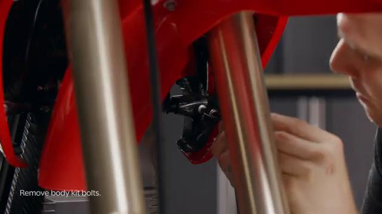

### 2. Remove the carbon fiber spoiler

Remove the carbon fiber spoiler. Refer to: 01.021.01 Remove and install carbon fiber spoiler assembly ↗.

### 3. Remove the front fender

Remove the front fender. Refer to: 01.005.01 Remove and install the front fender ↗. Please take all the necessary precautionary measures to handle high voltage components. High voltage components should only be handled by qualified personnel.

### 4. Disconnect the CAN BUS connector

Disconnect the CAN BUS connector.

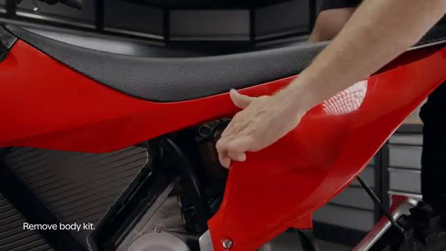

### 5. Install the protective cover onto the CAN BUS socket on the battery

Install the protective cover onto the CAN BUS socket on the battery.

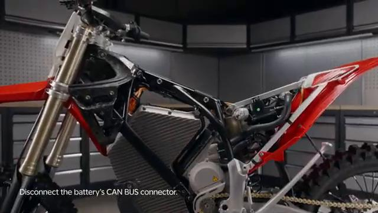

### 6. Disconnect the battery power plug

Disconnect the battery power plug.

### 7. Install the protective cover onto the power socket on the battery

Install the protective cover onto the power socket on the battery.

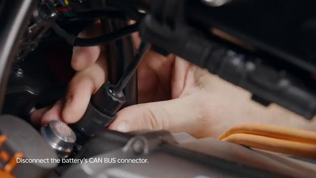

### 8. Remove the VCU

Remove the VCU. Refer to: 04.025.01 Remove and install VCU ↗.

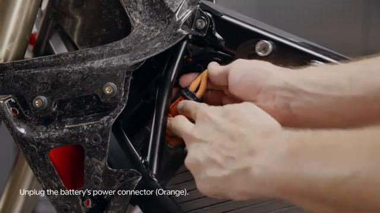

### 9. Untighten the rear skid plate bolts

Untighten the rear skid plate bolts.

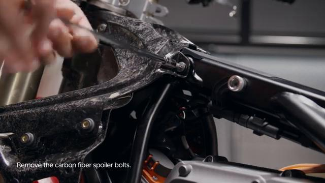

### 10. Untighten the battery front mounting bolts

Untighten the battery front mounting bolts.

### 11. Untighten the battery bottom and top shaft nuts

Untighten the battery bottom and top shaft nuts.

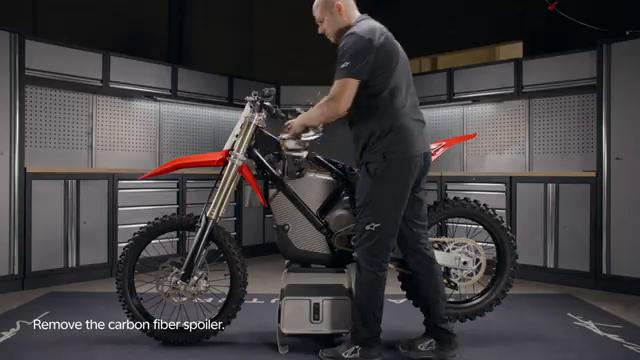

### 12. Pull out the battery bottom shaft

Pull out the battery bottom shaft. Step 12 require at least two people.

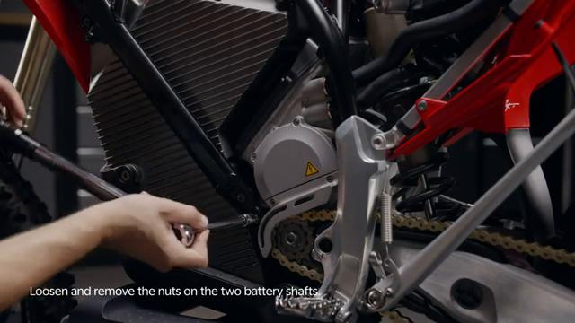

### 13. While one person holds the battery steady on the stand, lift the bike over the battery with the help of another person

While one person holds the battery steady on the stand, lift the bike over the battery with the help of another person.

### 14. Untighten the remaining skid plate bolts

Untighten the remaining skid plate bolts.

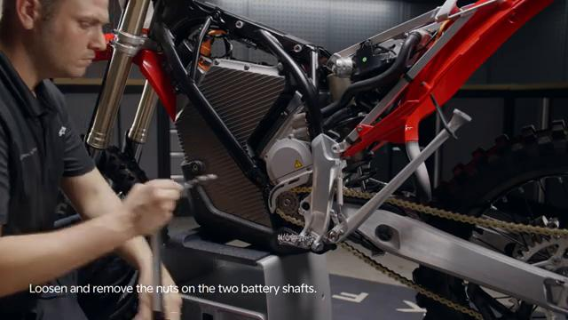

### 15. Separate the battery from the skid plate

Separate the battery from the skid plate.

## Installation Procedure

### 16. Place the battery on the skid plate

Place the battery on the skid plate.

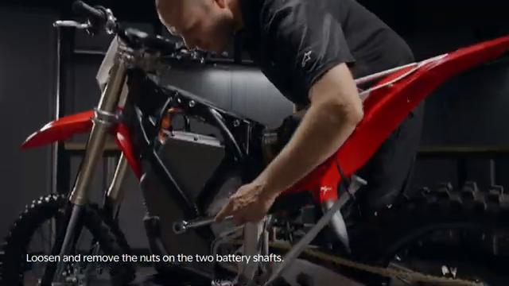

### 17. Tighten the skid plate side bolts to 15 Nm

Tighten the skid plate side bolts to 15 Nm.

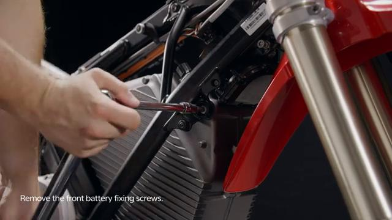

### 18. Place the battery firmly on the center of the stand

Place the battery firmly on the center of the stand. Step 4 require at least two people.

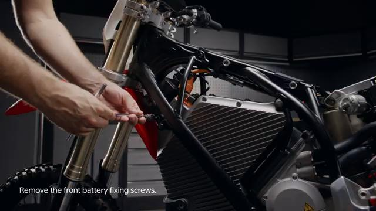

### 19. While one person holds the battery steady on the stand, lift the bike over the battery with the help of another person

While one person holds the battery steady on the stand, lift the bike over the battery with the help of another person.

### 20. Clean and grease the battery shafts

Clean and grease the battery shafts. Ensure to align the battery mounting holes with the frame’s.

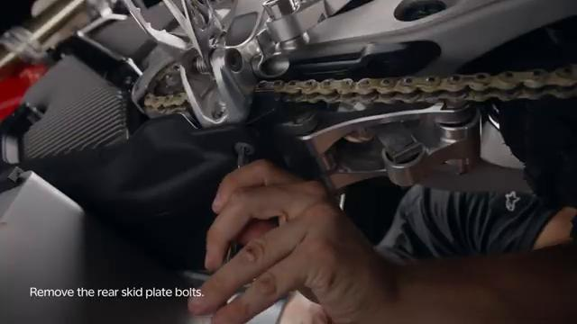

### 21. Insert the battery top shaft

Insert the battery top shaft.

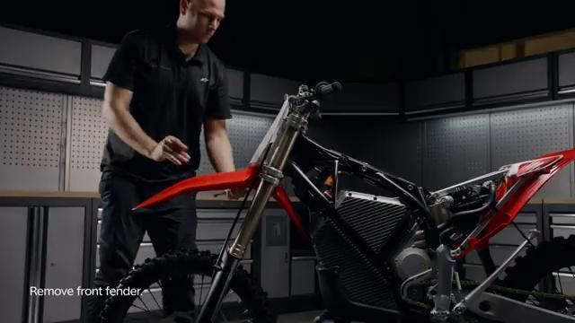

### 22. Insert the battery bottom shaft

Insert the battery bottom shaft.

### 23. Tighten the battery front mounting bolts to 40 Nm

Tighten the battery front mounting bolts to 40 Nm.

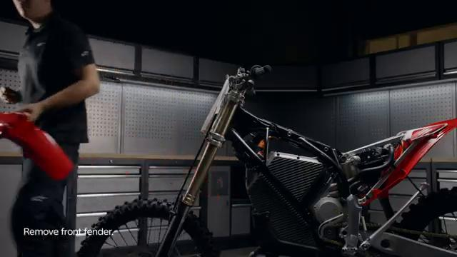

### 24. Tighten the battery top shaft nut to 40 Nm

Tighten the battery top shaft nut to 40 Nm.

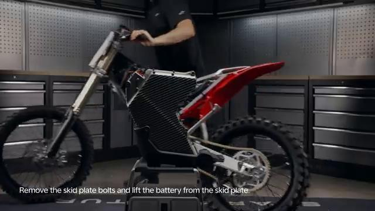

### 25. Tighten the battery bottom shaft nut to 40 Nm

Tighten the battery bottom shaft nut to 40 Nm.

### 26. Tighten the skid plate rear bolts to 15 Nm

Tighten the skid plate rear bolts to 15 Nm.

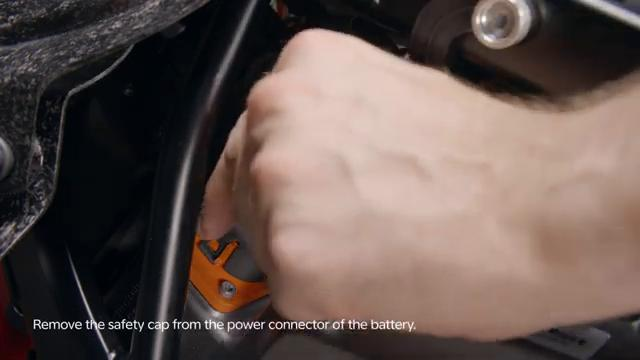

### 27. Install the VCU

Install the VCU. Refer to: 04.025.01 Remove and install VCU ↗.

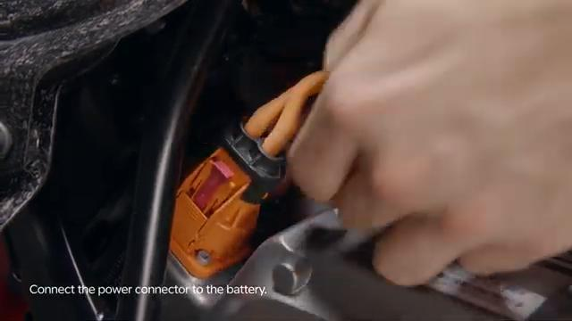

### 28. Remove the protective cover from the power socket on the battery

Remove the protective cover from the power socket on the battery.

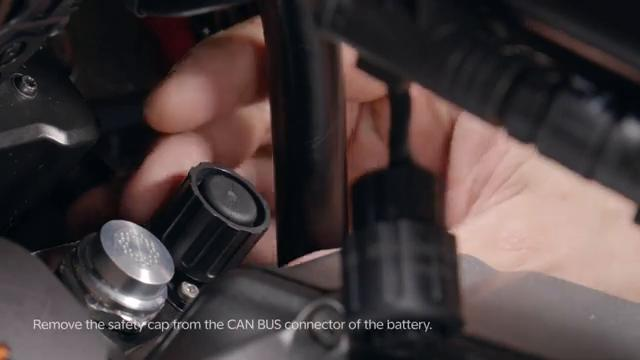

### 29. Connect the battery power plug

Connect the battery power plug.

### 30. Remove the protective cover from the CAN BUS socket on the battery

Remove the protective cover from the CAN BUS socket on the battery.

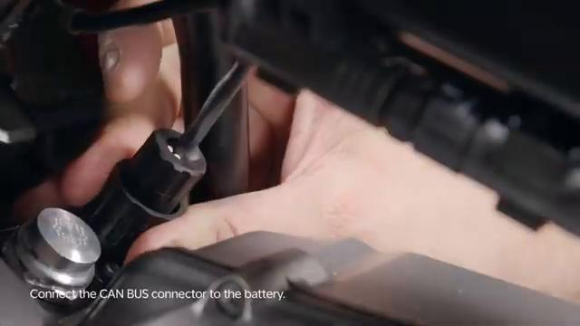

### 31. Connect the CAN BUS plug

Connect the CAN BUS plug.

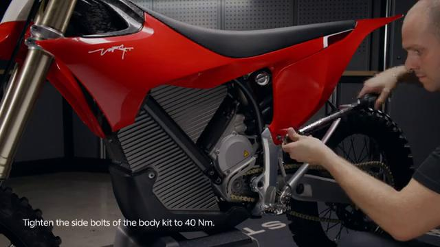

### 32. Install the carbon fiber spoiler assembly

Install the carbon fiber spoiler assembly. Refer to: 01.021.01 Remove and install carbon fiber spoiler assembly ↗.

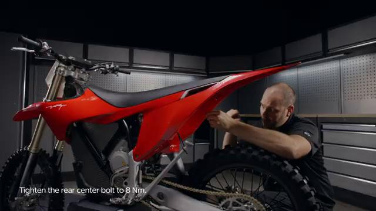

### 33. Install the spoiler assembly

Install the spoiler assembly. Refer to: 01.007.01 Remove and install spoiler assembly ↗.

### 34. Install the front fender

Install the front fender. Refer to: 01.005.01 Remove and install the front fender ↗. Turn ON the bike and connect to the Stark phone to check battery status and that the bike is operating normally after battery replacement. is permitted only with the express written permission.

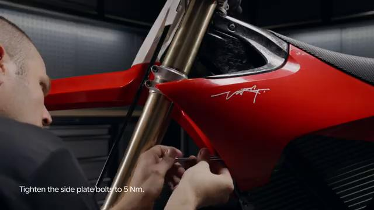

## Torque Summary

| Component | Torque |
| --- | ---: |
| Tighten the skid plate side bolts | 15 Nm |
| Tighten the battery front mounting bolts | 40 Nm |
| Tighten the battery top shaft nut | 40 Nm |
| Tighten the battery bottom shaft nut | 40 Nm |
| Tighten the skid plate rear bolts | 15 Nm |

Verified torque items:

- Tighten the skid plate side bolts: **15 Nm** from the original Stark Future tutorial video text overlay.
- Tighten the battery front mounting bolts: **40 Nm** from the original Stark Future tutorial video text overlay.
- Tighten the battery top shaft nut: **40 Nm** from the original Stark Future tutorial video text overlay.
- Tighten the battery bottom shaft nut: **40 Nm** from the original Stark Future tutorial video text overlay.
- Tighten the skid plate rear bolts: **15 Nm** from the original Stark Future tutorial video text overlay.

## Critical Checks Before Riding

- Confirm the serviced components are fully seated and all fasteners are tightened in the correct order.
- Recheck all torque-critical hardware before riding.
- Make sure all routed cables, clips, brackets, and surrounding parts are returned to their original positions.
- Inspect the bike visually for any missing hardware before returning it to service.
