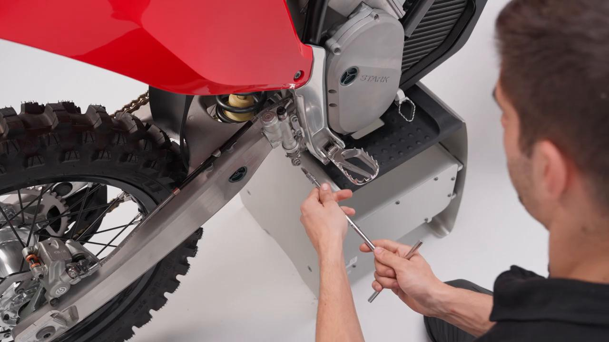
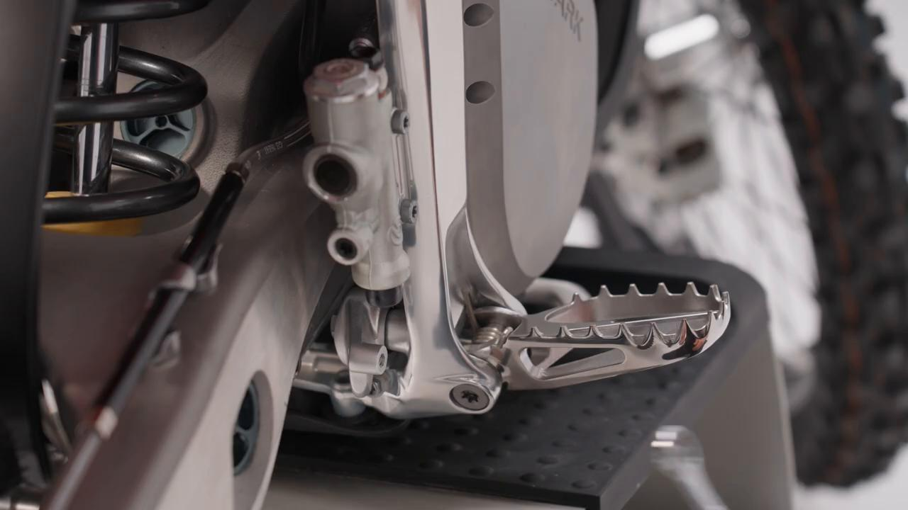
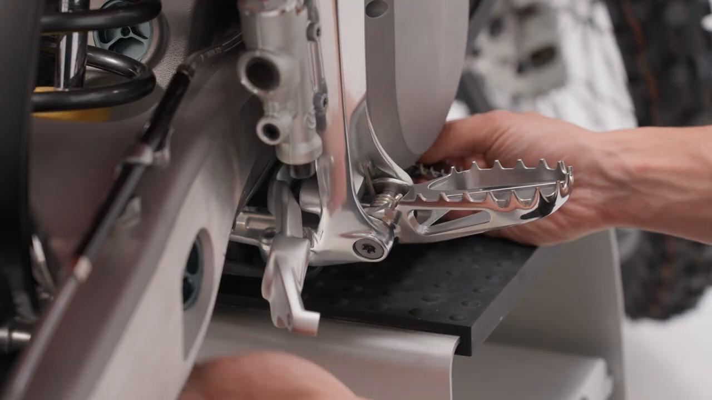
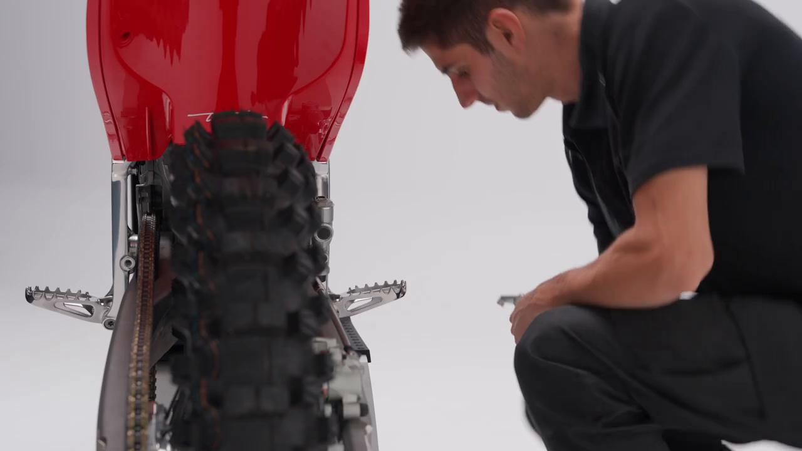
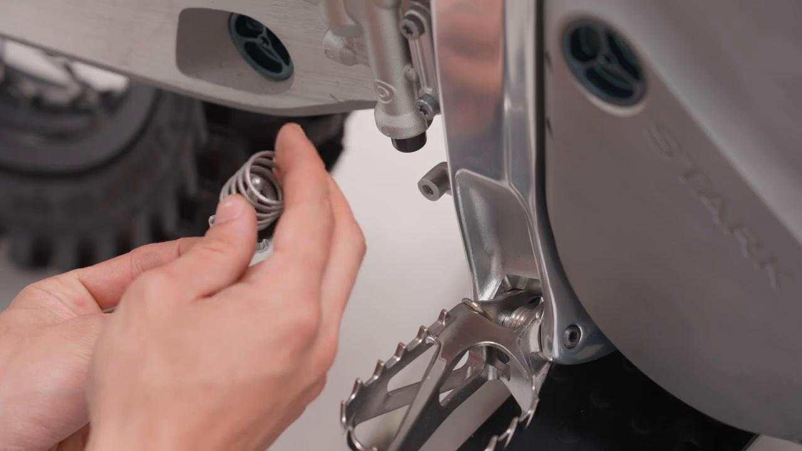
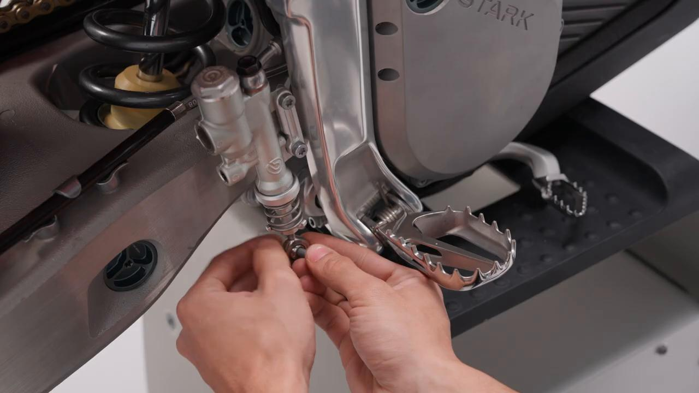
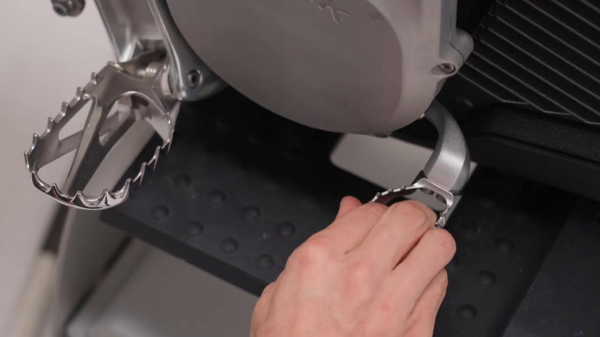

# Remove and Install Brake Pedal - Stark VARG MX 1.2 / EX

Source video: `Remove and Install Brake Pedal - Stark VARG MX 1.2` by Stark Future Official

Applicable models: `MX 1.2 / EX`

## Scope

This guide converts the official Stark Future tutorial video into a step-by-step workshop procedure. It documents each action shown in the video in sequence and pairs every step with a dedicated screenshot.

## Preparation

- Place the bike on a stable stand or work area before starting the procedure.
- Prepare the correct tools for the fasteners, clips, brackets, and components shown in the video.
- Keep removed hardware organized in sequence so reassembly follows the same order as the video.
- Have a torque wrench ready for any tightening steps that specify a torque value.

## Removal Procedure

### 1. Loosen and remove the lever rod–to–brake pedal bolt

Loosen and remove the lever rod–to–brake pedal bolt.

Carefully collect the spring and spring housing during removal.

### 2. Unscrew the rear brake pedal sway bolt

Unscrew the rear brake pedal sway bolt.

### 3. Carefully remove the rear brake pedal

Carefully remove the rear brake pedal.

## Installation Procedure

### 4. Install the brake pedal in its position and tighten the sway bolt to 20 Nm

Install the brake pedal in its position and tighten the sway bolt to **20 Nm**.

### 5. Carefully position the spring and spring housing, then insert the push rod into the rear foot brake master cylinder

Carefully position the spring and spring housing, then insert the push rod into the rear foot brake master cylinder.

### 6. Tighten the lever rod–to–brake pedal bolt to 10 Nm

Tighten the lever rod–to–brake pedal bolt to **10 Nm**.

### 7. Verify that the brake pedal and the entire brake system are functioning correctly

Verify that the brake pedal and the entire brake system are functioning correctly.

## Torque Summary

| Component | Torque |
| --- | ---: |
| Install the brake pedal in its position and tighten the sway bolt | 20 Nm |
| Tighten the lever rod–to–brake pedal bolt | 10 Nm |

Video-sourced torque items:

- Install the brake pedal in its position and tighten the sway bolt: **20 Nm** from the official Stark tutorial video.
- Tighten the lever rod–to–brake pedal bolt: **10 Nm** from the official Stark tutorial video.

## Critical Checks Before Riding

- Confirm the serviced component is fully seated and all fasteners are tightened in the correct order.
- Recheck all torque-critical hardware before riding.
- Make sure all routed cables, clips, brackets, and surrounding parts are returned to their original positions.
- Inspect the bike visually for any missing hardware before returning it to service.
