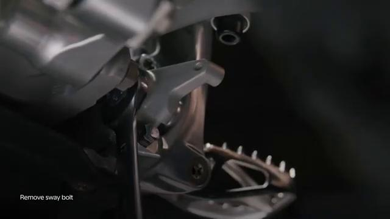
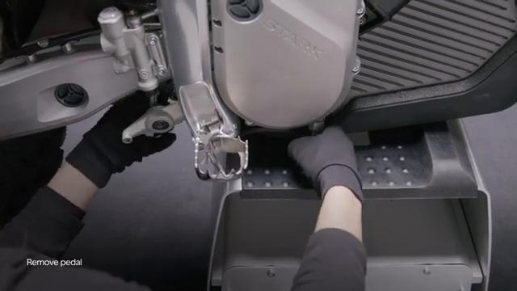
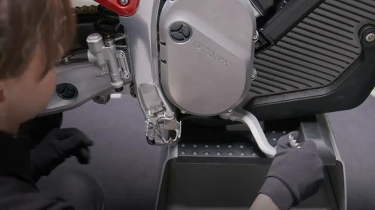
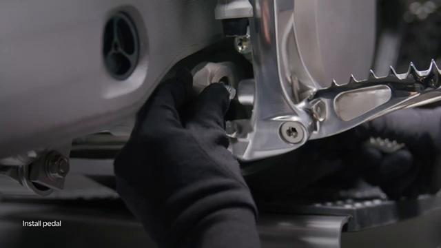
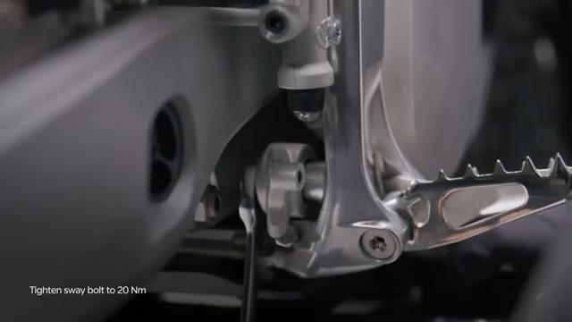
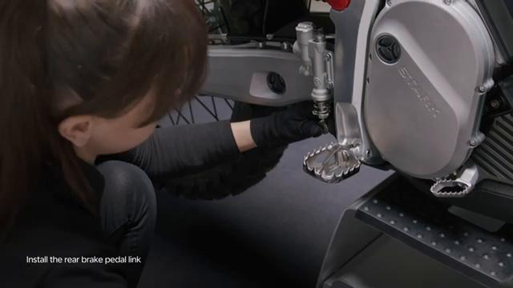
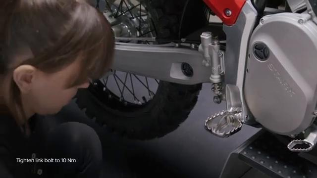

# Remove and Install Brake Pedal - Stark VARG

Source video: `Remove and Install Brake Pedal - Stark VARG` by Stark Future Official

Applicable models: `MX`

## Scope

This guide follows the same step-by-step workshop structure as the MX tutorials, but it is derived as a visual sequence from the official Stark Future ASMR video. Because the source video does not provide usable captions or narration, the procedure is documented through curated screenshots and concise action guidance.

## Preparation

- Place the bike on a stable stand or work area before starting the procedure.
- Prepare the correct tools for the fasteners, clips, brackets, and components shown in the video.
- Keep removed hardware organized in sequence so reassembly follows the same order as the video.
- Have a torque wrench ready for any tightening steps that specify a torque value.

## Removal Procedure

### 1. Prepare access to the Brake Pedal

Hold the foot pedal spring and prepare access around the brake pedal and linkage before removing hardware.

Keep the removed fasteners organized in sequence so reassembly matches the video.

### 2. Remove the visible retaining hardware for the Brake Pedal

Loosen the brake pedal link bolt while supporting the pedal assembly.

Support the component as the last fastener is removed.

### 3. Release any bracket, clip, or coupling attached to the Brake Pedal

Unscrew the sway bolt and release the brake pedal from the linkage.

Note the orientation of these supporting pieces before setting them aside.

### 4. Remove the Brake Pedal from the bike

Carefully slide the brake pedal toward the front of the bike and remove it through the gap between the side plate and the battery.

Inspect the removed part and the mounting points before reassembly.

## Installation Procedure

### 5. Position the Brake Pedal for installation

Gently slide the brake pedal back in through the gap between the side plate and the battery.

Hold the component in place until the first retaining hardware is started.

### 6. Reconnect or refit the support pieces for the Brake Pedal

Install the sway bolt and seat the pedal correctly before final tightening.

Tighten the sway bolt to **20 Nm**.

### 7. Install the retaining hardware for the Brake Pedal

Assemble the brake pedal link and hold the linkage in place while the bolt is started by hand.

### 8. Verify the completed installation of the Brake Pedal

Tighten the brake pedal link bolt to **10 Nm** and verify the pedal returns and moves freely.

Check brake operation before returning the bike to service.

## Torque Summary

| Component | Torque |
| --- | ---: |
| Tighten the sway bolt | 20 Nm |
| Tighten the brake pedal link bolt | 10 Nm |

Verified torque items:

- Tighten the sway bolt: **20 Nm** from Stark technical manual `02.018.01 Remove and install brake pedal`.
- Tighten the brake pedal link bolt: **10 Nm** from Stark technical manual `02.018.01 Remove and install brake pedal`.

## Critical Checks Before Riding

- Confirm the serviced component is fully seated and all fasteners are tightened in the correct order.
- Recheck all torque-critical hardware before riding.
- Make sure all routed cables, clips, brackets, and surrounding parts are returned to their original positions.
- Inspect the bike visually for any missing hardware before returning it to service.
