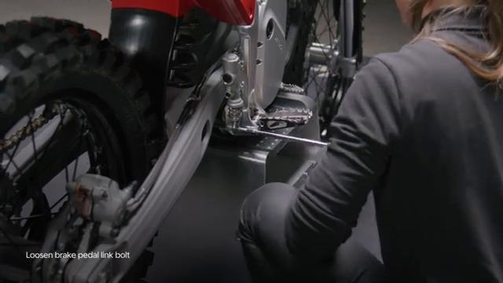
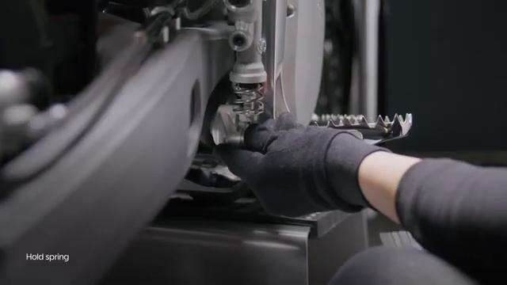
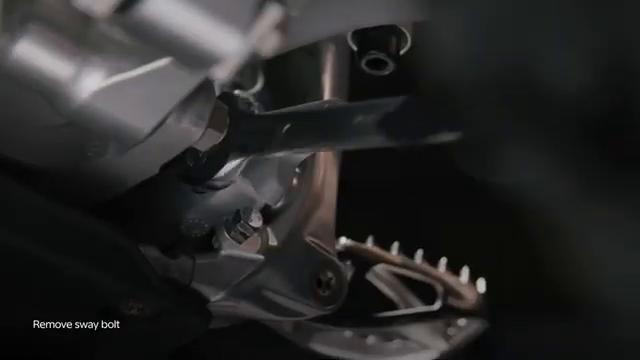
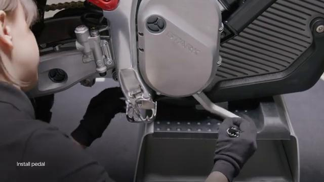
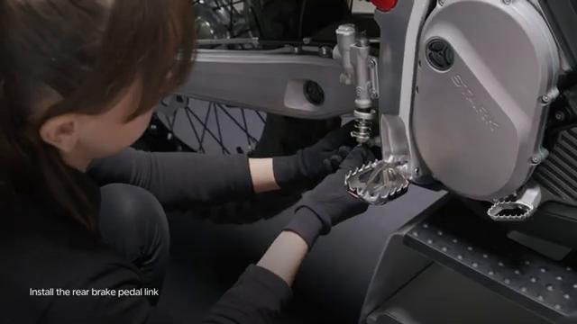
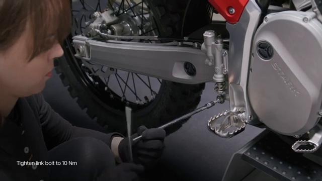
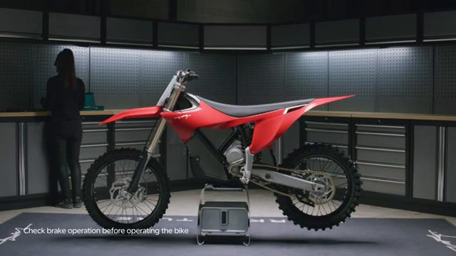
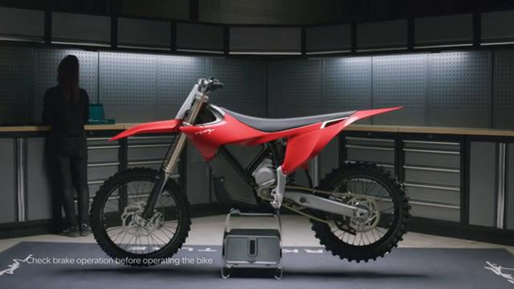

# Remove and Install Brake Pedal - Stark VARG

Source video: `Remove and Install Brake Pedal - Stark VARG` by Stark Future Official

Applicable models: `MX`

## Scope

This guide follows the original Stark Future video overlay sequence for the procedure shown in the original MX tutorial video. Each step below is aligned to the instruction text shown on screen.

## Preparation

- Place the bike on a stable stand or work area before starting the procedure.
- Prepare the correct tools for the fasteners, clips, brackets, and components shown in the video.
- Keep removed hardware organized in sequence so reassembly follows the same order as the video.
- Follow the torque values shown in the original Stark tutorial video wherever the video displays a torque on screen.

## Removal Procedure

### 1. Hold the foot pedal spring

Hold the foot pedal spring.

### 2. Loosen the brake pedal link bolt

Loosen the brake pedal link bolt. Beware of falling objects.

### 3. Unscrew the sway bolt

Unscrew the sway bolt.

### 4. Carefully remove the brake pedal by sliding it towards the front of the bike between the side plate and the battery

Carefully remove the brake pedal by sliding it towards the front of the bike between the side plate and the battery.

## Installation Procedure

### 5. Gently slide the brake pedal in through gap between the side plate and the battery

Gently slide the brake pedal in through gap between the side plate and the battery.

### 6. Tighten the sway bolt to 20 Nm

Tighten the sway bolt to 20 Nm.

### 7. Assemble the brake pedal link

Assemble the brake pedal link.

### 8. Hold the brake pedal link assembly in place and tighten the bolt to 10 Nm

Hold the brake pedal link assembly in place and tighten the bolt to **10 Nm**. Check brake operation before operating the bike.

## Torque Summary

| Component | Torque |
| --- | ---: |
| Tighten the sway bolt | 20 Nm |
| Hold the brake pedal link assembly in place and tighten the bolt | 10 Nm |

Verified torque items:

- Tighten the sway bolt: **20 Nm** from the original Stark Future tutorial video text overlay.
- Hold the brake pedal link assembly in place and tighten the bolt: **10 Nm** from the original Stark Future tutorial video text overlay.

## Critical Checks Before Riding

- Confirm the serviced components are fully seated and all fasteners are tightened in the correct order.
- Recheck all torque-critical hardware before riding.
- Make sure all routed cables, clips, brackets, and surrounding parts are returned to their original positions.
- Inspect the bike visually for any missing hardware before returning it to service.
