# Remove and Install Charging Port - Stark VARG

Source video: `Remove and Install Charging Port - Stark VARG` by Stark Future Official

Applicable models: `MX`

## Scope

This guide follows the original Stark Future video overlay sequence for the procedure shown in the original MX tutorial video. Each step below is aligned to the instruction text shown on screen.

## Preparation

- Place the bike on a stable stand or work area before starting the procedure.
- Prepare the correct tools for the fasteners, clips, brackets, and components shown in the video.
- Keep removed hardware organized in sequence so reassembly follows the same order as the video.
- Follow the torque values shown in the original Stark tutorial video wherever the video displays a torque on screen.

## Removal Procedure

### 1. Remove the spoiler assembly

Remove the spoiler assembly. Refer to: 01.007.01 Remove and install spoiler assembly ↗. Please take all the necessary precautionary measures to handle high voltage components. High voltage components should only be handled by qualified personnel.

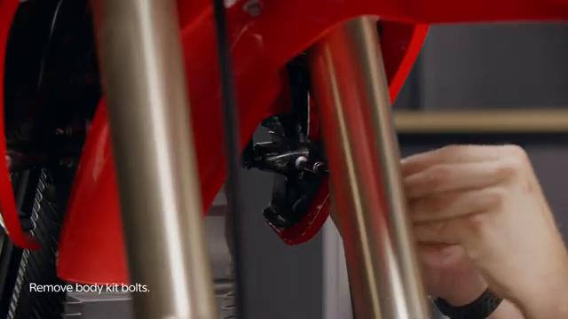

### 2. Disconnect the CAN BUS connector

Disconnect the CAN BUS connector.

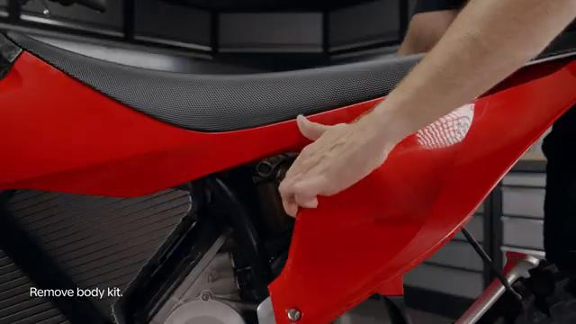

### 3. Install the protective cover onto the CAN BUS socket on the battery

Install the protective cover onto the CAN BUS socket on the battery.

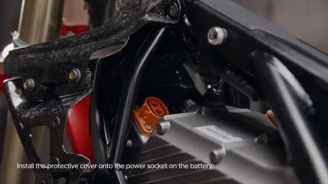

### 4. Disconnect the battery power plug

Disconnect the battery power plug.

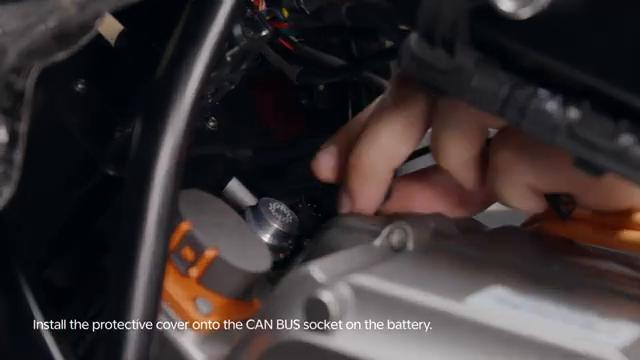

### 5. Install the protective cover onto the power socket on the battery

Install the protective cover onto the power socket on the battery.

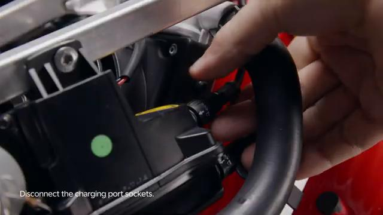

### 6. Disconnect the charging port sockets

Disconnect the charging port sockets.

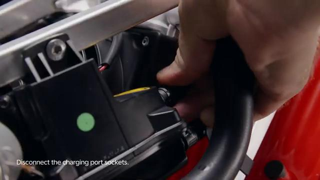

### 7. Untighten the charging port bolts

Untighten the charging port bolts.

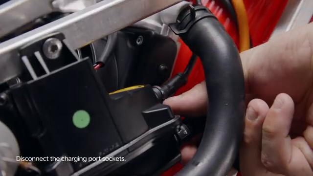

### 8. Remove the charging port

Remove the charging port.

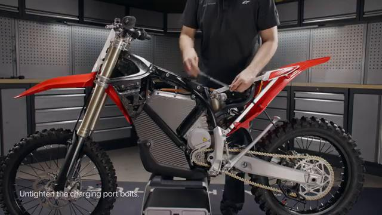

## Installation Procedure

### 9. Place the charging port in place

Place the charging port in place.

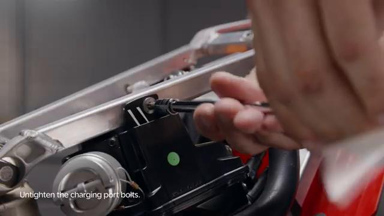

### 10. Tighten the charging port bolts to 5 Nm

Tighten the charging port bolts to 5 Nm.

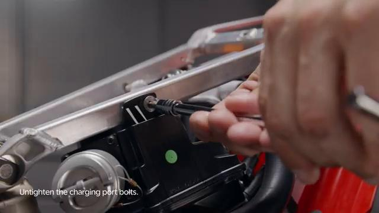

### 11. Connect the charging port sockets

Connect the charging port sockets. Please take all the necessary precaucionary measures to handle high voltage components. High voltage components should only be handled by qualified personnel.

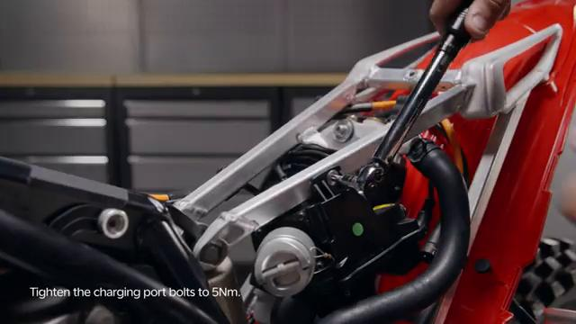

### 12. Remove the protective cover onto the power socket on the battery

Remove the protective cover onto the power socket on the battery.

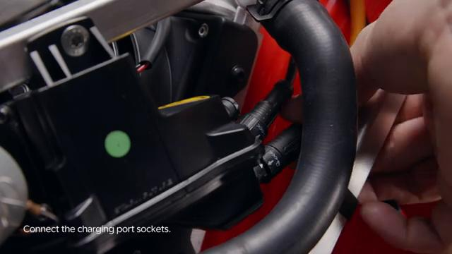

### 13. Connect the battery power plug

Connect the battery power plug.

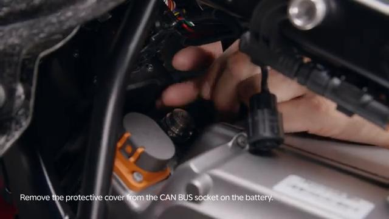

### 14. Remove the protective cover onto the CAN BUS socket on the battery

Remove the protective cover onto the CAN BUS socket on the battery.

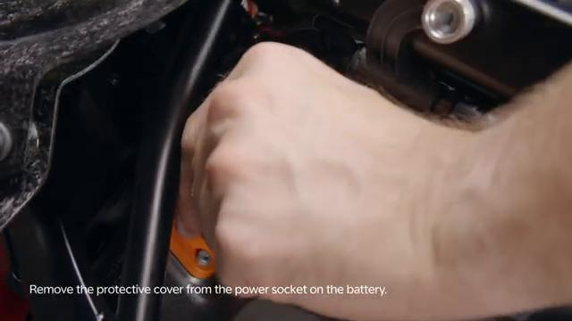

### 15. Connect the CAN BUS connector

Connect the CAN BUS connector.

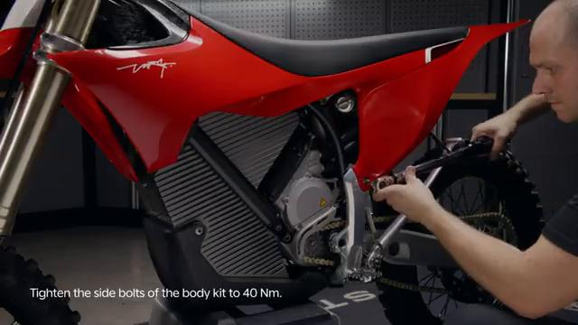

### 16. Install the spoiler assembly

Install the spoiler assembly. Refer to: 01.007.01 Remove and install spoiler assembly ↗. Turn ON the bike and connect to the Stark phone to check battery status and that the bike is operating normally after disconnecting electronic components. is permitted only with the express written permission.

## Torque Summary

| Component | Torque |
| --- | ---: |
| Tighten the charging port bolts | 5 Nm |

Verified torque items:

- Tighten the charging port bolts: **5 Nm** from the original Stark Future tutorial video text overlay.

## Critical Checks Before Riding

- Confirm the serviced components are fully seated and all fasteners are tightened in the correct order.
- Recheck all torque-critical hardware before riding.
- Make sure all routed cables, clips, brackets, and surrounding parts are returned to their original positions.
- Inspect the bike visually for any missing hardware before returning it to service.
