# Remove and Install Control Switch - Stark VARG

Source video: `Remove and Install Control Switch - Stark VARG` by Stark Future Official

Applicable models: `MX`

## Scope

This guide follows the original Stark Future video overlay sequence for the control switch procedure. Each step below is aligned to the instruction text shown on screen in the original MX tutorial video.

## Preparation

- Place the bike on a stable stand or work area before starting the procedure.
- Prepare the correct tools for the front number plate, junction box, control switch clamp, and wiring clips shown in the video.
- Keep removed hardware organized in sequence so reassembly follows the same order as the video.
- Follow the torque values shown in the original Stark tutorial video wherever the video displays a torque on screen.

## Removal Procedure

### 1. Remove number plate bolt

Remove the front number plate bolt.

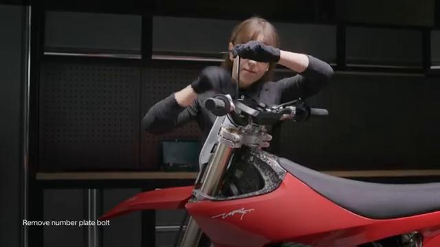

### 2. Remove number plate up and outward

Lift the front number plate up and outward to remove it.

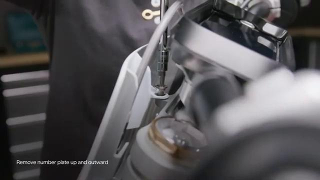

### 3. Remove junction box lid

Remove the junction box lid.

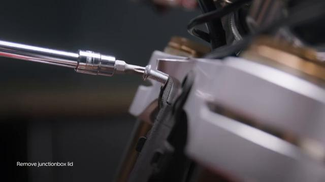

### 4. Loosen connectors

Loosen the connectors in the junction box area.

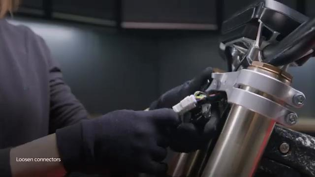

### 5. Disconnect the plugs

Disconnect the plugs.

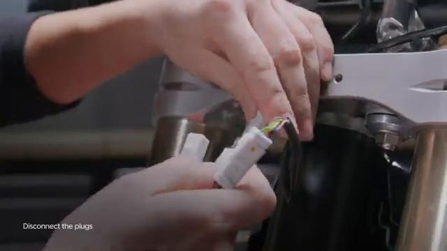

### 6. Remove rubber strap

Remove the rubber strap.

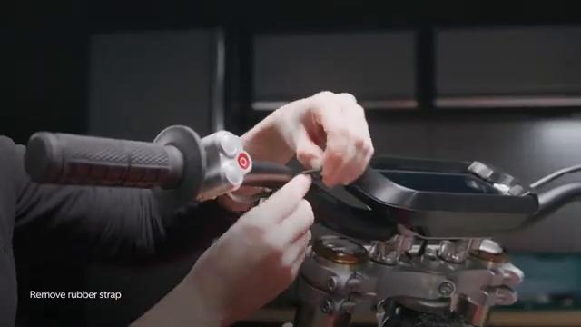

### 7. Hold switch and remove clamp bolt

Hold the switch and remove the clamp bolt.

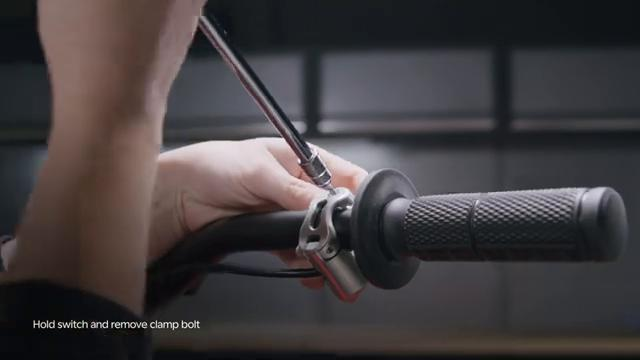

### 8. Remove the switch

Remove the control switch.

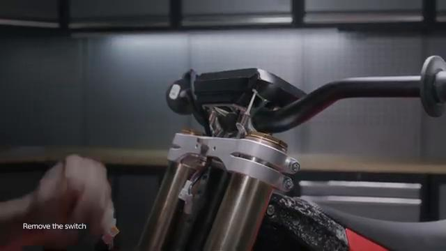

## Installation Procedure

### 9. Hold switch in place and tighten clamp bolt

Hold the switch in place on the handlebar and start tightening the clamp bolt.

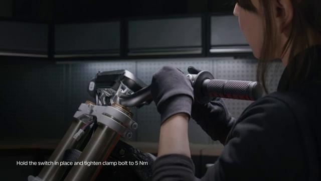

### 10. Tighten clamp bolt to 5 Nm

Tighten the control switch clamp bolt to **5 Nm**.

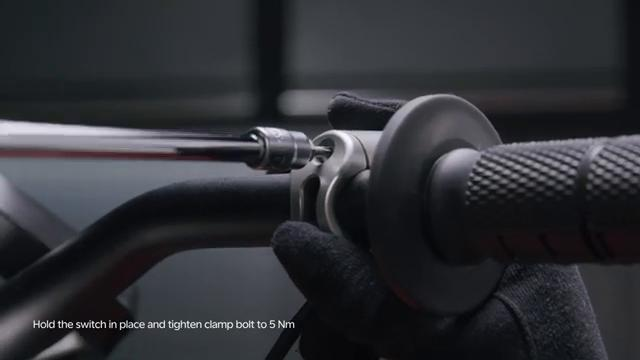

### 11. Connect the plugs

Connect the plugs.

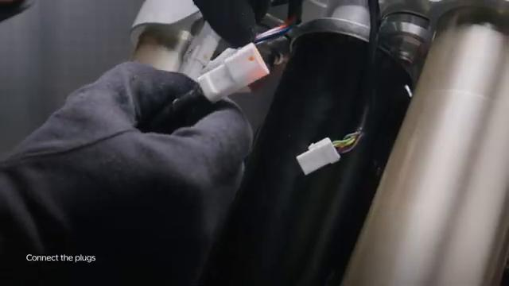

### 12. Clip connectors onto the junction box

Clip the connectors onto the junction box.

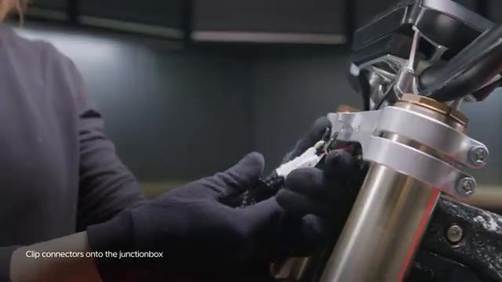

### 13. Tighten junction box bolts

Tighten the junction box bolts.

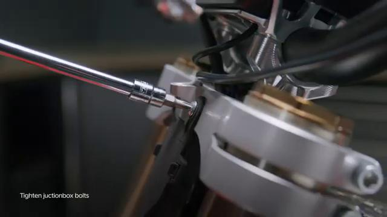

### 14. Tighten number plate bolt to 8 Nm

Tighten the front number plate bolt to **8 Nm**.

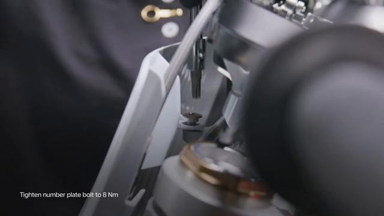

## Torque Summary

| Component | Torque |
| --- | ---: |
| Tighten control switch clamp bolt | 5 Nm |
| Tighten number plate bolt | 8 Nm |

Verified torque items:

- Tighten the control switch clamp bolt: **5 Nm** from the original Stark Future tutorial video text overlay.
- Tighten the front number plate bolt: **8 Nm** from the original Stark Future tutorial video text overlay.

## Critical Checks Before Riding

- Confirm the control switch is seated correctly on the handlebar and does not rotate unexpectedly.
- Recheck all torque-critical hardware before riding.
- Make sure the plugs, junction box connectors, and rubber strap are returned to their original positions.
- Inspect the bike visually for any missing hardware before returning it to service.
