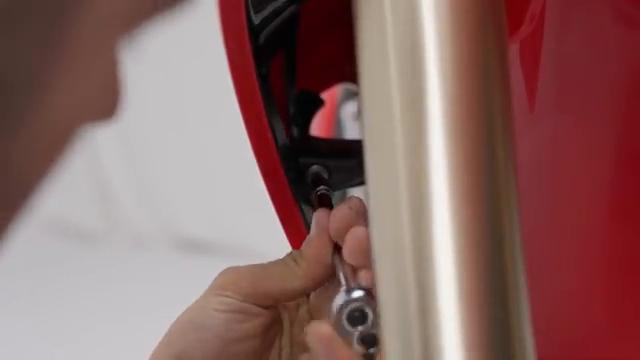
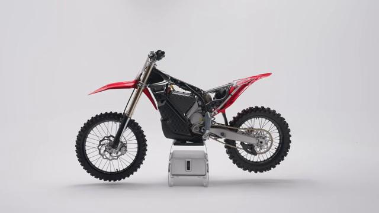
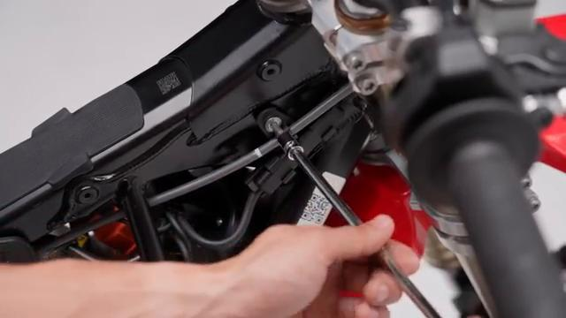
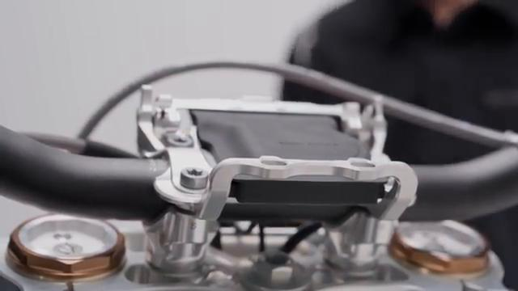
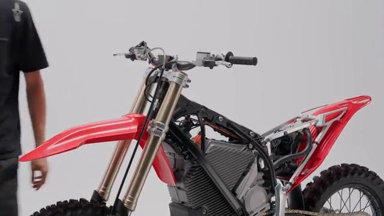
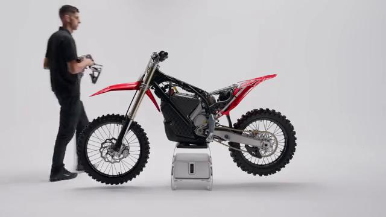
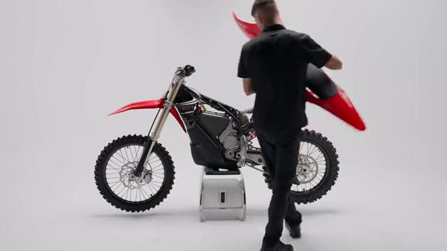
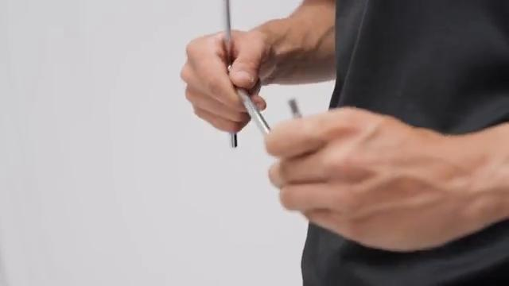

# Remove and Install Docking Station - Stark VARG MX 1.2

Source video: `Remove and Install Docking Station - Stark VARG MX 1.2` by Stark Future Official

## Scope

This guide follows the same step-by-step workshop structure as the MX tutorials, but it is derived as a visual sequence from the official Stark Future ASMR video. Because the EX video does not provide usable captions or narration, the procedure is documented through curated screenshots and concise action guidance.

## Preparation

- Place the bike on a stable stand or work area before starting the procedure.
- Prepare the correct tools for the fasteners, clips, brackets, and components shown in the video.
- Keep removed hardware organized in sequence so reassembly follows the same order as the video.
- Have a torque wrench ready for any tightening steps that specify a torque value.

## Removal Procedure

### 1. Prepare access to the Docking Station

Remove or move aside the surrounding part, cover, or hardware needed to reach the Docking Station.

Keep the removed fasteners organized in sequence so reassembly matches the video.

### 2. Remove the visible retaining hardware for the Docking Station

Remove the bolts, screws, nuts, or clips that directly secure the Docking Station.

Support the component as the last fastener is removed.

### 3. Release any bracket, clip, or coupling attached to the Docking Station

Free any bracket, clip, spacer, linkage, or connector that still ties the Docking Station to the bike.

Note the orientation of these supporting pieces before setting them aside.

### 4. Remove the Docking Station from the bike

Lift, slide, or guide the Docking Station out of its mounting position once the retaining hardware is removed.

Inspect the removed part and the mounting points before reassembly.

## Installation Procedure

### 5. Position the Docking Station for installation

Return the Docking Station to its mounting position and align the holes, tabs, or locating surfaces.

Hold the component in place until the first retaining hardware is started.

### 6. Reconnect or refit the support pieces for the Docking Station

Reinstall any bracket, clip, spacer, linkage, or coupling associated with the Docking Station.

Make sure each supporting piece is seated correctly before final tightening.

### 7. Install the retaining hardware for the Docking Station

Install the main retaining hardware for the Docking Station by hand first, then tighten it evenly.

Check that the component remains aligned while the hardware is brought fully home.

### 8. Verify the completed installation of the Docking Station

Inspect the final position of the Docking Station and confirm that all hardware, clips, and surrounding parts are back in place.

Check the component for correct fit and movement before returning the bike to service.

## Critical Checks Before Riding

- Confirm the serviced component is fully seated and all fasteners are tightened in the correct order.
- Recheck all torque-critical hardware before riding.
- Make sure all routed cables, clips, brackets, and surrounding parts are returned to their original positions.
- Inspect the bike visually for any missing hardware before returning it to service.
