# Remove and Install Docking Station - Stark VARG

Source video: `Remove and Install Docking Station - Stark VARG` by Stark Future Official

Applicable models: `MX`

## Scope

This guide follows the original Stark Future video overlay sequence for the docking station procedure. Each step below is aligned to the instruction text shown on screen in the original MX tutorial video.

## Preparation

- Place the bike on a stable stand or work area before starting the procedure.
- Prepare the correct tools for the number plate, junction box, docking station bolts, and phone mount hardware shown in the video.
- Keep removed hardware organized in sequence so reassembly follows the same order as the video.
- Follow the torque values shown in the original Stark tutorial video wherever the video displays a torque on screen.

## Removal Procedure

### 1. Remove phone

Remove the phone from the docking station.

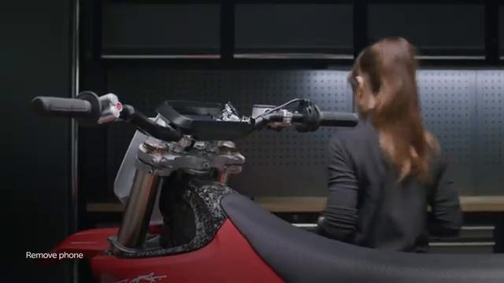

### 2. Remove number plate bolt

Remove the front number plate bolt.

### 3. Remove number plate up and outward

Lift the front number plate up and outward to remove it.

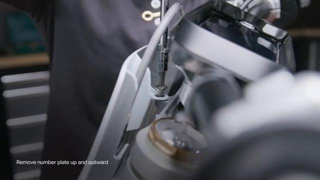

### 4. Remove junction box lid

Remove the junction box lid.

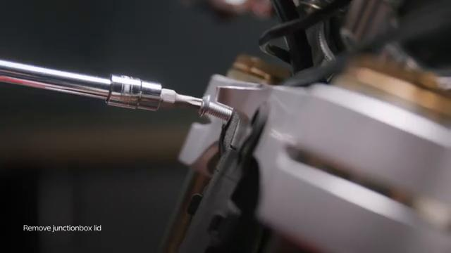

### 5. Disconnect the plugs

Disconnect the plugs.

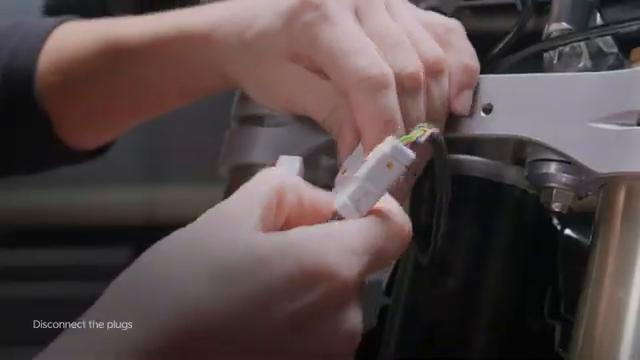

### 6. Take note of the handlebar angle before loosening docking station bolts

Note the handlebar angle before loosening the docking station bolts so it can be restored during assembly.

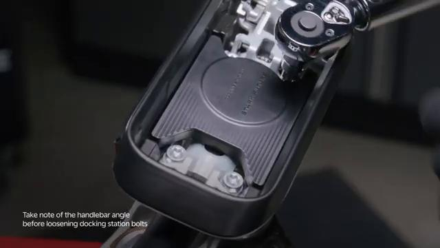

### 7. Remove docking station bolts

Remove the docking station bolts.

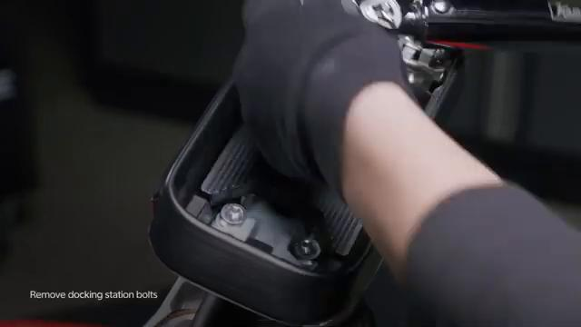

### 8. Remove docking station

Remove the docking station.

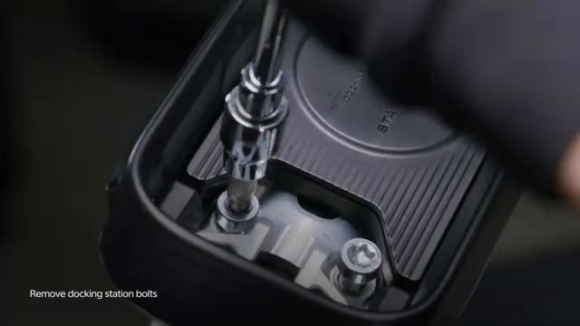

## Installation Procedure

### 9. Insert the bolts in the docking station

Insert the bolts in the docking station.

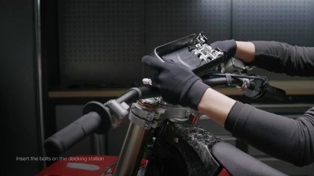

### 10. Tighten bolts

Tighten the docking station bolts evenly while keeping the handlebar angle aligned with the note taken during removal.

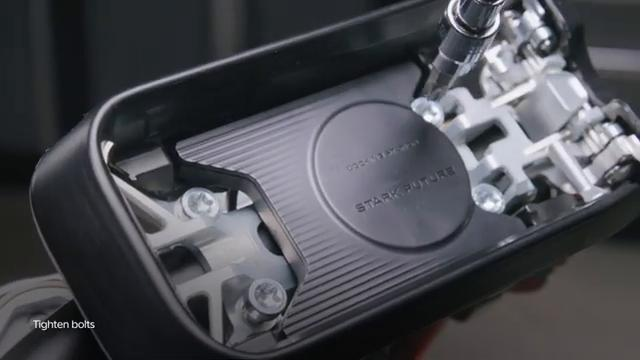

### 11. Tighten bolts to 30 Nm

Tighten the docking station bolts to **30 Nm**.

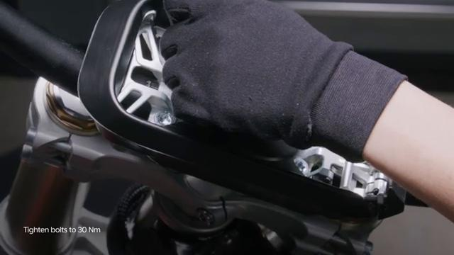

### 12. Connect the plugs

Connect the plugs.

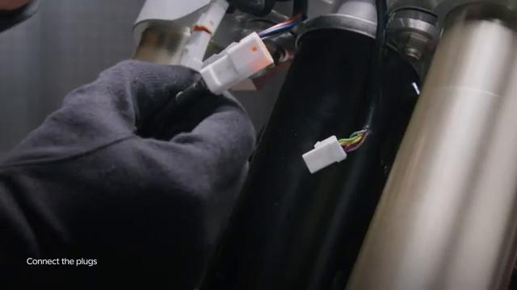

### 13. Clip connectors onto the junction box

Clip the connectors onto the junction box.

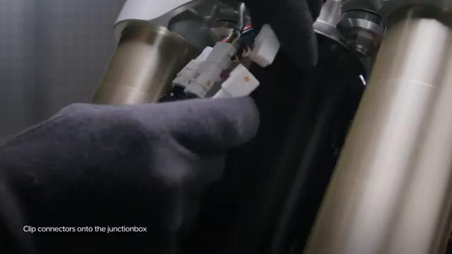

### 14. Tighten junction box bolts

Tighten the junction box bolts.

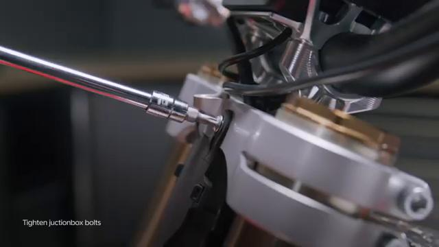

### 15. Tighten front number plate bolt to 8 Nm

Tighten the front number plate bolt to **8 Nm**.

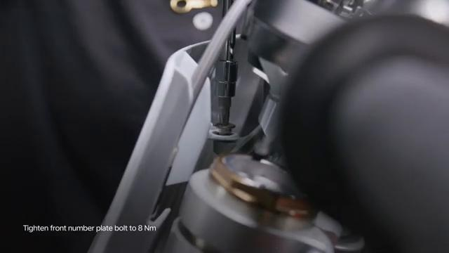

### 16. Insert phone in the docking station left side first

Insert the phone into the docking station left side first.

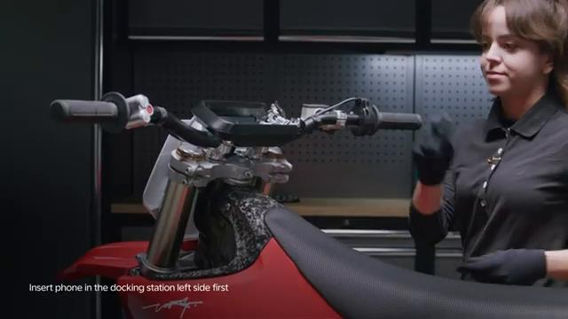

### 17. Ensure the phone is secure before operating the bike

Ensure the phone is secure before operating the bike.

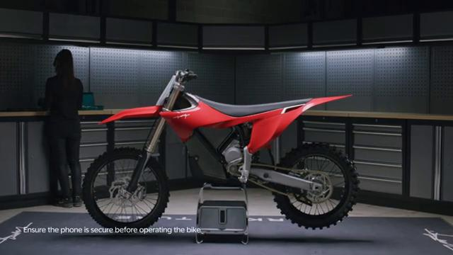

## Torque Summary

| Component | Torque |
| --- | ---: |
| Tighten docking station bolts | 30 Nm |
| Tighten front number plate bolt | 8 Nm |

Verified torque items:

- Tighten the docking station bolts: **30 Nm** from the original Stark Future tutorial video text overlay.
- Tighten the front number plate bolt: **8 Nm** from the original Stark Future tutorial video text overlay.

## Critical Checks Before Riding

- Confirm the docking station is aligned to the original handlebar angle and fully seated.
- Recheck all torque-critical hardware before riding.
- Make sure the plugs, junction box connectors, and front number plate are returned to their original positions.
- Check that the phone locks in securely before operating the bike.
