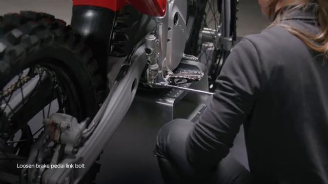
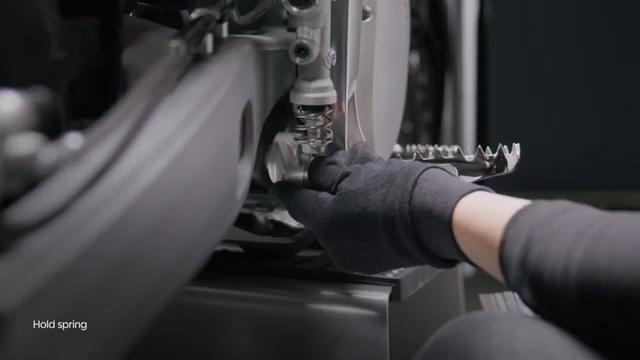
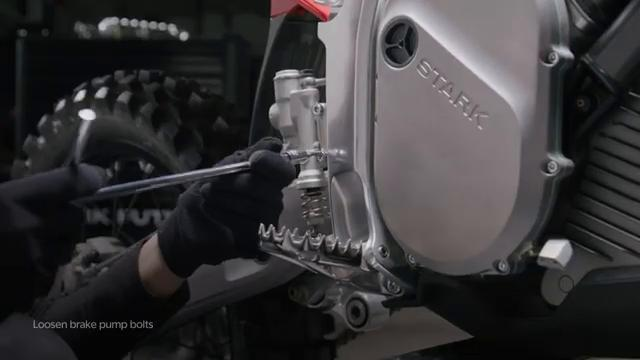
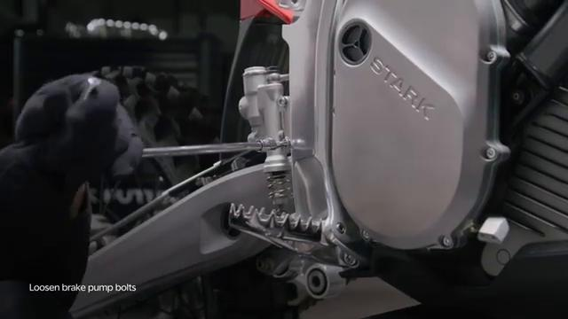
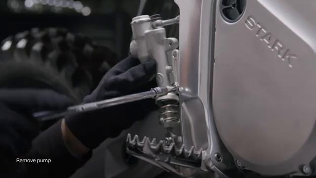
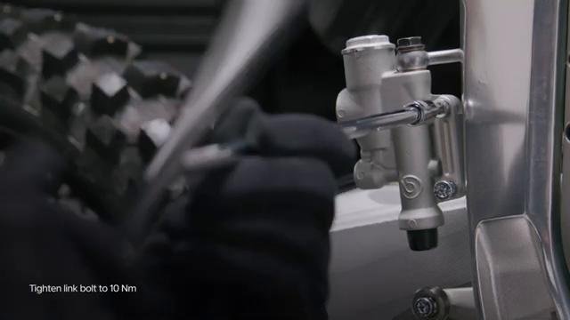
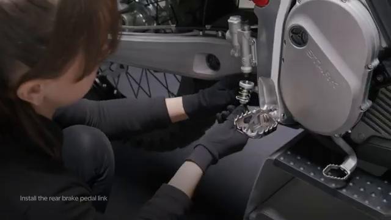
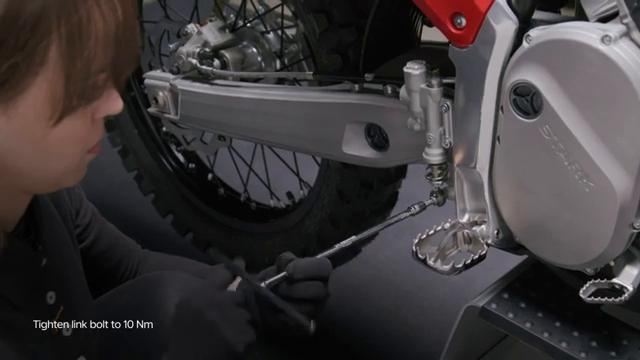
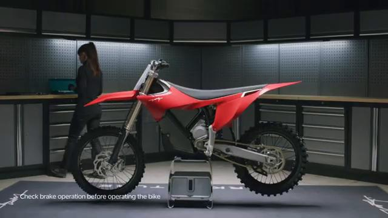

# Remove and Install Foot Brake Master Cylinder - Stark VARG

Source video: `Remove and Install Foot Brake Master Cylinder - Stark VARG` by Stark Future Official

Applicable models: `MX`

## Scope

This guide follows the original Stark Future video overlay sequence for the procedure shown in the original MX tutorial video. Each step below is aligned to the instruction text shown on screen.

## Preparation

- Place the bike on a stable stand or work area before starting the procedure.
- Prepare the correct tools for the fasteners, clips, brackets, and components shown in the video.
- Keep removed hardware organized in sequence so reassembly follows the same order as the video.
- Follow the torque values shown in the original Stark tutorial video wherever the video displays a torque on screen.

## Removal Procedure

### 1. Hold the foot pedal spring

Hold the foot pedal spring.

### 2. Unscrew the pedal link bolt

Unscrew the pedal link bolt. Beware of falling objects.

### 3. Unscrew the foot brake master cylinder bolts

Unscrew the foot brake master cylinder bolts.

### 4. Remove the master cylinder

Remove the master cylinder.

## Installation Procedure

### 5. Hold the foot brake master cylinder in place

Hold the foot brake master cylinder in place.

### 6. Tighten the foot brake master cylinder bolts to 10 Nm

Tighten the foot brake master cylinder bolts to 10 Nm.

### 7. Assemble the brake pedal link

Assemble the brake pedal link.

### 8. Hold the assembled brake pedal link in place

Hold the assembled brake pedal link in place.

### 9. Tighten the brake pedal link bolt to 10 Nm

Tighten the brake pedal link bolt to 10 Nm. Check brakes operation before operating the bike. is permitted only with the express written permission.

## Torque Summary

| Component | Torque |
| --- | ---: |
| Tighten the foot brake master cylinder bolts | 10 Nm |
| Tighten the brake pedal link bolt | 10 Nm |

Verified torque items:

- Tighten the foot brake master cylinder bolts: **10 Nm** from the original Stark Future tutorial video text overlay.
- Tighten the brake pedal link bolt: **10 Nm** from the original Stark Future tutorial video text overlay.

## Critical Checks Before Riding

- Confirm the serviced components are fully seated and all fasteners are tightened in the correct order.
- Recheck all torque-critical hardware before riding.
- Make sure all routed cables, clips, brackets, and surrounding parts are returned to their original positions.
- Inspect the bike visually for any missing hardware before returning it to service.
