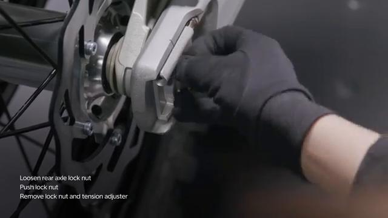
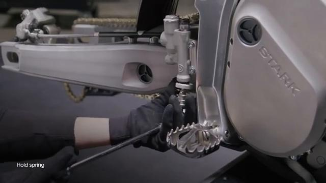
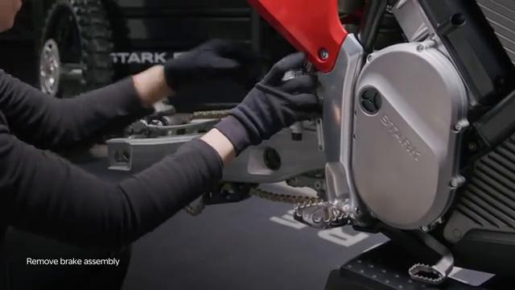
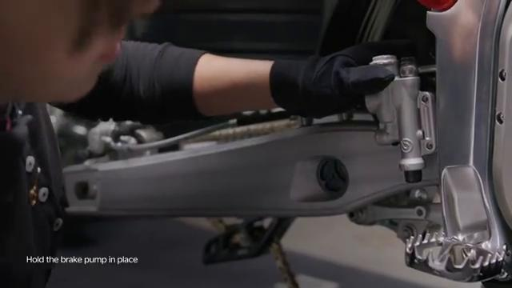
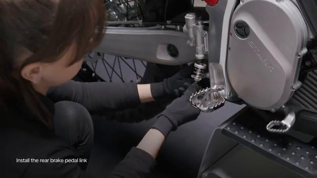
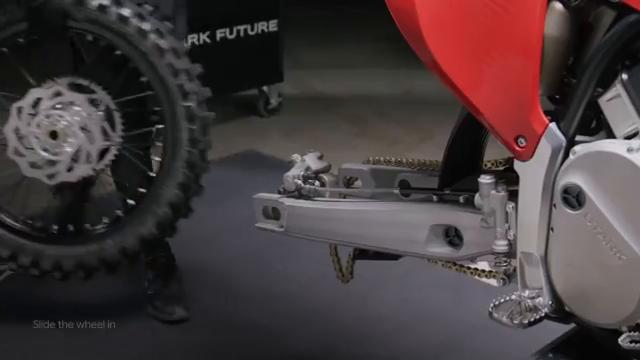
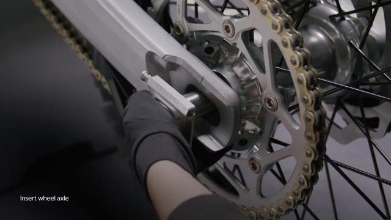
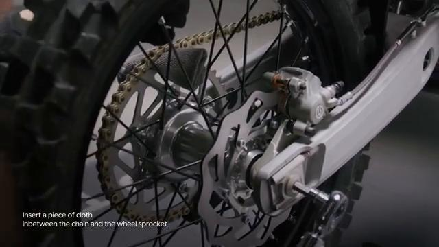

# Remove and Install Foot Brake - Stark VARG

Source video: `Remove and Install Foot Brake - Stark VARG` by Stark Future Official

Applicable models: `MX`

## Scope

This guide follows the same step-by-step workshop structure as the MX tutorials, but it is derived as a visual sequence from the official Stark Future ASMR video. Because the source video does not provide usable captions or narration, the procedure is documented through curated screenshots and concise action guidance.

## Preparation

- Place the bike on a stable stand or work area before starting the procedure.
- Prepare the correct tools for the fasteners, clips, brackets, and components shown in the video.
- Keep removed hardware organized in sequence so reassembly follows the same order as the video.
- Have a torque wrench ready for any tightening steps that specify a torque value.

## Removal Procedure

### 1. Prepare access to the Foot Brake

Remove the surrounding parts needed to expose the Foot Brake and its routing or mounting points.

Keep the removed fasteners organized in sequence so reassembly matches the video.

### 2. Remove the visible retaining hardware for the Foot Brake

Remove the visible Foot Brake fasteners while supporting the brake component as the hardware comes free.

Support the component as the last fastener is removed.

### 3. Release any bracket, clip, or coupling attached to the Foot Brake

Free any bracket, clip, spacer, linkage, or connector that still ties the Foot Brake to the bike.

Note the orientation of these supporting pieces before setting them aside.

### 4. Remove the Foot Brake from the bike

Remove the Foot Brake from the bike once the last fastener and any routed support pieces are released.

Inspect the removed part and the mounting points before reassembly.

## Installation Procedure

### 5. Position the Foot Brake for installation

Return the Foot Brake to its mounting position and align the holes, tabs, or locating surfaces.

Hold the component in place until the first retaining hardware is started.

### 6. Reconnect or refit the support pieces for the Foot Brake

Reinstall any bracket, clip, spacer, linkage, or coupling associated with the Foot Brake.

Make sure each supporting piece is seated correctly before final tightening.

### 7. Install the retaining hardware for the Foot Brake

Install the Foot Brake retaining hardware by hand first and keep the brake component aligned during tightening.

Check that the component remains aligned while the hardware is brought fully home.

Tighten the foot brake master cylinder bolts to **10 Nm**.

Tighten the brake pedal peg bolts to **5 Nm**.

Tighten the brake pedal sway bolts to **20 Nm**.

Tighten the brake pedal link bolts to **10 Nm**.

### 8. Verify the completed installation of the Foot Brake

Inspect the final position of the Foot Brake and confirm that all hardware, clips, and surrounding parts are back in place.

Check the component for correct fit and movement before returning the bike to service.

## Torque Summary

| Component | Torque |
| --- | ---: |
| Tighten the foot brake master cylinder bolts | 10 Nm |
| Tighten the brake pedal peg bolts | 5 Nm |
| Tighten the brake pedal sway bolts | 20 Nm |
| Tighten the brake pedal link bolts | 10 Nm |

Verified torque items:

- Tighten the foot brake master cylinder bolts: **10 Nm** from the official Stark VARG owner manual torque table.
- Tighten the brake pedal peg bolts: **5 Nm** from the official Stark VARG owner manual torque table.
- Tighten the brake pedal sway bolts: **20 Nm** from the official Stark VARG owner manual torque table.
- Tighten the brake pedal link bolts: **10 Nm** from the official Stark VARG owner manual torque table.

## Critical Checks Before Riding

- Confirm the serviced component is fully seated and all fasteners are tightened in the correct order.
- Recheck all torque-critical hardware before riding.
- Make sure all routed cables, clips, brackets, and surrounding parts are returned to their original positions.
- Inspect the bike visually for any missing hardware before returning it to service.
