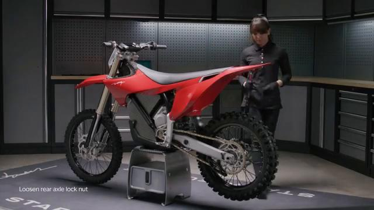
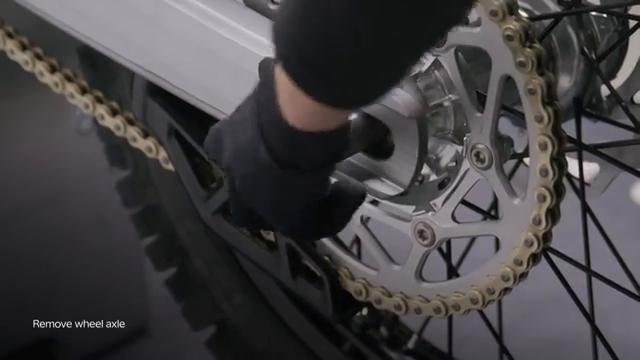
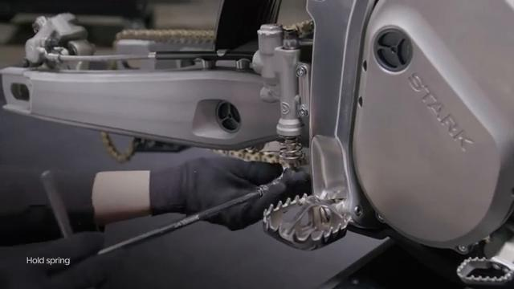
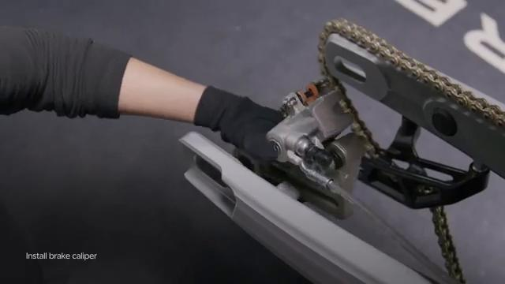
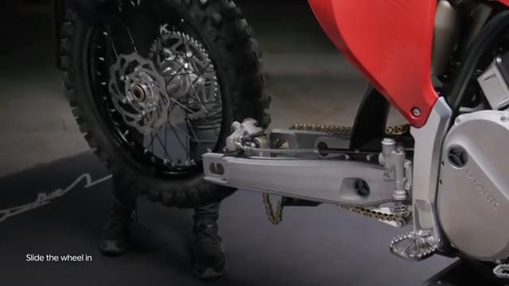
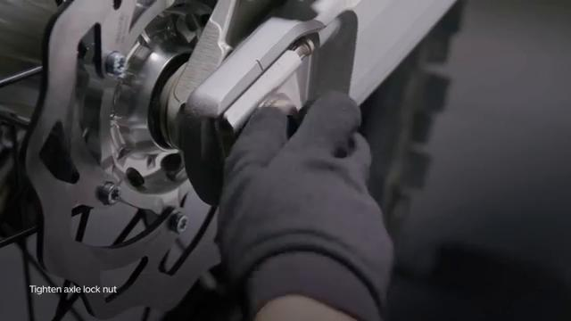
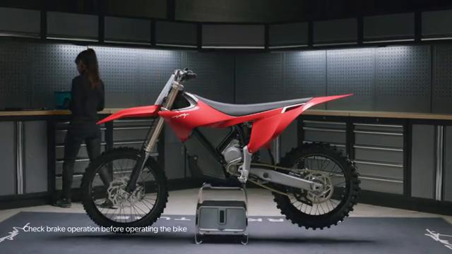

# Remove and Install Foot Brake - Stark VARG

Source video: `Remove and Install Foot Brake - Stark VARG` by Stark Future Official

Applicable models: `MX`

## Scope

This guide follows the original Stark Future video overlay sequence for the procedure shown in the original MX tutorial video. Each step below is aligned to the instruction text shown on screen.

## Preparation

- Place the bike on a stable stand or work area before starting the procedure.
- Prepare the correct tools for the fasteners, clips, brackets, and components shown in the video.
- Keep removed hardware organized in sequence so reassembly follows the same order as the video.
- Follow the torque values shown in the original Stark tutorial video wherever the video displays a torque on screen.

## Removal Procedure

### 1. Remove the rear wheel

Remove the rear wheel. Refer to: 09.015.01 Remove and Install rear wheel ↗.

### 2. Remove the foot brake master cylinder

Remove the foot brake master cylinder. Refer to: 02.027.01 Remove and Install foot brake master cylinder ↗.

### 3. Grab the rear brake caliper and the foot brake master cylinder and clear the brake hose from the swingarm brake line bracket

Grab the rear brake caliper and the foot brake master cylinder and clear the brake hose from the swingarm brake line bracket.

## Installation Procedure

### 4. Grab the rear brake caliper and the foot brake master cylinder and fit the hose onto the swingarm brake line bracket

Grab the rear brake caliper and the foot brake master cylinder and fit the hose onto the swingarm brake line bracket.

### 5. Secure the rear brake caliper

Secure the rear brake caliper.

### 6. Install the foot brake master cylinder

Install the foot brake master cylinder. Refer to: 02.027.01 Remove and Install foot brake master cylinder ↗.

### 7. Install rear wheel

Install rear wheel. Refer to: 09.015.01 Remove and Install rear wheel ↗. Check brakes operation before operating the bike. is permitted only with the express written permission.

## Critical Checks Before Riding

- Confirm the serviced components are fully seated and all fasteners are tightened in the correct order.
- Recheck all torque-critical hardware before riding.
- Make sure all routed cables, clips, brackets, and surrounding parts are returned to their original positions.
- Inspect the bike visually for any missing hardware before returning it to service.
