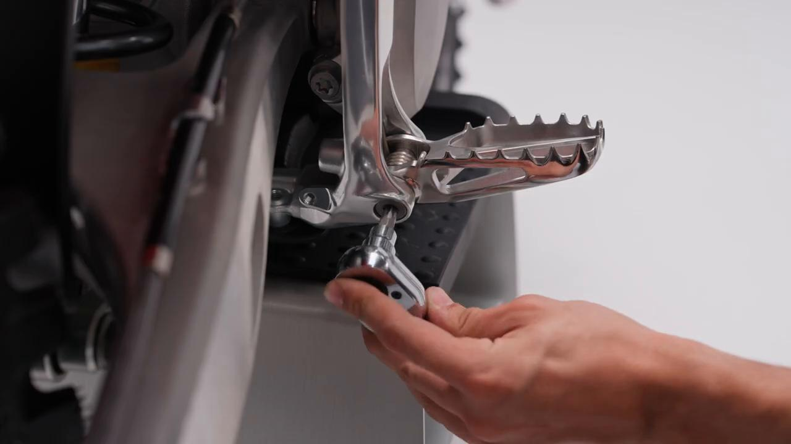
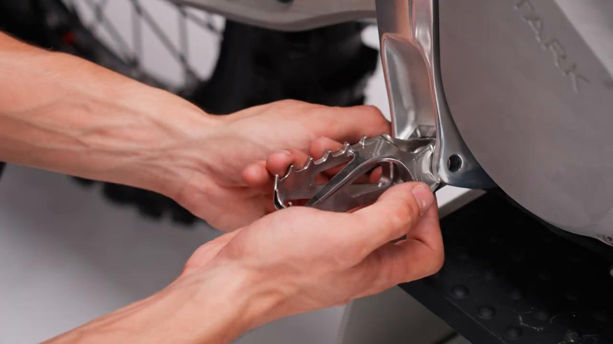
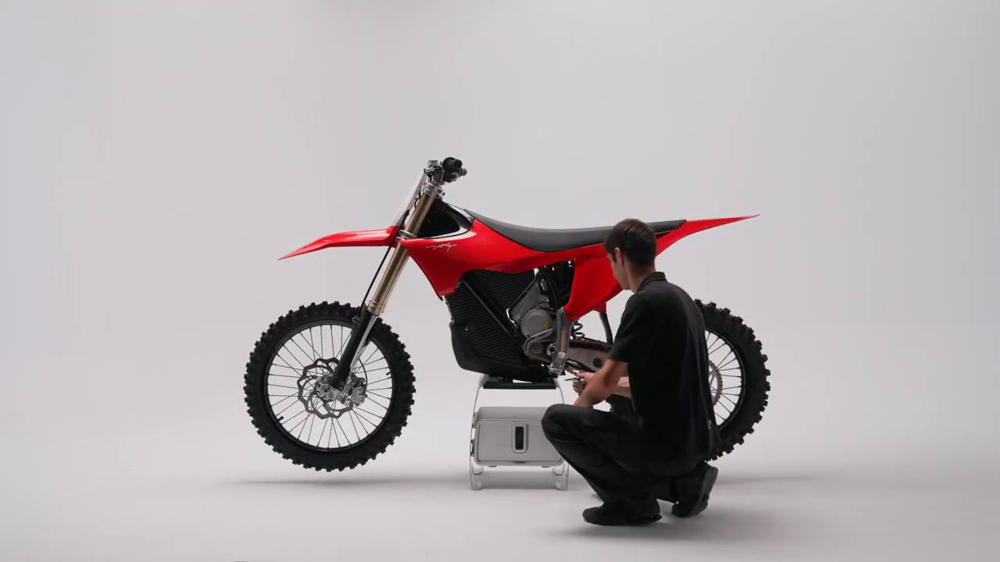
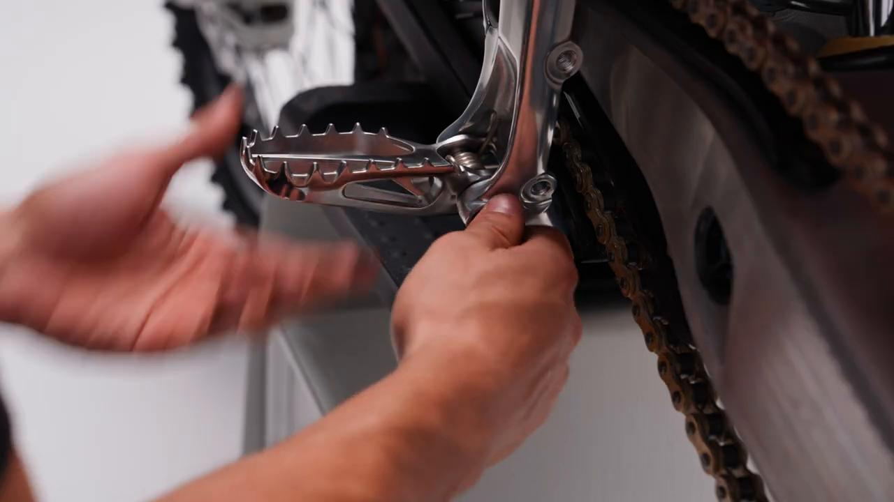
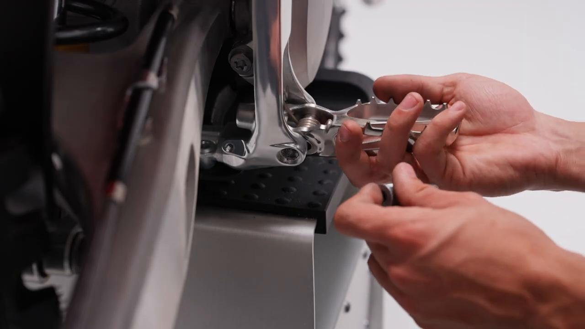
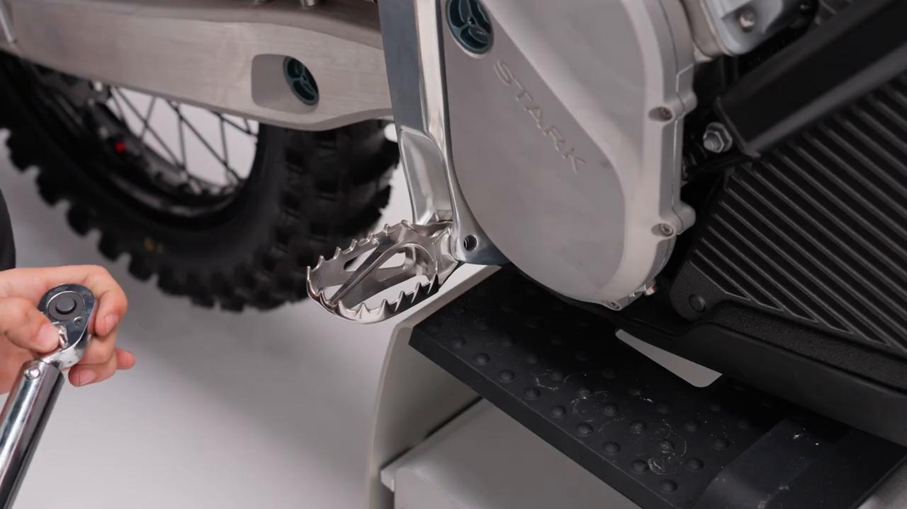
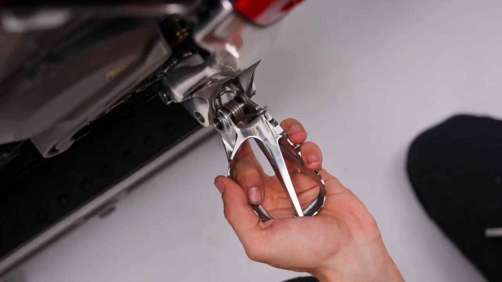
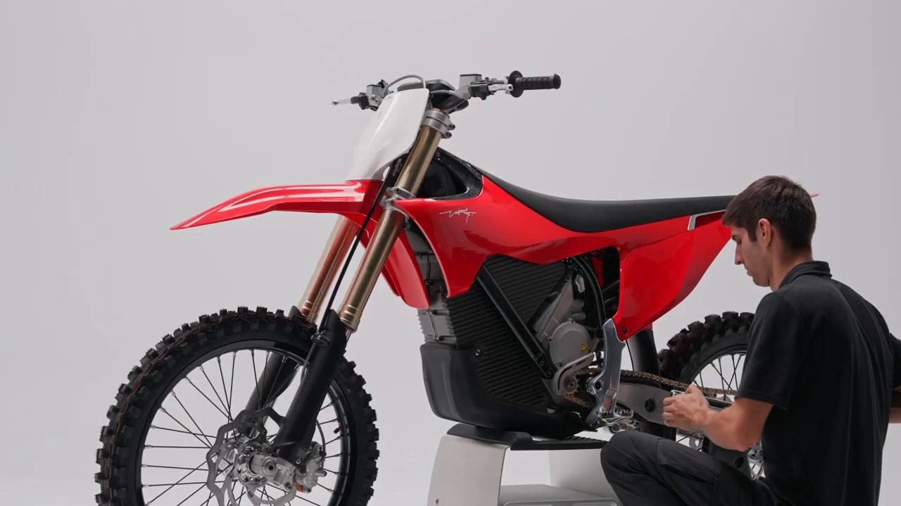

# Remove and Install Footpegs - Stark VARG MX 1.2

Source video: `Remove and Install Footpegs - Stark VARG MX 1.2` by Stark Future Official

## Scope

This guide converts the official Stark Future tutorial video into a step-by-step workshop procedure. It documents each action shown in the video in sequence and pairs every step with a dedicated screenshot.

## Preparation

- Place the bike on a stable stand or work area before starting the procedure.
- Prepare the correct tools for the fasteners, clips, brackets, and components shown in the video.
- Keep removed hardware organized in sequence so reassembly follows the same order as the video.
- Have a torque wrench ready for any tightening steps that specify a torque value.

## Removal Procedure

### 1. Unscrew the right foot peg pin

Unscrew the right foot peg pin.

### 2. Remove the foot peg from the side plate

Remove the foot peg from the side plate.

### 3. Unscrew the left foot peg pin

Unscrew the left foot peg pin.

### 4. Remove the foot peg from the side plate

Remove the foot peg from the side plate.

## Installation Procedure

### 5. Position the right foot peg into the right side plate

Position the right foot peg into the right side plate.

### 6. Tighten the foot peg pin to 20 Nm

Tighten the foot peg pin to **20 Nm**.

### 7. Position the left foot peg into the left side plate

Position the left foot peg into the left side plate.

### 8. Tighten the foot peg pin to 20 Nm

Tighten the foot peg pin to **20 Nm**.

## Torque Summary

| Component | Torque |
| --- | ---: |
| Tighten the foot peg pin | 20 Nm |

Video-sourced torque items:

- Tighten the foot peg pin: **20 Nm** from the official Stark tutorial video.

## Critical Checks Before Riding

- Confirm the serviced component is fully seated and all fasteners are tightened in the correct order.
- Recheck all torque-critical hardware before riding.
- Make sure all routed cables, clips, brackets, and surrounding parts are returned to their original positions.
- Inspect the bike visually for any missing hardware before returning it to service.
