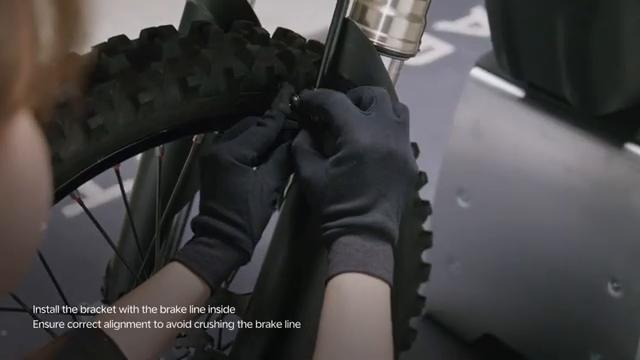

# Remove and Install Forks - Stark VARG

Source video: `Remove and Install Forks - Stark VARG` by Stark Future Official

Applicable models: `MX`

## Scope

This guide follows the original Stark Future video overlay sequence for the procedure shown in the original MX tutorial video. Each step below is aligned to the instruction text shown on screen.

## Preparation

- Place the bike on a stable stand or work area before starting the procedure.
- Prepare the correct tools for the fasteners, clips, brackets, and components shown in the video.
- Keep removed hardware organized in sequence so reassembly follows the same order as the video.
- Follow the torque values shown in the original Stark tutorial video wherever the video displays a torque on screen.

## Removal Procedure

### 1. Remove brake line bracket screws

Remove brake line bracket screws.

### 2. Loosen fork clamp bolts on the left fork

Loosen fork clamp bolts on the left fork.

## Installation Procedure

### 3. Push the axi lock nut inside

Push the axi lock nut inside.

### 4. Remove axle lock nut

Remove axle lock nut.

### 5. Hold the whect and remove tre ale

Hold the whect and remove tre ale.

### 6. Hold the wheel and remove tee axle shee the whed out betecnn the fork

Hold the wheel and remove tee axle shee the whed out betecnn the fork.

### 7. Loosen the tripie clamp fork bolts

Loosen the tripie clamp fork bolts.

### 8. Hold the fork while loosening the last bett

Hold the fork while loosening the last bett.

### 9. Tighten clamp bolts

Tighten clamp bolts.

### 10. Ensure the fork hold in place before refeasing

Ensure the fork hold in place before refeasing.

### 11. Tighten tuple clamp bolts to value engraved on the part

Tighten tuple clamp bolts to value engraved on the part.

### 12. Pushing the axle inside

Pushing the axle inside.

### 13. Tighten axle lock nut

Tighten axle lock nut.

### 14. Tighten nght fork clamp bolts

Tighten nght fork clamp bolts.

### 15. Tighten bolts to 25

Tighten bolts to 25.

### 16. Loosen nght fork clamp bolts

Loosen nght fork clamp bolts.

### 17. Tighten all fork clamp bolts to 15 Nm

Tighten all fork clamp bolts to 15 Nm.

### 18. Install the bracket with the brake line inside

Install the bracket with the brake line inside.

### 19. Ensure correct alignment to avoid crush ng the brase

Ensure correct alignment to avoid crush ng the brase.

### 20. Ensure correct alignment to avoid crush ng the brake

Ensure correct alignment to avoid crush ng the brake.

### 21. Tighten brake tne bracket screws

Tighten brake tne bracket screws.

### 22. Check brake operation before operating the bike

Check brake operation before operating the bike.

## Torque Summary

| Component | Torque |
| --- | ---: |
| Tighten all fork clamp bolts | 15 Nm |

Verified torque items:

- Tighten all fork clamp bolts: **15 Nm** from the original Stark Future tutorial video text overlay.

## Critical Checks Before Riding

- Confirm the serviced components are fully seated and all fasteners are tightened in the correct order.
- Recheck all torque-critical hardware before riding.
- Make sure all routed cables, clips, brackets, and surrounding parts are returned to their original positions.
- Inspect the bike visually for any missing hardware before returning it to service.
