# Remove and Install Forks - Stark VARG

Source video: `Remove and Install Forks - Stark VARG` by Stark Future Official

Applicable models: `MX`

## Scope

This guide follows the original Stark Future video overlay sequence for the procedure shown in the original MX tutorial video. Each step below is aligned to the instruction text shown on screen.

## Preparation

- Place the bike on a stable stand or work area before starting the procedure.
- Prepare the correct tools for the fasteners, clips, brackets, and components shown in the video.
- Keep removed hardware organized in sequence so reassembly follows the same order as the video.
- Follow the torque values shown in the original Stark tutorial video wherever the video displays a torque on screen.

## Removal Procedure

### 1. Remove brake line bracket screws

Remove brake line bracket screws.

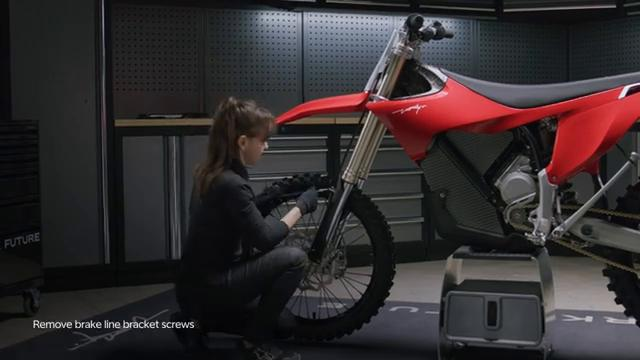

### 2. Remove the brake line bracket

Remove the brake line bracket.

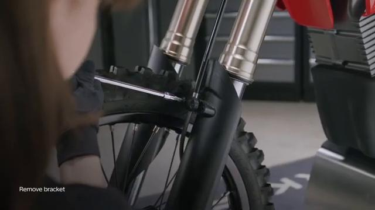

### 3. Remove the front brake caliper bolts

Remove the front brake caliper bolts, then lift the caliper clear of the disc.

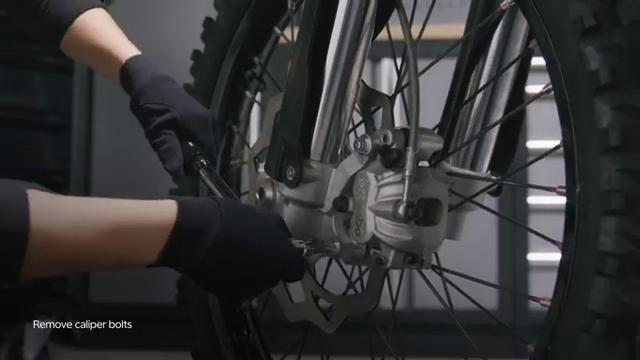

### 4. Loosen fork clamp bolts on the left fork

Loosen fork clamp bolts on the left fork.

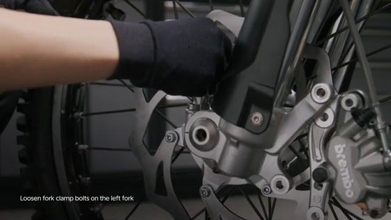

### 5. Loosen fork clamp bolts on the right fork

Loosen fork clamp bolts on the right fork.

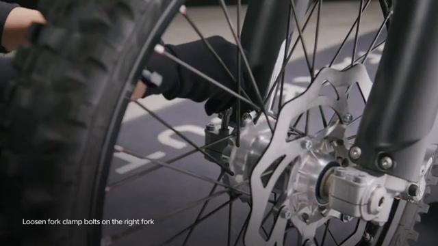

### 6. Push the axle lock nut inside

Push the axle lock nut inside.

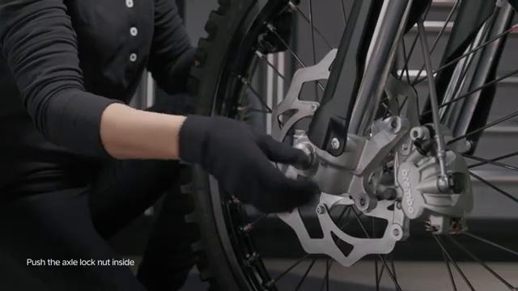

### 7. Remove axle lock nut

Remove axle lock nut.

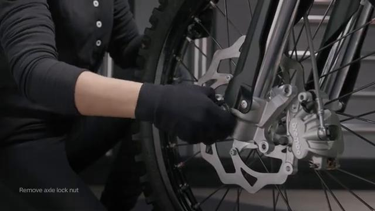

### 8. Lift the front of the bike to support the rear wheel on the floor, then hold the wheel and remove the axle

Lift the front of the bike to support the rear wheel on the floor, then hold the wheel and remove the axle.

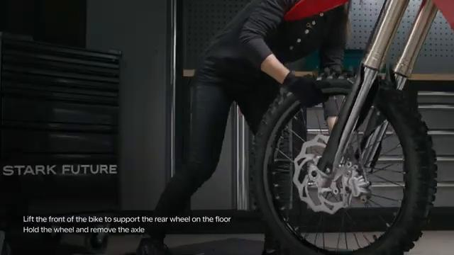

### 9. Slide the wheel out between the forks

Slide the wheel out between the forks.

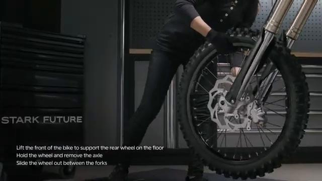

### 10. Loosen the triple clamp fork bolts

Loosen the triple clamp fork bolts.

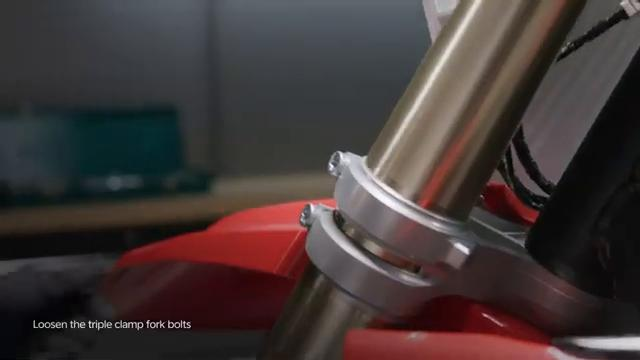

### 11. Hold the fork while loosening the last bolt, then remove the fork

Hold the fork while loosening the last bolt, then remove the fork.

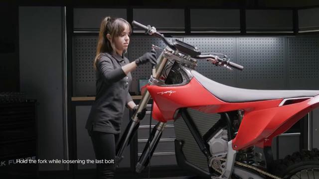

## Installation Procedure

### 12. Hold the fork in place and tighten the clamp bolts

Hold the fork in place and tighten the clamp bolts enough to support it before final torque is applied.

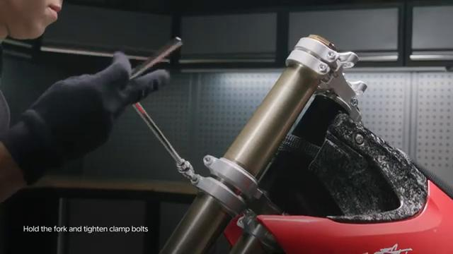

### 13. Ensure the fork holds in place before releasing it

Ensure the fork holds in place before releasing it.

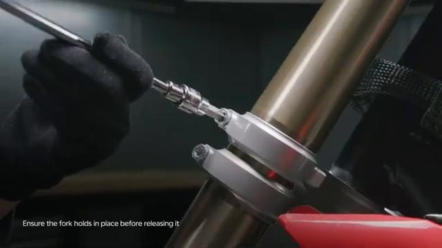

### 14. Tighten the triple clamp bolts to the etched torque values marked on the part

Tighten the triple clamp bolts to the etched torque values marked on the part.

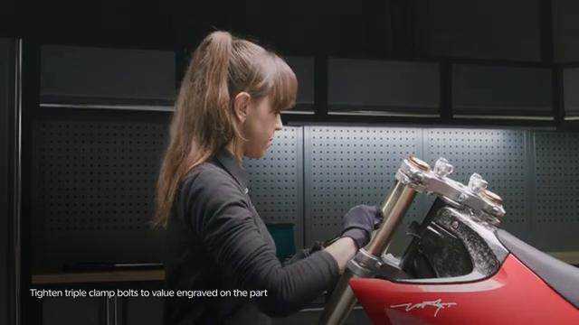

### 15. Push the axle inside

Push the axle inside.

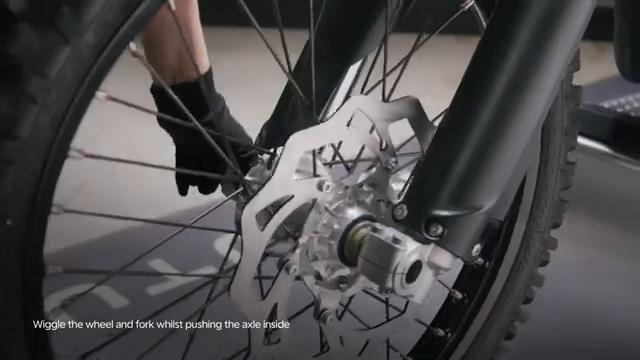

### 16. Tighten the axle lock nut to 35 Nm

Tighten the axle lock nut to **35 Nm**.

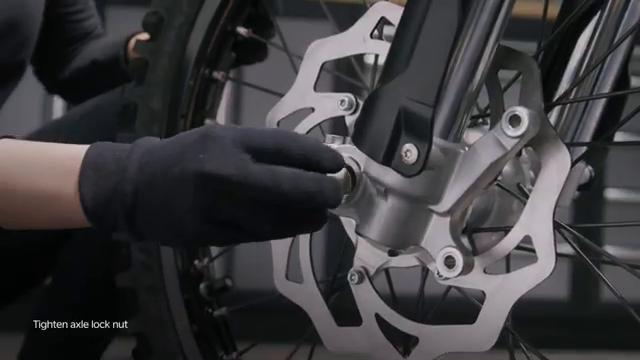

### 17. Tighten the right fork clamp bolts enough to seat the axle

Tighten the right fork clamp bolts enough to seat the axle. Final torque for the fork clamp bolts is applied in step 21.

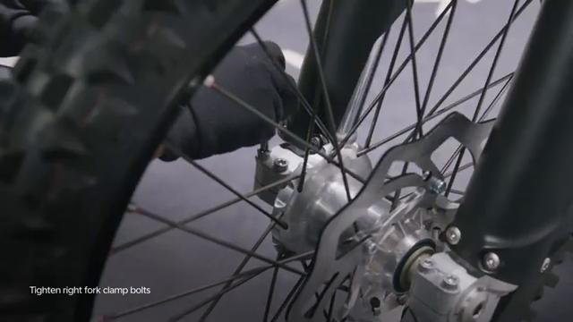

### 18. Slide the brake caliper onto the brake disc

Slide the brake caliper onto the brake disc.

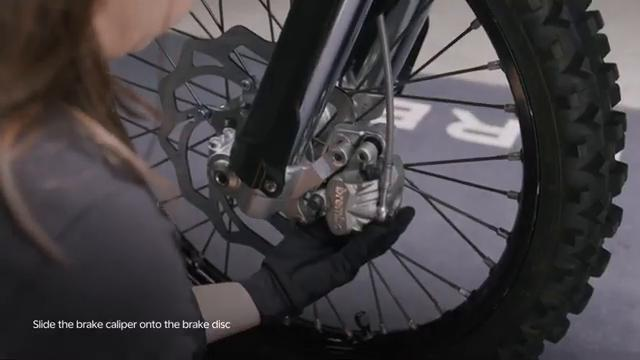

### 19. Tighten the caliper bolts to 25 Nm

Tighten the caliper bolts to **25 Nm**.

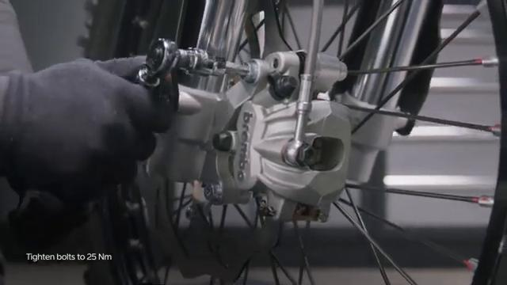

### 20. Loosen the right fork clamp bolts

Loosen the right fork clamp bolts to let the fork settle before final clamp torque is applied.

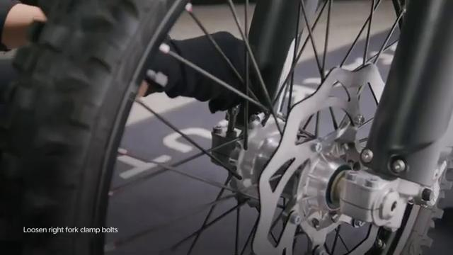

### 21. Tighten all fork clamp bolts to 15 Nm

Tighten all fork clamp bolts to **15 Nm**.

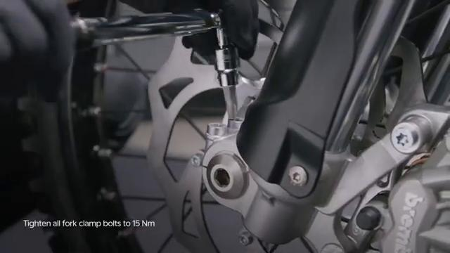

### 22. Install the bracket with the brake line inside

Install the bracket with the brake line inside.

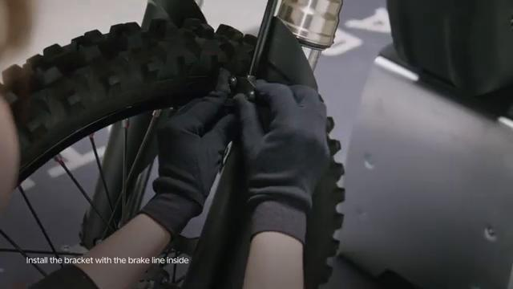

### 23. Ensure correct alignment to avoid crushing the brake line

Ensure correct alignment to avoid crushing the brake line.

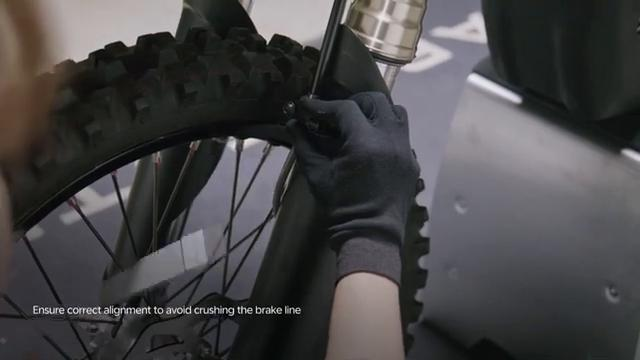

### 24. Tighten brake line bracket screws

Tighten brake line bracket screws. The torque value is not shown in the video; verify the official Stark specification before final tightening.

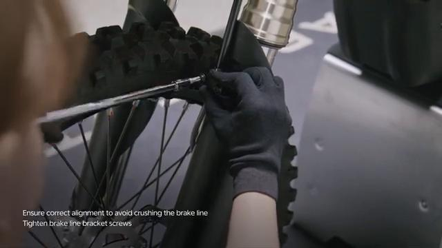

### 25. Check brake operation before operating the bike

Check brake operation before operating the bike.

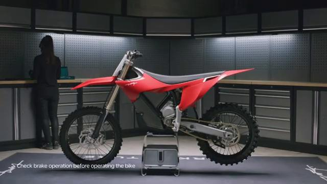

## Torque Summary

| Component | Torque |
| --- | ---: |
| Axle lock nut | 35 Nm |
| Caliper bolts | 25 Nm |
| Fork clamp bolts | 15 Nm |
| Triple clamp bolts | Etched torque values on the fork assembly |

Verified torque items:

- Axle lock nut: **35 Nm** from the original Stark Future front wheel installation torque for the same front axle hardware.
- Caliper bolts: **25 Nm** from the original Stark Future tutorial video text overlay.
- Fork clamp bolts: **15 Nm** from the original Stark Future tutorial video text overlay.
- Triple clamp bolts: use the **etched torque values** marked on the KYB fork assembly, as shown in the original Stark tutorial video.

## Critical Checks Before Riding

- Confirm the serviced components are fully seated and all fasteners are tightened in the correct order.
- Recheck all torque-critical hardware before riding.
- Make sure all routed cables, clips, brackets, and surrounding parts are returned to their original positions.
- Inspect the bike visually for any missing hardware before returning it to service.
