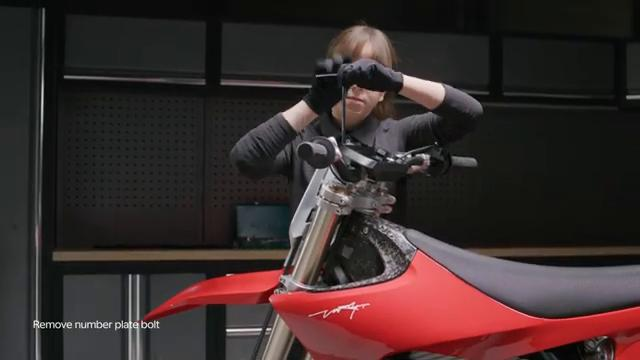
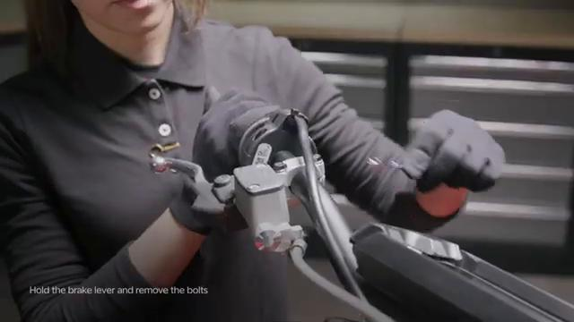
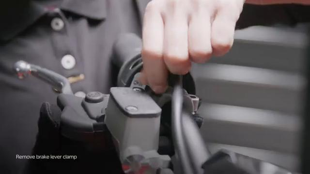
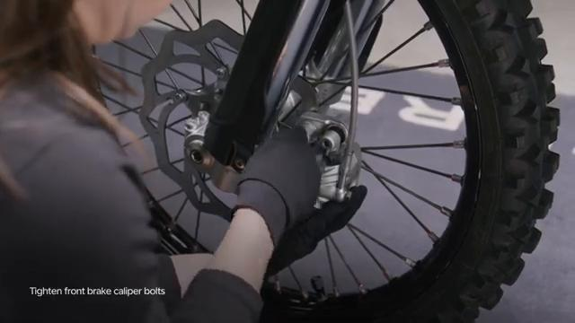
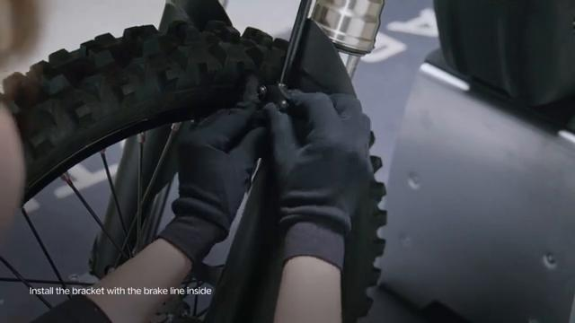
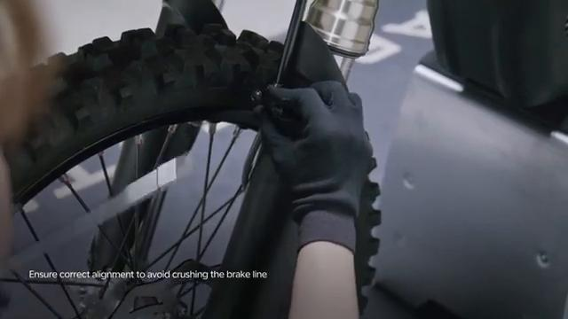
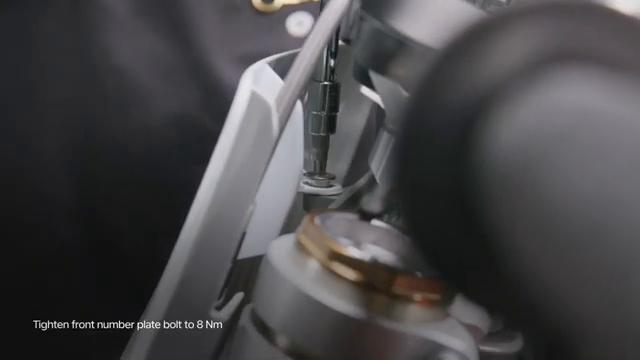
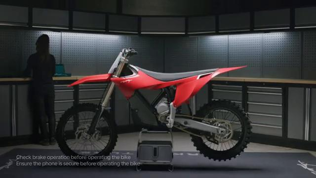

# Remove and Install Front Brake Assembly - Stark VARG

Source video: `Remove and Install Front Brake Assembly - Stark VARG` by Stark Future Official

Applicable models: `MX`

## Scope

This guide follows the original Stark Future video overlay sequence for the procedure shown in the original MX tutorial video. Each step below is aligned to the instruction text shown on screen.

## Preparation

- Place the bike on a stable stand or work area before starting the procedure.
- Prepare the correct tools for the fasteners, clips, brackets, and components shown in the video.
- Keep removed hardware organized in sequence so reassembly follows the same order as the video.
- Follow the torque values shown in the original Stark tutorial video wherever the video displays a torque on screen.

## Removal Procedure

### 1. Remove the front number plate

Remove the front number plate. Refer to: 01.006.01 Remove and Install front number plate ↗.

### 2. Remove the front line bracket

Remove the front line bracket. Refer to: 02.011.01 Remove and Install front brake line bracket ↗.

### 3. Remove the front brake caliper

Remove the front brake caliper. Refer to: 02.005.01 Remove and Install front brake caliper ↗.

### 4. Remove the hand brake master cylinder

Remove the hand brake master cylinder. Refer to: 02.009.01 Remove and Install hand break master cylinder ↗. Beware of falling objects.

## Installation Procedure

### 5. Install the front brake master cylinder

Install the front brake master cylinder. Refer to: 02.009.01 Remove and Install hand break master cylinder ↗.

### 6. Install the front brake caliper

Install the front brake caliper. Refer to: 02.005.01 Remove and Install front brake caliper ↗.

### 7. Install the front line bracket

Install the front line bracket. Refer to: 02.011.01 Remove and Install front brake line bracket ↗.

### 8. Install the front number plate

Install the front number plate. Refer to: 01.006.01 Remove and Install front number plate ↗. Check brake operation before operating the bike. is permitted only with the express written permission.

## Critical Checks Before Riding

- Confirm the serviced components are fully seated and all fasteners are tightened in the correct order.
- Recheck all torque-critical hardware before riding.
- Make sure all routed cables, clips, brackets, and surrounding parts are returned to their original positions.
- Inspect the bike visually for any missing hardware before returning it to service.
