# Remove and Install Front Brake Caliper - Stark VARG MX 1.2

Source video: `Remove and Install Front Brake Caliper - Stark VARG MX 1.2` by Stark Future Official

## Scope

This guide converts the official Stark Future tutorial video into a step-by-step workshop procedure. It documents each action shown in the video in sequence and pairs every step with a dedicated screenshot.

## Preparation

- Place the bike on a stable stand or work area before starting the procedure.
- Prepare the correct tools for the fasteners, clips, brackets, and components shown in the video.
- Keep removed hardware organized in sequence so reassembly follows the same order as the video.
- Have a torque wrench ready for any tightening steps that specify a torque value.

## Removal Procedure

### 1. Carefully remove the master cylinder reservoir cap

Carefully remove the master cylinder reservoir cap.

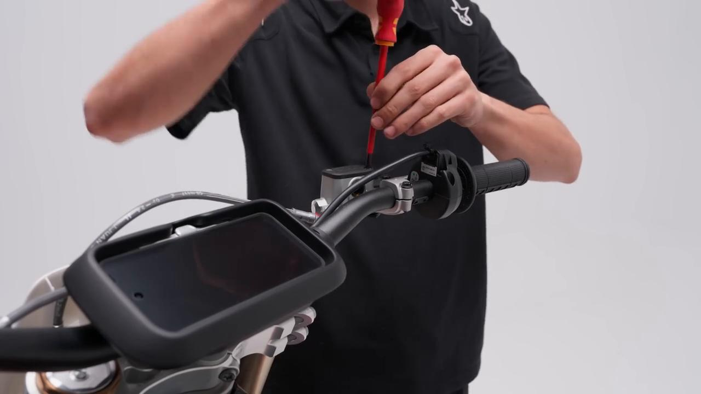

### 2. Remove the rubber cap from the front caliper bleeder

Remove the rubber cap from the front caliper bleeder.

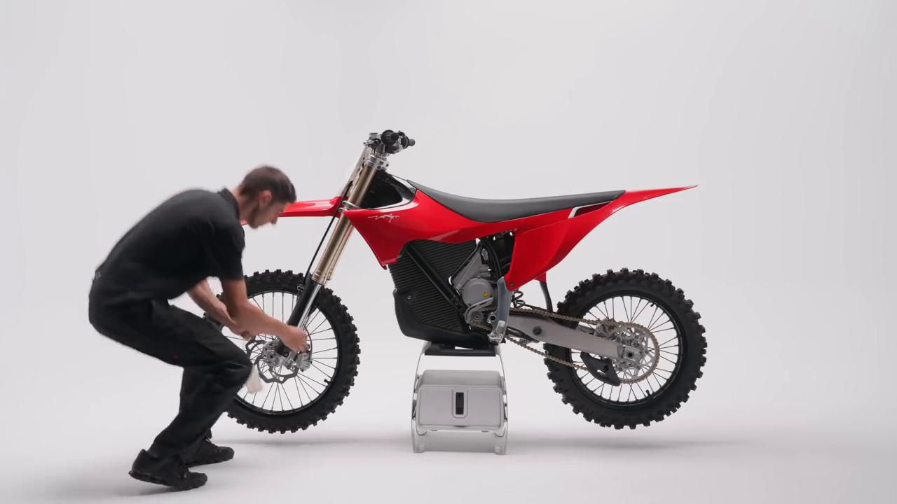

### 3. Fit the wrench onto the bleed screw to open and close it before attaching the hose to drain the brake fluid

Fit the wrench onto the bleed screw to open and close it before attaching the hose to drain the brake fluid.

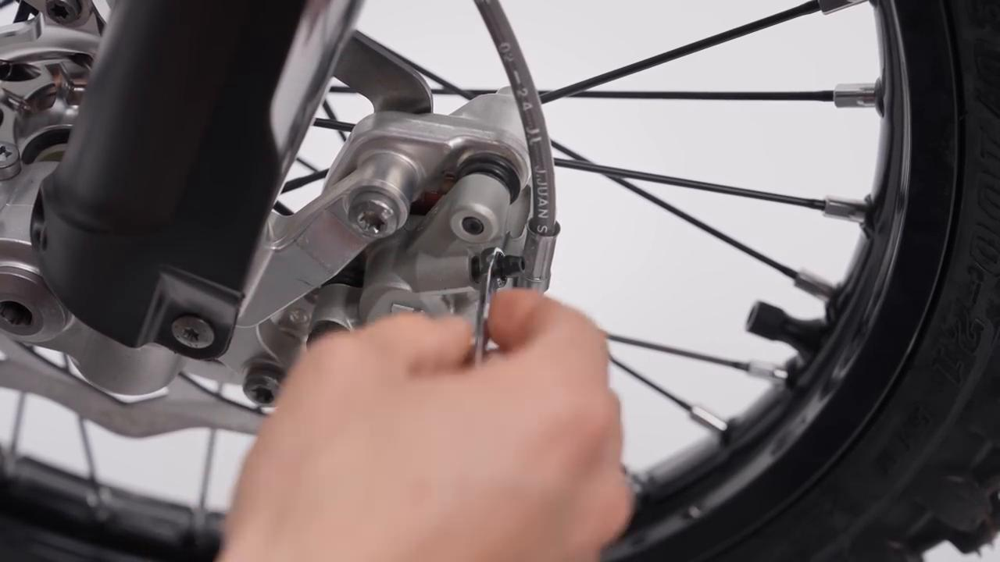

### 4. Drain the brake fluid from the system

Drain the brake fluid from the system.

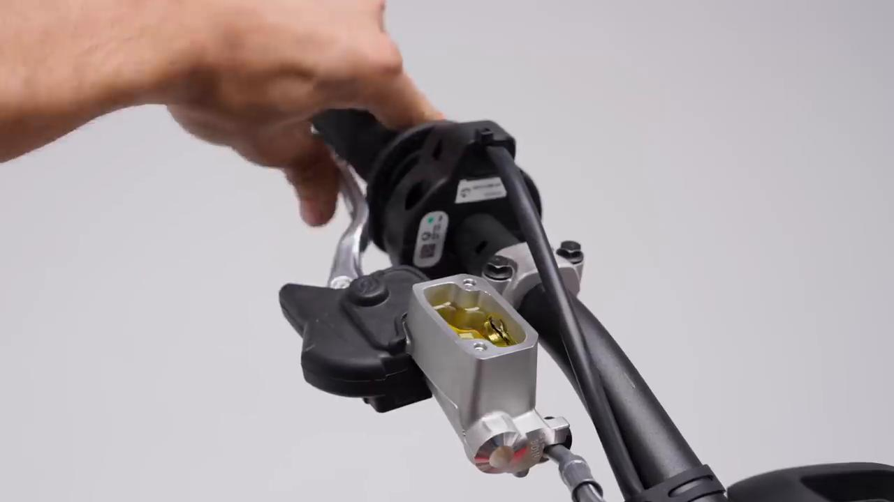

### 5. Carefully remove the hose from the front caliper bleeder

Carefully remove the hose from the front caliper bleeder.

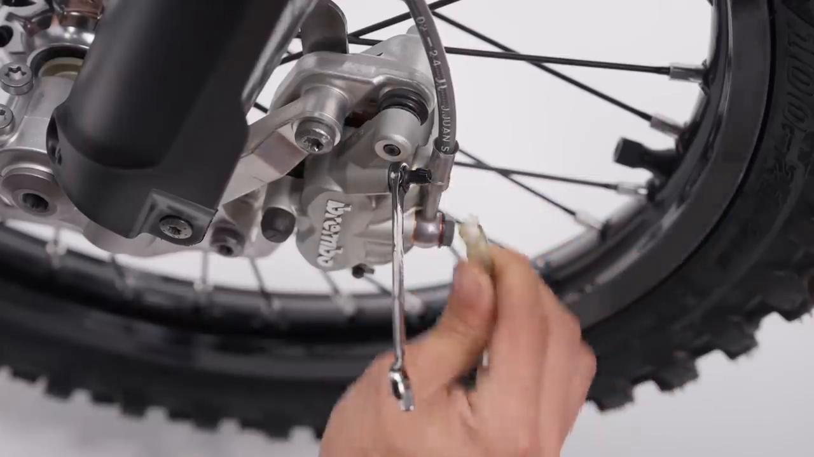

### 6. Unscrew the banjo bolt from the front brake caliper. Note: Carefully remove and dispose of the copper washers

Unscrew the banjo bolt from the front brake caliper. Note: Carefully remove and dispose of the copper washers.

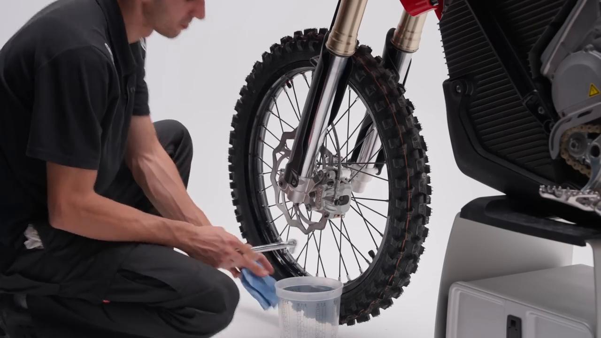

### 7. Unscrew and remove both front brake caliper bolts to completely remove the caliper

Unscrew and remove both front brake caliper bolts to completely remove the caliper.

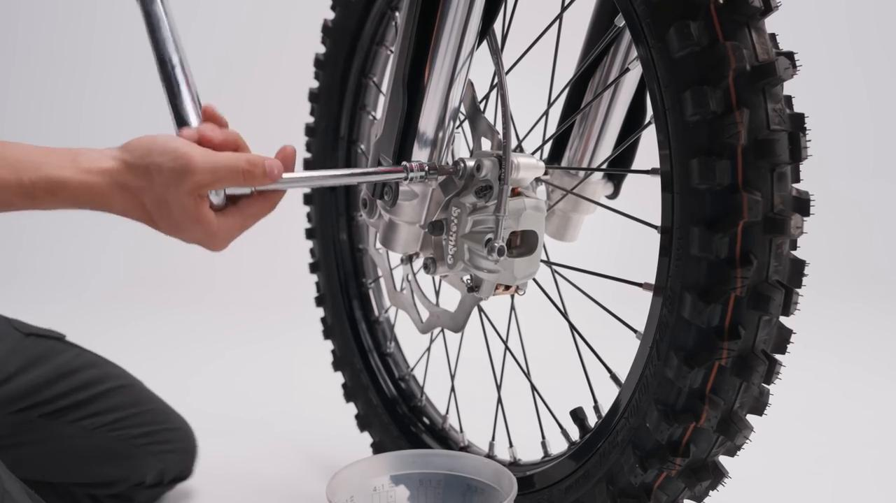

## Installation Procedure

### 8. Apply thread locker to both front brake caliper bolts, then install the caliper and tighten the bolts to 25 Nm

Apply thread locker to both front brake caliper bolts, then install the caliper and tighten the bolts to **25 Nm**.

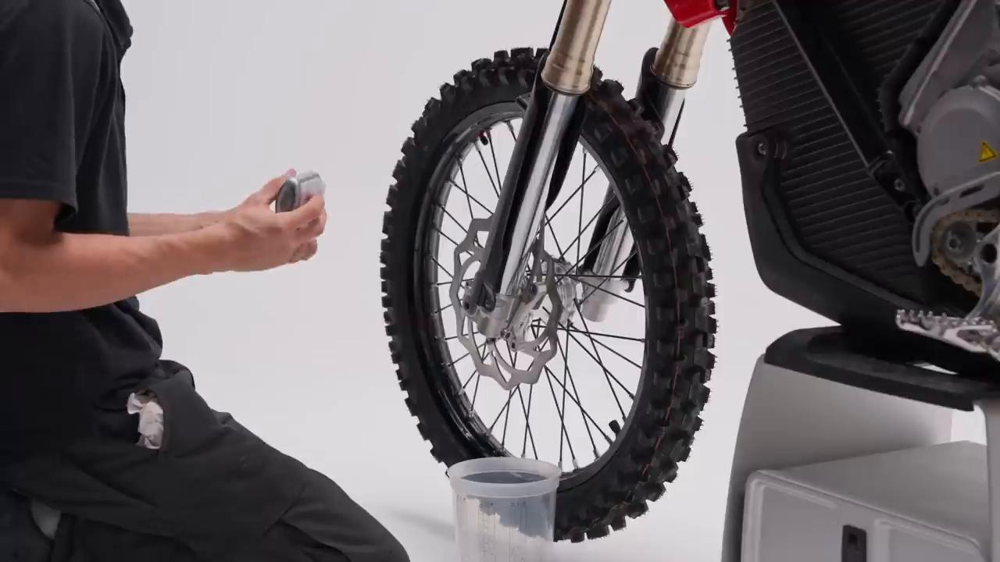

### 9. Clean the area thoroughly

Clean the area thoroughly.

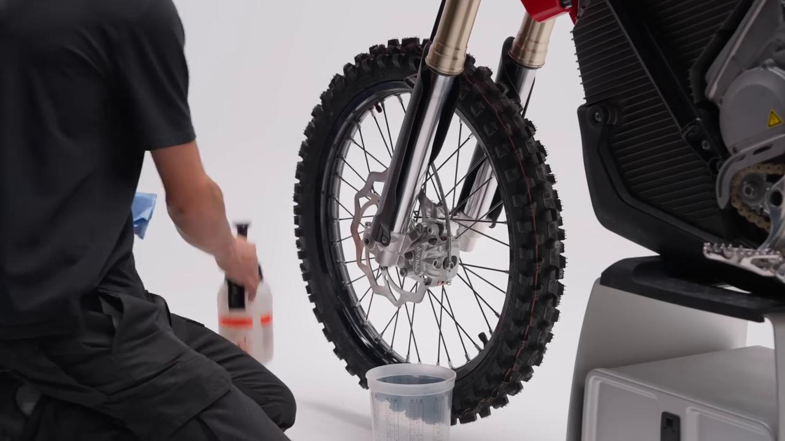

### 10. Tighten the banjo bolt into the front caliper to 25 Nm

Tighten the banjo bolt into the front caliper to **25 Nm**.

Use new copper washers and position them on either side of the brake hose.

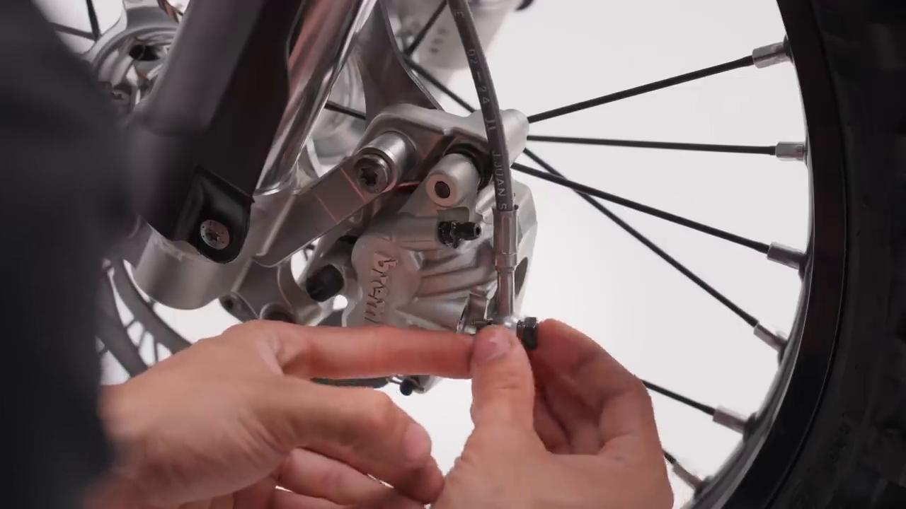

### 11. Fit the wrench onto the bleed screw to open and close it before attaching the hose to drain the brake fluid

Fit the wrench onto the bleed screw to open and close it before attaching the hose to drain the brake fluid.

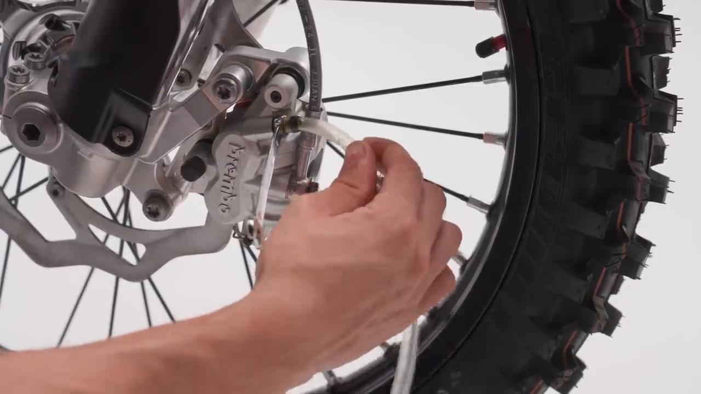

### 12. Bleed the braking system by adding brake fluid to the reservoir. 05.06 Pump the brake lever several times and, while holding it pulled in, open and close the front caliper bleed screw before releasing the lever

Bleed the braking system by adding brake fluid to the reservoir. 05.06 Pump the brake lever several times and, while holding it pulled in, open and close the front caliper bleed screw before releasing the lever.

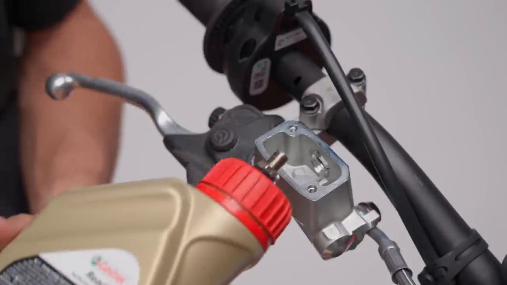

### 13. Actively check the brake fluid level

Actively check the brake fluid level.

Ensure the level does not drop too low at any time.

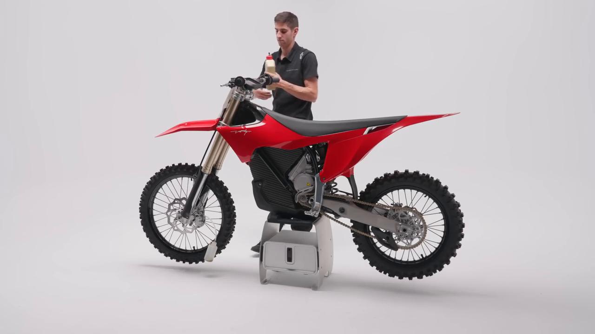

### 14. Carefully remove the hose from the front brake caliper bleed screw, then tighten the bleed screw and clean the area

Carefully remove the hose from the front brake caliper bleed screw, then tighten the bleed screw and clean the area.

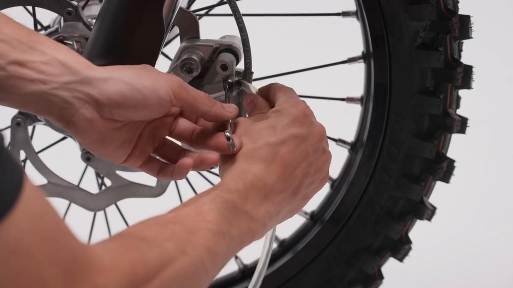

### 15. Place the rubber protector cap into its position

Place the rubber protector cap into its position.

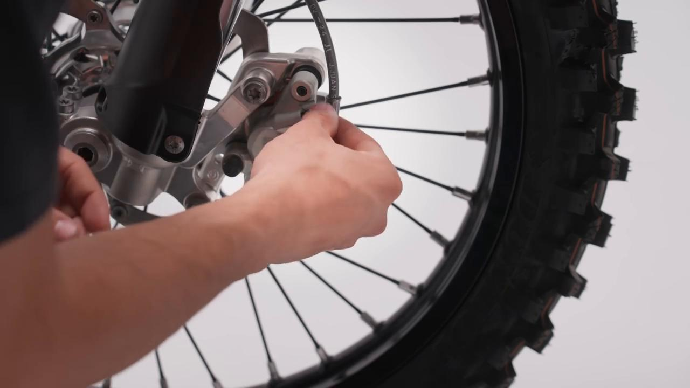

### 16. Install the master cylinder reservoir cap and tighten both screws securely

Install the master cylinder reservoir cap and tighten both screws securely.

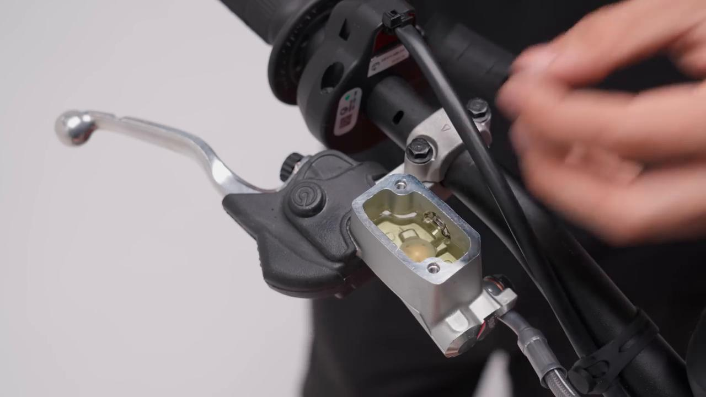

### 17. Clean the area thoroughly and test the brake system

Clean the area thoroughly and test the brake system.

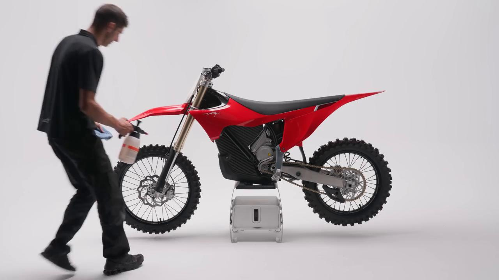

## Torque Summary

| Component | Torque |
| --- | ---: |
| Apply thread locker to both front brake caliper bolts, then install the caliper and tighten the bolts | 25 Nm |
| Tighten the banjo bolt into the front caliper | 25 Nm |

Video-sourced torque items:

- Apply thread locker to both front brake caliper bolts, then install the caliper and tighten the bolts: **25 Nm** from the official Stark tutorial video.
- Tighten the banjo bolt into the front caliper: **25 Nm** from the official Stark tutorial video.

## Critical Checks Before Riding

- Confirm the serviced component is fully seated and all fasteners are tightened in the correct order.
- Recheck all torque-critical hardware before riding.
- Make sure all routed cables, clips, brackets, and surrounding parts are returned to their original positions.
- Inspect the bike visually for any missing hardware before returning it to service.
