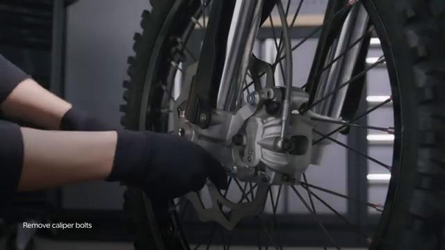
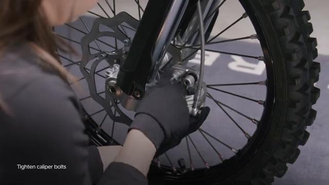
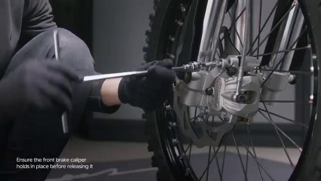
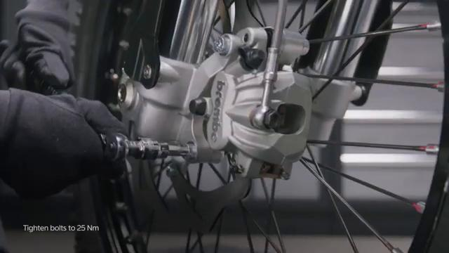
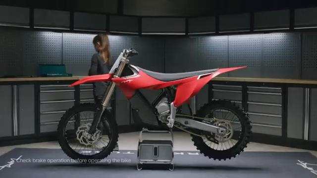

# Remove and Install Front Brake Caliper - Stark VARG

Source video: `Remove and Install Front Brake Caliper - Stark VARG` by Stark Future Official

Applicable models: `MX`

## Scope

This guide follows the original Stark Future video overlay sequence for the procedure shown in the original MX tutorial video. Each step below is aligned to the instruction text shown on screen.

## Preparation

- Place the bike on a stable stand or work area before starting the procedure.
- Prepare the correct tools for the fasteners, clips, brackets, and components shown in the video.
- Keep removed hardware organized in sequence so reassembly follows the same order as the video.
- Follow the torque values shown in the original Stark tutorial video wherever the video displays a torque on screen.

## Removal Procedure

### 1. Unscrew front brake caliper bolts

Unscrew front brake caliper bolts.

### 2. Remove front brake caliper

Remove front brake caliper.

## Installation Procedure

### 3. Clean the front brake caliper bolts and apply medium strength thread locker

Clean the front brake caliper bolts and apply medium strength thread locker.

### 4. Slide the brake caliper onto the front brake disc

Slide the brake caliper onto the front brake disc.

### 5. Tighten the front brake caliper bolts by hand until it holds in place

Tighten the front brake caliper bolts by hand until it holds in place.

### 6. Tighten the front brake caliper bolts to 25 Nm

Tighten the front brake caliper bolts to 25 Nm. Check brake operation before operating the bike. is permitted only with the express written permission.

## Torque Summary

| Component | Torque |
| --- | ---: |
| Tighten the front brake caliper bolts | 25 Nm |

Verified torque items:

- Tighten the front brake caliper bolts: **25 Nm** from the original Stark Future tutorial video text overlay.

## Critical Checks Before Riding

- Confirm the serviced components are fully seated and all fasteners are tightened in the correct order.
- Recheck all torque-critical hardware before riding.
- Make sure all routed cables, clips, brackets, and surrounding parts are returned to their original positions.
- Inspect the bike visually for any missing hardware before returning it to service.
