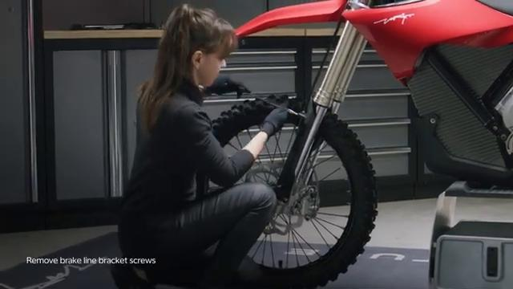
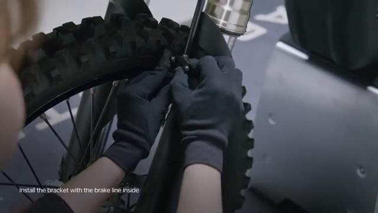
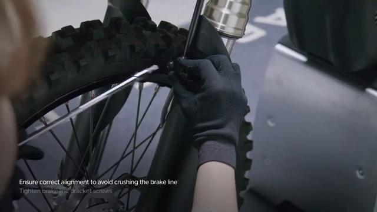
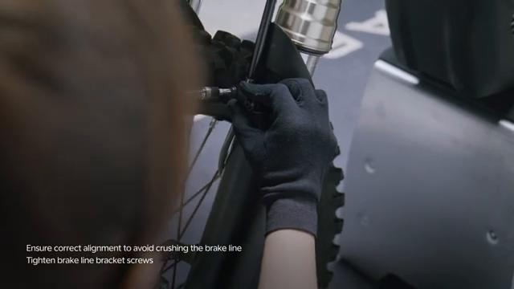

# Remove and Install Front Brake Line Bracket - Stark VARG

Source video: `Remove and Install Front Brake Line Bracket - Stark VARG` by Stark Future Official

Applicable models: `MX`

## Scope

This guide follows the original Stark Future video overlay sequence for the procedure shown in the original MX tutorial video. Each step below is aligned to the instruction text shown on screen.

## Preparation

- Place the bike on a stable stand or work area before starting the procedure.
- Prepare the correct tools for the fasteners, clips, brackets, and components shown in the video.
- Keep removed hardware organized in sequence so reassembly follows the same order as the video.
- Follow the torque values shown in the original Stark tutorial video wherever the video displays a torque on screen.

## Removal Procedure

### 1. Unscrew the front brake line brackets screws

Unscrew the front brake line brackets screws.

### 2. Remove the bracket

Remove the bracket. Beware of falling objects.

## Installation Procedure

### 3. Hold the front brake line bracket in place

Hold the front brake line bracket in place. Ensure correct alignment to avoid crushing the brake line.

### 4. Tighten brake line bracket screws to 3 Nm

Tighten brake line bracket screws to 3 Nm. Check brakes operation before operating the bike. is permitted only with the express written permission.

## Torque Summary

| Component | Torque |
| --- | ---: |
| Tighten brake line bracket screws | 3 Nm |

Verified torque items:

- Tighten brake line bracket screws: **3 Nm** from the original Stark Future tutorial video text overlay.

## Critical Checks Before Riding

- Confirm the serviced components are fully seated and all fasteners are tightened in the correct order.
- Recheck all torque-critical hardware before riding.
- Make sure all routed cables, clips, brackets, and surrounding parts are returned to their original positions.
- Inspect the bike visually for any missing hardware before returning it to service.
