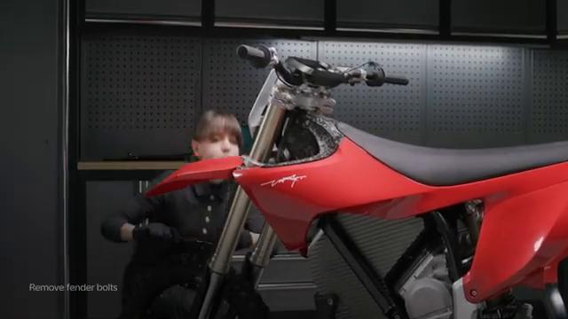
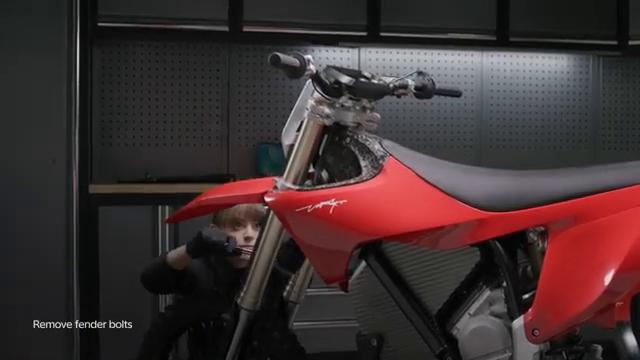
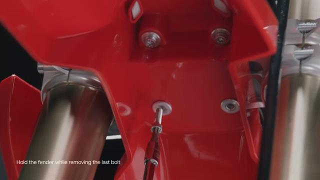
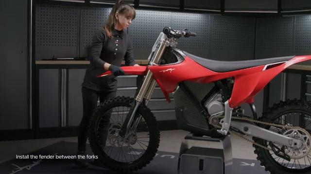
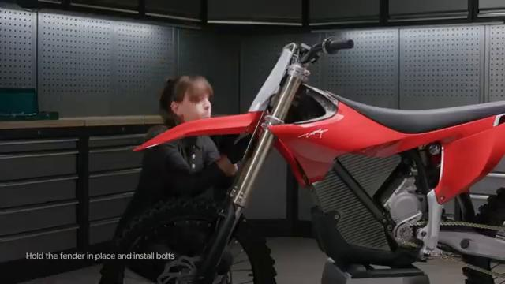
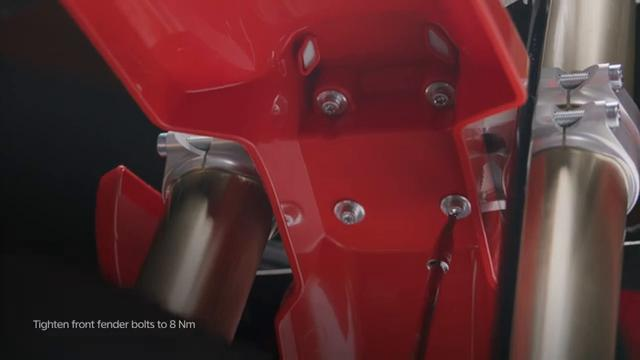

# Remove and Install Front Fender - Stark VARG

Source video: `Remove and Install Front Fender - Stark VARG` by Stark Future Official

Applicable models: `MX`

## Scope

This guide follows the original Stark Future video overlay sequence for the procedure shown in the original MX tutorial video. Each step below is aligned to the instruction text shown on screen.

## Preparation

- Place the bike on a stable stand or work area before starting the procedure.
- Prepare the correct tools for the fasteners, clips, brackets, and components shown in the video.
- Keep removed hardware organized in sequence so reassembly follows the same order as the video.
- Follow the torque values shown in the original Stark tutorial video wherever the video displays a torque on screen.

## Removal Procedure

### 1. Unscrew all 4 front fender bolts

Unscrew all 4 front fender bolts. Beware of falling bolts or bushings.

### 2. Carefully take the front fender out between the forks

Carefully take the front fender out between the forks.

## Installation Procedure

### 3. Carefully fit the front fender between the forks

Carefully fit the front fender between the forks.

### 4. Align the front fender holes with the front number plate studs and the triple clamp

Align the front fender holes with the front number plate studs and the triple clamp.

### 5. Tighten at least one bolt with a bushing to secure the fender in place

Tighten at least one bolt with a bushing to secure the fender in place.

### 6. Tighten the remaining bolts with bushings by hand until all hold in place

Tighten the remaining bolts with bushings by hand until all hold in place.

### 7. Tighten all front fender bolts to 8 Nm

Tighten all front fender bolts to **8 Nm**.

## Torque Summary

| Component | Torque |
| --- | ---: |
| Tighten all front fender bolts | 8 Nm |

Verified torque items:

- Tighten all front fender bolts: **8 Nm** from the original Stark Future tutorial video text overlay.

## Critical Checks Before Riding

- Confirm the serviced components are fully seated and all fasteners are tightened in the correct order.
- Recheck all torque-critical hardware before riding.
- Make sure all routed cables, clips, brackets, and surrounding parts are returned to their original positions.
- Inspect the bike visually for any missing hardware before returning it to service.
