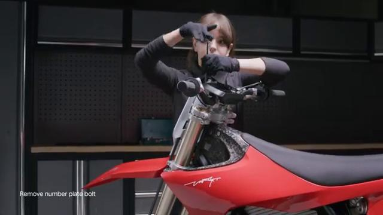
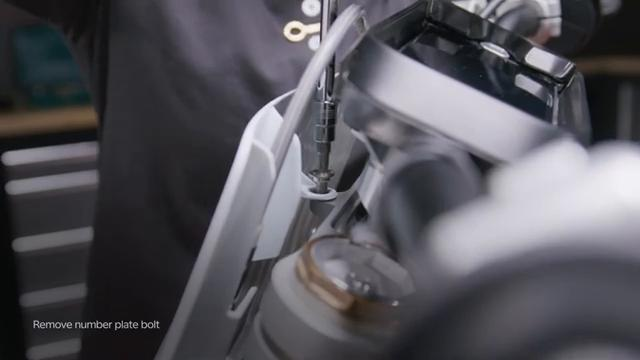
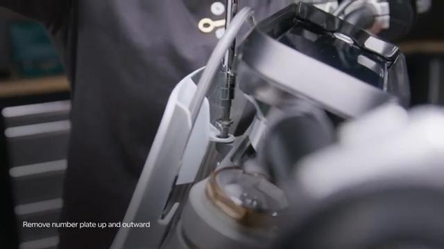
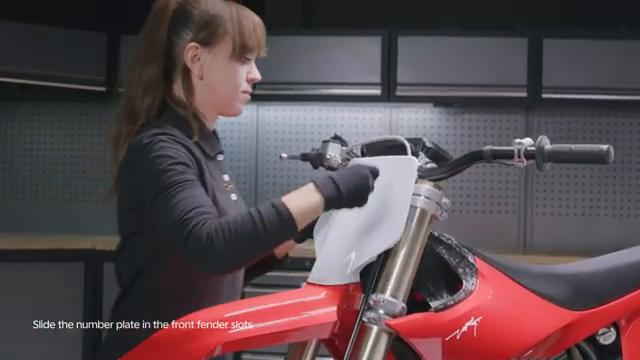
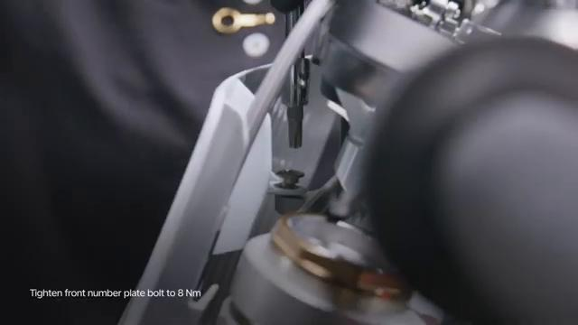

# Remove and Install Front Number Plate - Stark VARG

Source video: `Remove and Install Front Number Plate - Stark VARG` by Stark Future Official

Applicable models: `MX`

## Scope

This guide follows the original Stark Future video overlay sequence for the procedure shown in the original MX tutorial video. Each step below is aligned to the instruction text shown on screen.

## Preparation

- Place the bike on a stable stand or work area before starting the procedure.
- Prepare the correct tools for the fasteners, clips, brackets, and components shown in the video.
- Keep removed hardware organized in sequence so reassembly follows the same order as the video.
- Follow the torque values shown in the original Stark tutorial video wherever the video displays a torque on screen.

## Removal Procedure

### 1. Unscrew the front number plate bolt

Unscrew the front number plate bolt.

### 2. Remove the number plate up and outward

Remove the number plate up and outward.

### 3. Carefully work the brake line out of the number plate brackets

Carefully work the brake line out of the number plate brackets.

## Installation Procedure

### 4. Carefully fit the brake line in the number plate brackets

Carefully fit the brake line in the number plate brackets.

### 5. Slide the number plate in the front fender slots

Slide the number plate in the front fender slots.

### 6. Hold the front number plate with the holes aligned

Hold the front number plate with the holes aligned.

### 7. Tighten the front number plate bolt to 8 Nm

Tighten the front number plate bolt to 8 Nm. is permitted only with the express written permission.

## Torque Summary

| Component | Torque |
| --- | ---: |
| Tighten the front number plate bolt | 8 Nm |

Verified torque items:

- Tighten the front number plate bolt: **8 Nm** from the original Stark Future tutorial video text overlay.

## Critical Checks Before Riding

- Confirm the serviced components are fully seated and all fasteners are tightened in the correct order.
- Recheck all torque-critical hardware before riding.
- Make sure all routed cables, clips, brackets, and surrounding parts are returned to their original positions.
- Inspect the bike visually for any missing hardware before returning it to service.
