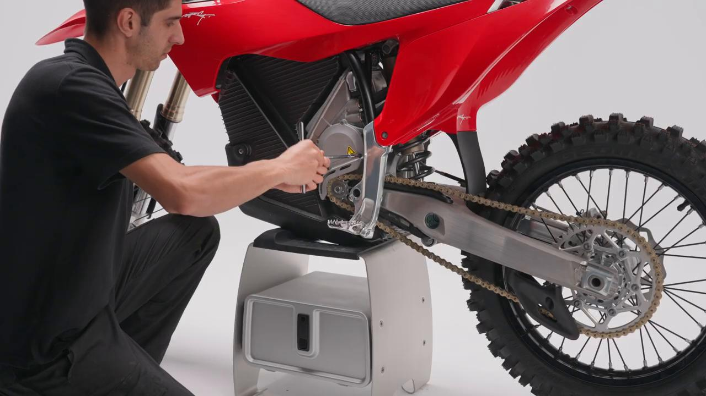
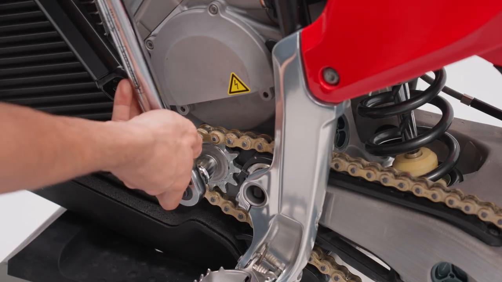
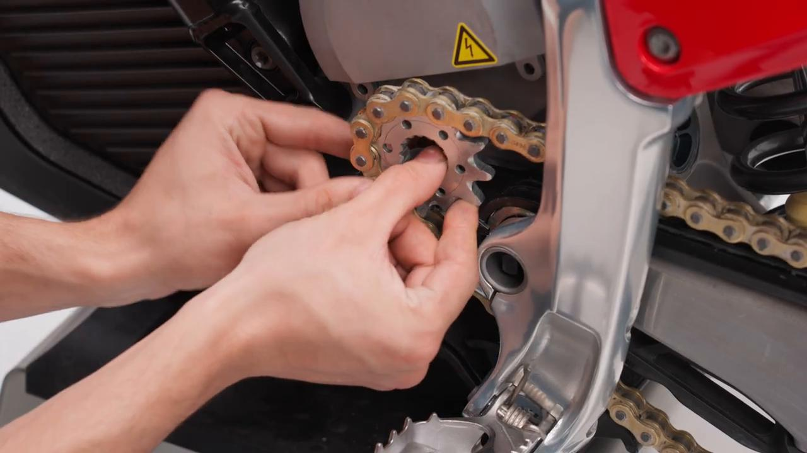
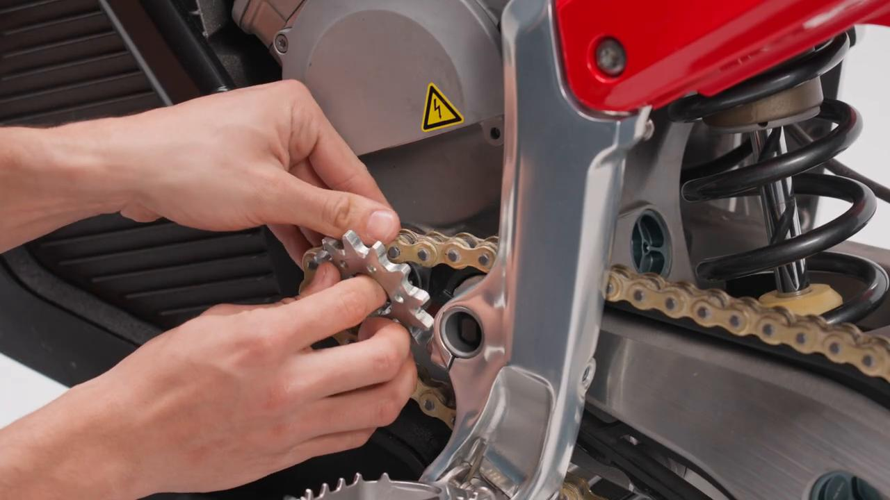
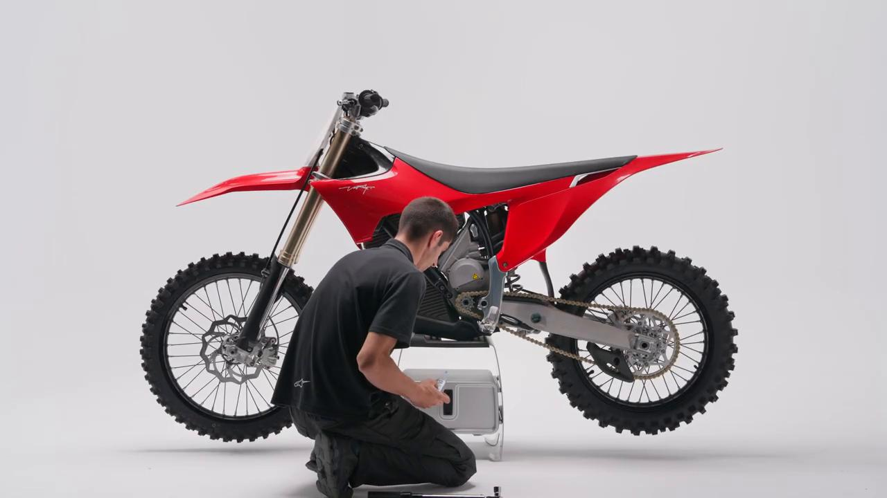
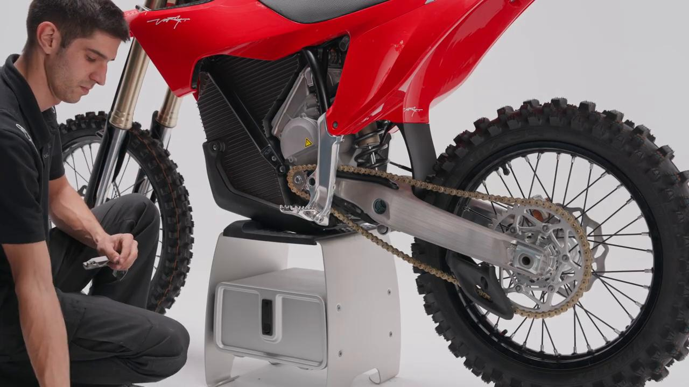

# Remove and Install Front Sprocket - Stark VARG MX 1.2

Source video: `Remove and Install Front Sprocket - Stark VARG MX 1.2` by Stark Future Official

## Scope

This guide converts the official Stark Future tutorial video into a step-by-step workshop procedure. It documents each action shown in the video in sequence and pairs every step with a dedicated screenshot.

## Preparation

- Place the bike on a stable stand or work area before starting the procedure.
- Prepare the correct tools for the fasteners, clips, brackets, and components shown in the video.
- Keep removed hardware organized in sequence so reassembly follows the same order as the video.
- Have a torque wrench ready for any tightening steps that specify a torque value.

## Removal Procedure

### 1. Remove the front sprocket guard

Remove the front sprocket guard.

### 2. Loosen the front sprocket bolt while applying the rear brake

Loosen the front sprocket bolt while applying the rear brake.

If necessary, use additional assistance to secure the rear wheel.

### 3. Carefully remove the front sprocket

Carefully remove the front sprocket.

### 4. Carefully install the front sprocket

Carefully install the front sprocket.

Ensure it is positioned correctly.

### 5. Carefully apply thread locker to the front sprocket bolt and tighten it to 80 Nm while applying the rear brake

Carefully apply thread locker to the front sprocket bolt and tighten it to **80 Nm** while applying the rear brake.

Ensure the washer is correctly positioned on the bushing.

## Installation Procedure

### 6. Install the front sprocket guard by tightening the two bolts to 5 Nm

Install the front sprocket guard by tightening the two bolts to **5 Nm**.

## Torque Summary

| Component | Torque |
| --- | ---: |
| Carefully apply thread locker to the front sprocket bolt and tighten it | 80 Nm |
| Install the front sprocket guard by tightening the two bolts | 5 Nm |

Video-sourced torque items:

- Carefully apply thread locker to the front sprocket bolt and tighten it: **80 Nm** from the official Stark tutorial video.
- Install the front sprocket guard by tightening the two bolts: **5 Nm** from the official Stark tutorial video.

## Critical Checks Before Riding

- Confirm the serviced component is fully seated and all fasteners are tightened in the correct order.
- Recheck all torque-critical hardware before riding.
- Make sure all routed cables, clips, brackets, and surrounding parts are returned to their original positions.
- Inspect the bike visually for any missing hardware before returning it to service.
