# Remove and Install Front Wheel - Stark VARG

Source video: `Remove and Install Front Wheel - Stark VARG` by Stark Future Official

Applicable models: `MX`

## Scope

This guide follows the original Stark Future video overlay sequence for the procedure shown in the original MX tutorial video. Each step below is aligned to the instruction text shown on screen.

## Preparation

- Place the bike on a stable stand or work area before starting the procedure.
- Prepare the correct tools for the fasteners, clips, brackets, and components shown in the video.
- Keep removed hardware organized in sequence so reassembly follows the same order as the video.
- Follow the torque values shown in the original Stark tutorial video wherever the video displays a torque on screen.

## Removal Procedure

### 1. Loosen the fork axle clamp bolts on the left fork

Loosen the fork axle clamp bolts on the left fork.

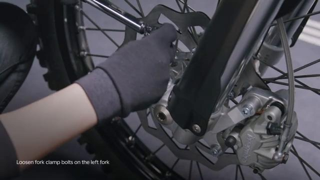

### 2. Loosen the front wheel axle bolt

Loosen the front wheel axle bolt.

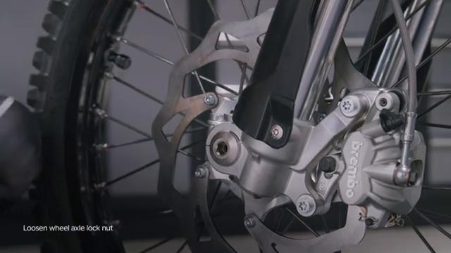

### 3. Loosen the fork axle clamp bolts on the right fork

Loosen the fork axle clamp bolts on the right fork.

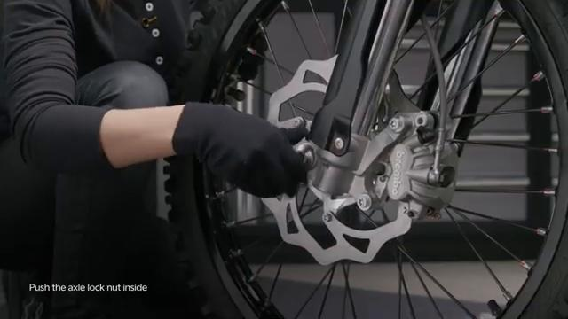

### 4. Unscrew the front axle bolt and push it inside before removing it completely to pop-out the axle on the other side

Unscrew the front axle bolt and push it inside before removing it completely to pop-out the axle on the other side.

### 5. Lift the front of the bike until the rear wheel is supported on the floor

Lift the front of the bike until the rear wheel is supported on the floor.

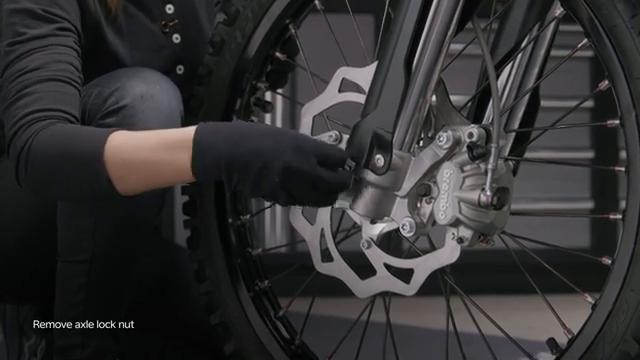

### 6. Hold the front wheel and remove the axle

Hold the front wheel and remove the axle.

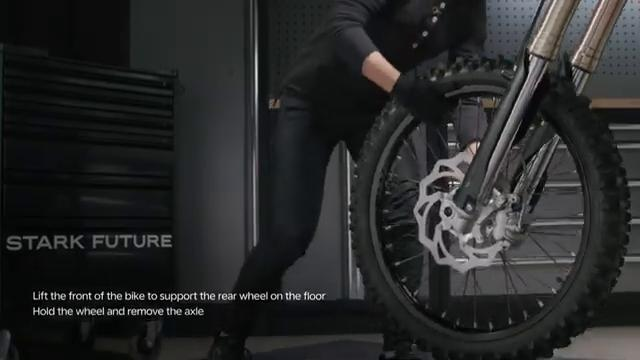

### 7. Slide the front wheel out between the forks

Slide the front wheel out between the forks.

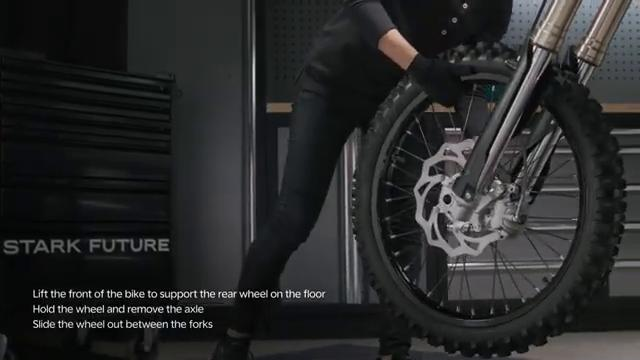

## Installation Procedure

### 8. Clean the wheel axle from any debris and apply lithium grease

Clean the wheel axle from any debris and apply lithium grease.

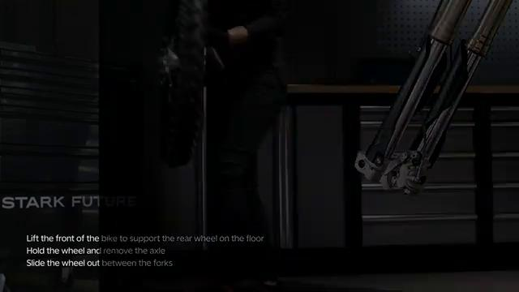

### 9. Slide the wheel between the forks

Slide the wheel between the forks. Ensure the brake disc is on the brake caliper side and slides between the brake pads.

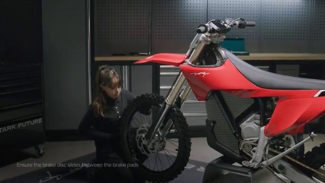

### 10. Align the fork holes with the wheel hub and push the axle inside from the right fork

Align the fork holes with the wheel hub and push the axle inside from the right fork. Gently wiggle the wheel to make it easier to slide the axle in. The weight of the front wheel on the bike may tilt it forward.

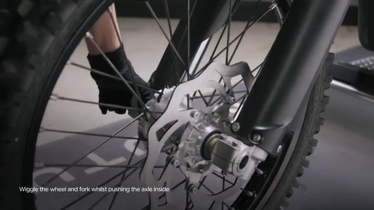

### 11. Tighten the axle lock bolt by hand until there is no play

Tighten the axle lock bolt by hand until there is no play.

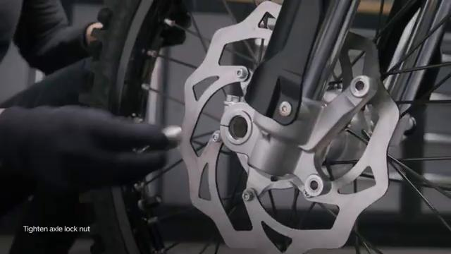

### 12. Tighten the right fork axle clamp bolts to 5 Nm

Tighten the right fork axle clamp bolts to **5 Nm**.

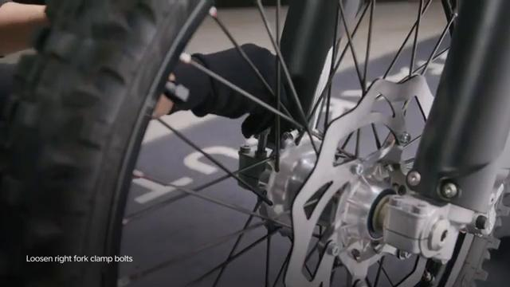

### 13. Tighten the axle lock bolt to 35 Nm

Tighten the axle lock bolt to **35 Nm**.

### 14. Loosen the right fork axle clamp bolts

Loosen the right fork axle clamp bolts.

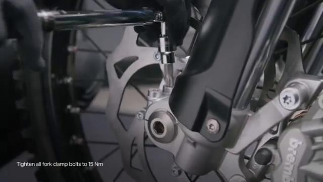

### 15. Spin the wheel by hand a few times and squeeze the front brake lever

Spin the wheel by hand a few times and squeeze the front brake lever.

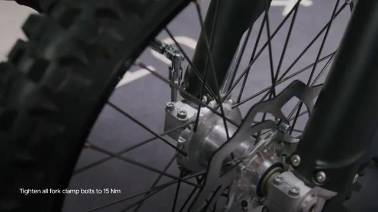

### 16. Tighten all fork axle clamp bolts to 15 Nm, 2x on the right fork and 2x on the left fork

Tighten all fork axle clamp bolts to **15 Nm**, 2x on the right fork and 2x on the left fork. Check brake operation before operating the bike.

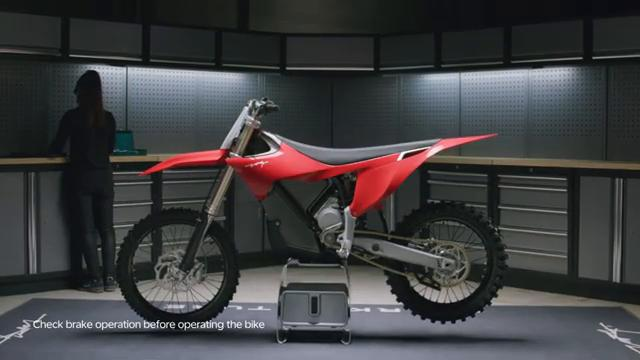

## Torque Summary

| Component | Torque |
| --- | ---: |
| Tighten the right fork axle clamp bolts | 5 Nm |
| Tighten the axle lock bolt | 35 Nm |
| Tighten all fork axle clamp bolts, 2x on the right fork and 2x on the left fork | 15 Nm |

Verified torque items:

- Tighten the right fork axle clamp bolts: **5 Nm** from the original Stark Future tutorial video text overlay.
- Tighten the axle lock bolt: **35 Nm** from the original Stark Future tutorial video text overlay.
- Tighten all fork axle clamp bolts, 2x on the right fork and 2x on the left fork: **15 Nm** from the original Stark Future tutorial video text overlay.

## Critical Checks Before Riding

- Confirm the serviced components are fully seated and all fasteners are tightened in the correct order.
- Recheck all torque-critical hardware before riding.
- Make sure all routed cables, clips, brackets, and surrounding parts are returned to their original positions.
- Inspect the bike visually for any missing hardware before returning it to service.
