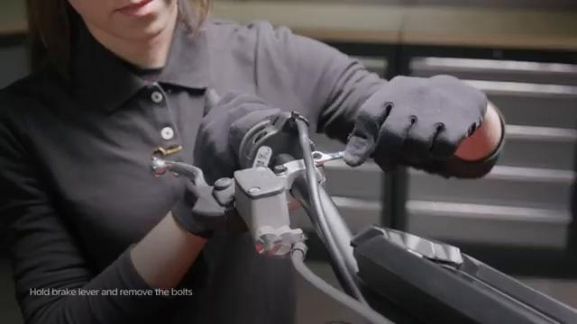
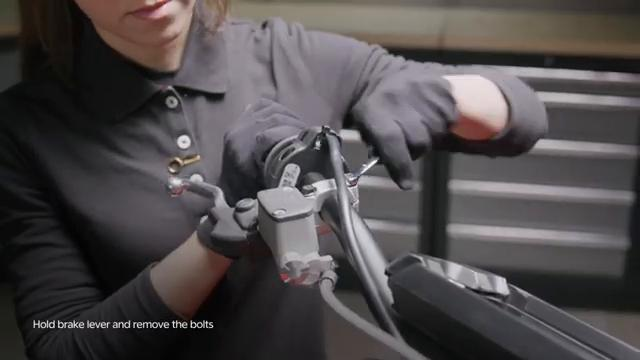
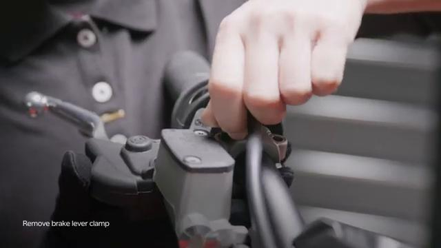
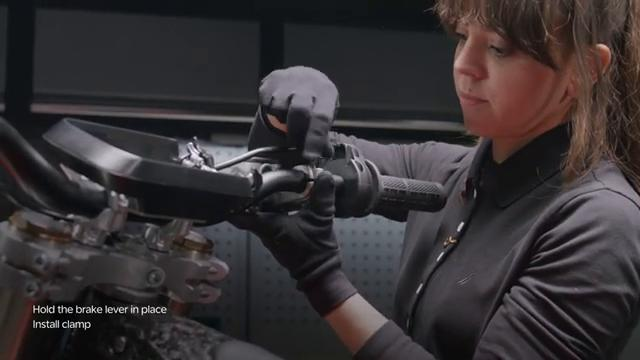
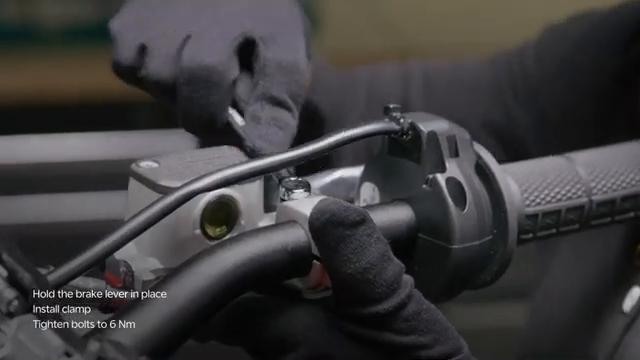
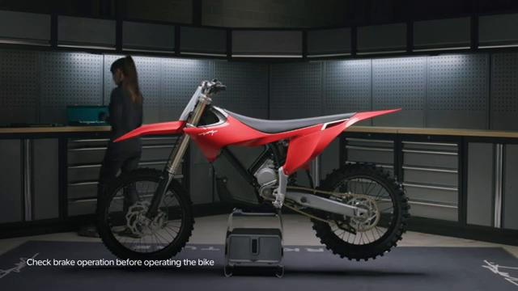

# Remove and Install Hand Brake Master Cylinder - Stark VARG

Source video: `Remove and Install Hand Brake Master Cylinder - Stark VARG` by Stark Future Official

Applicable models: `MX`

## Scope

This guide follows the original Stark Future video overlay sequence for the procedure shown in the original MX tutorial video. Each step below is aligned to the instruction text shown on screen.

## Preparation

- Place the bike on a stable stand or work area before starting the procedure.
- Prepare the correct tools for the fasteners, clips, brackets, and components shown in the video.
- Keep removed hardware organized in sequence so reassembly follows the same order as the video.
- Follow the torque values shown in the original Stark tutorial video wherever the video displays a torque on screen.

## Removal Procedure

### 1. Hold the master cylinder and unscrew bolts

Hold the master cylinder and unscrew bolts.

### 2. Remove master cylinder clamp

Remove master cylinder clamp. Beware of falling objects.

## Installation Procedure

### 3. Hold the master cylinder in place

Hold the master cylinder in place.

### 4. Install clamp

Install clamp.

### 5. Tighten the bolts by hand

Tighten the bolts by hand. Before the final tightening, place the brake lever in the prefered position. Ensure the brake lever can move freely and you are able to fully press it without rubbing or touching other handlebar controls.

### 6. Tighten the bolts to 6 Nm

Tighten the bolts to **6 Nm**. Check brake operation before operating the bike.

## Torque Summary

| Component | Torque |
| --- | ---: |
| Tighten the bolts | 6 Nm |

Verified torque items:

- Tighten the bolts: **6 Nm** from the original Stark Future tutorial video text overlay.

## Critical Checks Before Riding

- Confirm the serviced components are fully seated and all fasteners are tightened in the correct order.
- Recheck all torque-critical hardware before riding.
- Make sure all routed cables, clips, brackets, and surrounding parts are returned to their original positions.
- Inspect the bike visually for any missing hardware before returning it to service.
