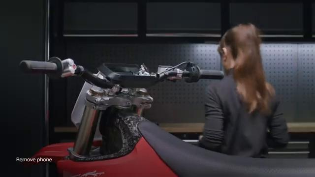
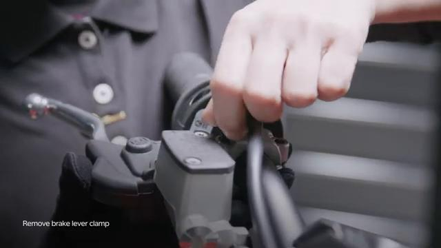
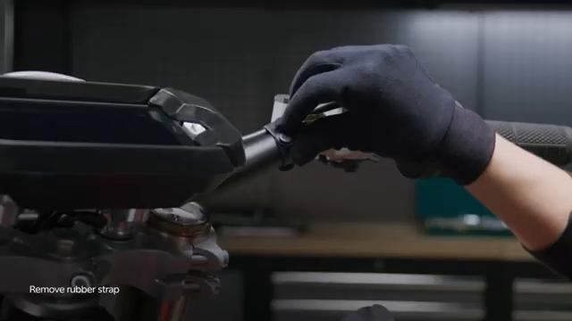
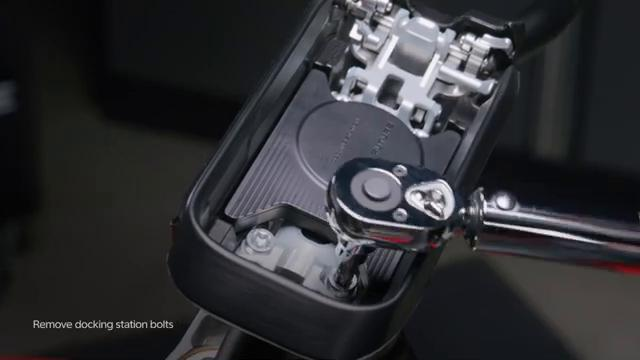
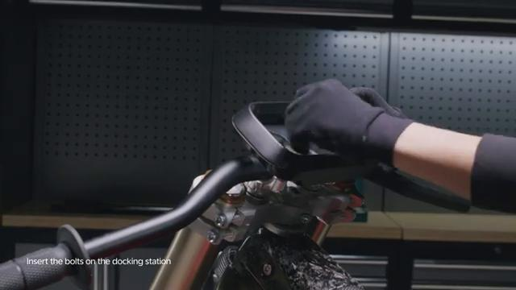
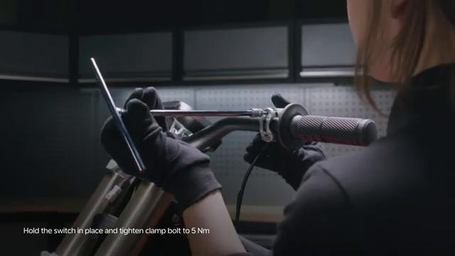
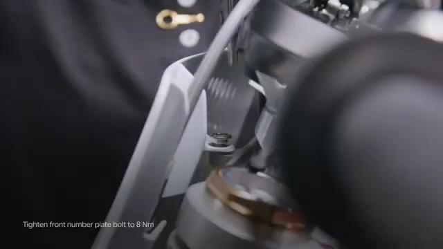
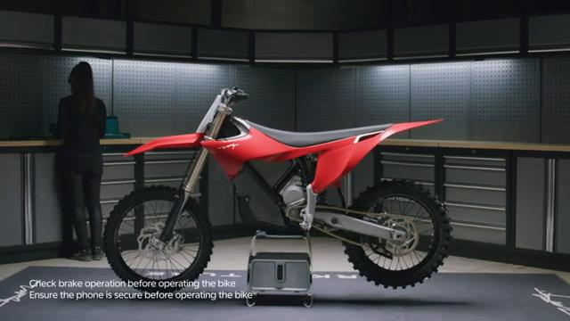

# Remove and Install Handlebar - Stark VARG

Source video: `Remove and Install Handlebar - Stark VARG` by Stark Future Official

Applicable models: `MX`

## Scope

This guide follows the original Stark Future video overlay sequence for the procedure shown in the original MX tutorial video. Each step below is aligned to the instruction text shown on screen.

## Preparation

- Place the bike on a stable stand or work area before starting the procedure.
- Prepare the correct tools for the fasteners, clips, brackets, and components shown in the video.
- Keep removed hardware organized in sequence so reassembly follows the same order as the video.
- Follow the torque values shown in the original Stark tutorial video wherever the video displays a torque on screen.

## Removal Procedure

### 1. Remove the front number plate

Remove the front number plate. Refer to: 01.006.01 Remove and install fron number plate ↗.

### 2. Untighten the front connectors lid bolts

Untighten the front connectors lid bolts.

### 3. Remove the connectors box lid

Remove the connectors box lid.

### 4. Disconnect the throttle, wireless charger module and control switch sockets

Disconnect the throttle, wireless charger module and control switch sockets.

## Installation Procedure

### 5. Connect the throttle, wireless charger module and control switch sockets

Connect the throttle, wireless charger module and control switch sockets.

### 6. Gently press the plugs onto the respective front connectors box slots

Gently press the plugs onto the respective front connectors box slots.

### 7. Clip the lid onto the front connectors box

Clip the lid onto the front connectors box.

### 8. Tighten the front connectors box bolts to 5 Nm

Tighten the front connectors box bolts to 5 Nm.

### 9. Install the front number plate

Install the front number plate. Refer to: 01.006.01 Remove and install fron number plate ↗. Turn ON the bike and connect to the Stark phone to check battery status and that the bike is operating normally after disconnecting electronic components. is permitted only with the express written permission.

## Torque Summary

| Component | Torque |
| --- | ---: |
| Tighten the front connectors box bolts | 5 Nm |

Verified torque items:

- Tighten the front connectors box bolts: **5 Nm** from the original Stark Future tutorial video text overlay.

## Critical Checks Before Riding

- Confirm the serviced components are fully seated and all fasteners are tightened in the correct order.
- Recheck all torque-critical hardware before riding.
- Make sure all routed cables, clips, brackets, and surrounding parts are returned to their original positions.
- Inspect the bike visually for any missing hardware before returning it to service.
