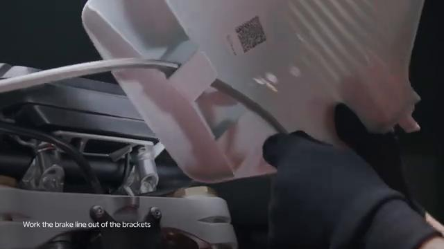
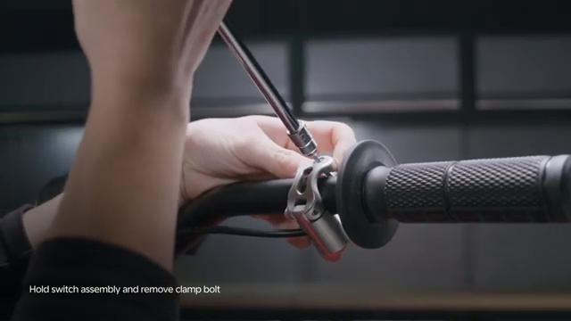
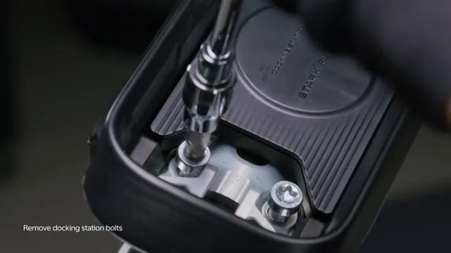
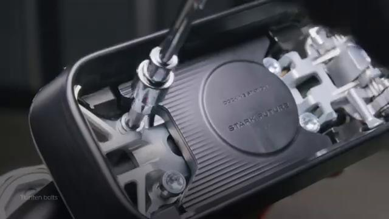
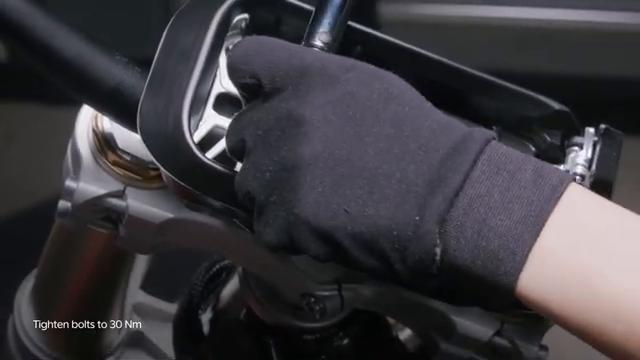
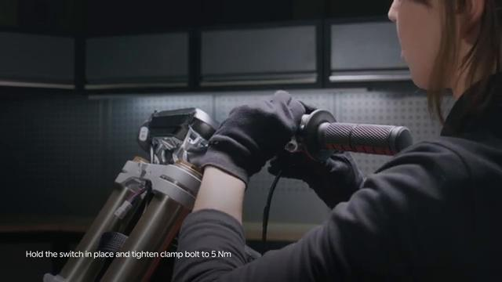
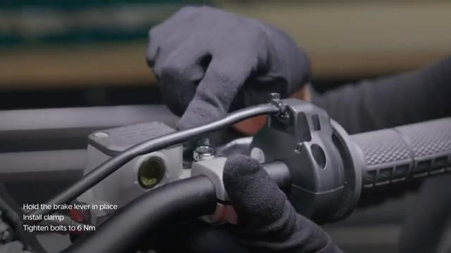
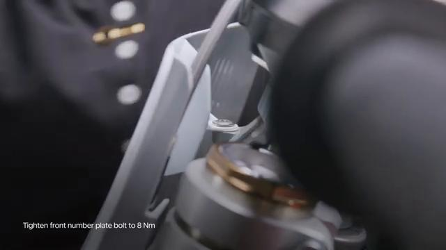

# Remove and Install Handlebar - Stark VARG

Source video: `Remove and Install Handlebar - Stark VARG` by Stark Future Official

Applicable models: `MX`

## Scope

This guide follows the same step-by-step workshop structure as the MX tutorials, but it is derived as a visual sequence from the official Stark Future ASMR video. Because the source video does not provide usable captions or narration, the procedure is documented through curated screenshots and concise action guidance.

## Preparation

- Place the bike on a stable stand or work area before starting the procedure.
- Prepare the correct tools for the fasteners, clips, brackets, and components shown in the video.
- Keep removed hardware organized in sequence so reassembly follows the same order as the video.
- Have a torque wrench ready for any tightening steps that specify a torque value.

## Removal Procedure

### 1. Prepare access to the Handlebar

Remove the surrounding parts needed to expose the Handlebar mounting points shown in the video.

Keep the removed fasteners organized in sequence so reassembly matches the video.

### 2. Remove the visible retaining hardware for the Handlebar

Remove the visible fasteners that secure the Handlebar and keep the hardware in removal order.

Support the component as the last fastener is removed.

### 3. Release any bracket, clip, or coupling attached to the Handlebar

Free any bracket, clip, spacer, linkage, or connector that still ties the Handlebar to the bike.

Note the orientation of these supporting pieces before setting them aside.

### 4. Remove the Handlebar from the bike

Remove the Handlebar from the bike once the remaining supports and fasteners are free.

Inspect the removed part and the mounting points before reassembly.

## Installation Procedure

### 5. Position the Handlebar for installation

Return the Handlebar to its mounting position and align the holes, tabs, or locating surfaces.

Hold the component in place until the first retaining hardware is started.

### 6. Reconnect or refit the support pieces for the Handlebar

Reinstall any bracket, clip, spacer, linkage, or coupling associated with the Handlebar.

Make sure each supporting piece is seated correctly before final tightening.

### 7. Install the retaining hardware for the Handlebar

Install the Handlebar retaining hardware by hand first so the part stays aligned in its mounting points.

Check that the component remains aligned while the hardware is brought fully home.

Tighten the docking station bolts to **30 Nm**.

### 8. Verify the completed installation of the Handlebar

Inspect the final position of the Handlebar and confirm that all hardware, clips, and surrounding parts are back in place.

Check the component for correct fit and movement before returning the bike to service.

## Torque Summary

| Component | Torque |
| --- | ---: |
| Tighten the docking station bolts | 30 Nm |

Verified torque items:

- Tighten the docking station bolts: **30 Nm** from the official Stark VARG owner manual torque table.

## Critical Checks Before Riding

- Confirm the serviced component is fully seated and all fasteners are tightened in the correct order.
- Recheck all torque-critical hardware before riding.
- Make sure all routed cables, clips, brackets, and surrounding parts are returned to their original positions.
- Inspect the bike visually for any missing hardware before returning it to service.
