# Remove and Install left Side Plate - Stark VARG

Source video: `Remove and Install left Side Plate - Stark VARG` by Stark Future Official

Applicable models: `MX`

## Scope

This guide follows the original Stark Future video overlay sequence for the left side plate procedure. Each step below is aligned to the instruction text shown on screen in the original MX tutorial video.

## Preparation

- Place the bike on a stable stand or work area before starting the procedure.
- Prepare the correct tools for the bodywork, shock mount, swingarm clamp, and side plate fasteners shown in the video.
- Keep removed hardware organized in sequence so reassembly follows the same order as the video.
- Follow the torque values shown in the original Stark tutorial video wherever the video displays a torque on screen.

## Removal Procedure

### 1. Remove front bolts

Remove the front bolts.

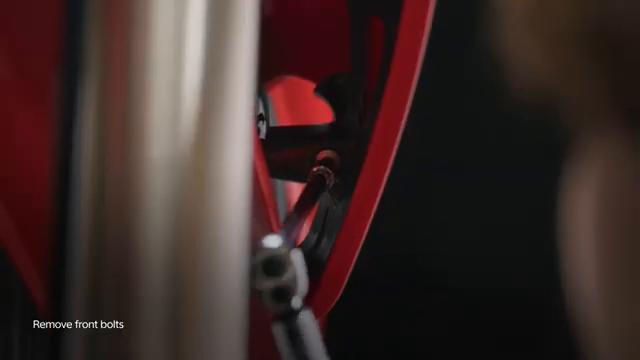

### 2. Remove rear center bolt

Remove the rear center bolt.

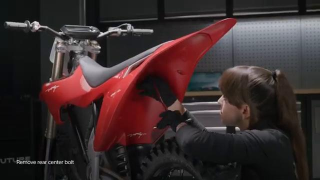

### 3. Remove side bolts

Remove the side bolts.

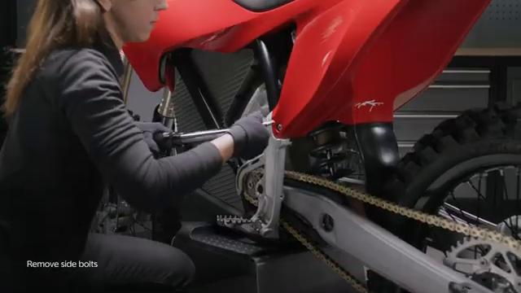

### 4. Remove the complete front spoiler

Remove the complete front spoiler.

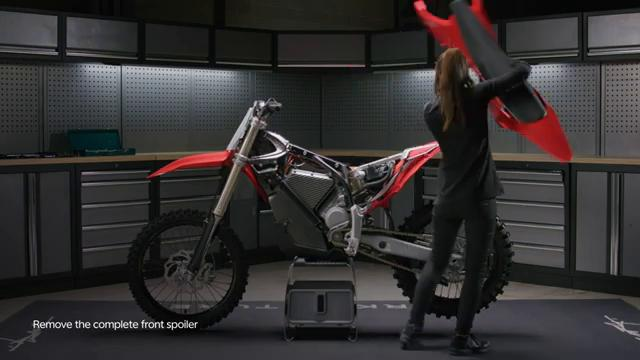

### 5. Remove lower fender bolts

Remove the lower fender bolts.

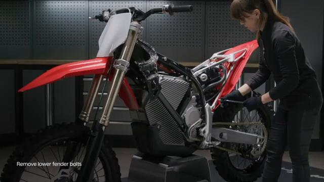

### 6. Remove lower rear fender

Remove the lower rear fender.

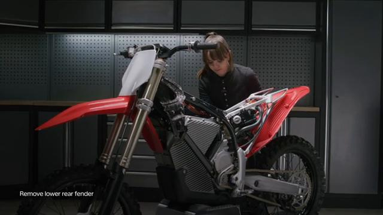

### 7. Loosen shock top lock nut

Loosen the shock top lock nut.

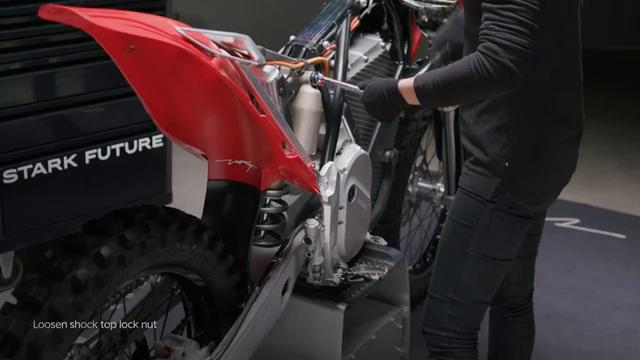

### 8. Remove bottom lock nut

Remove the bottom lock nut.

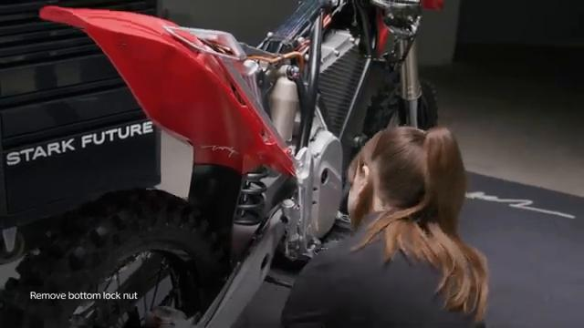

### 9. Remove top lock nut and bolt

Remove the top lock nut and bolt.

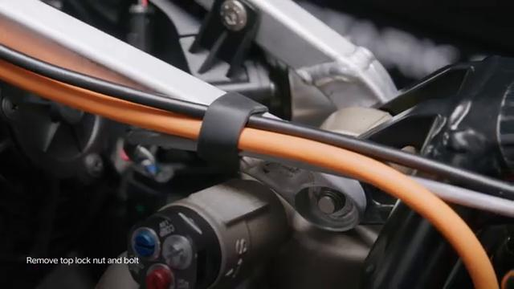

### 10. Remove bottom lock nut and bolt

Remove the bottom lock nut and bolt.

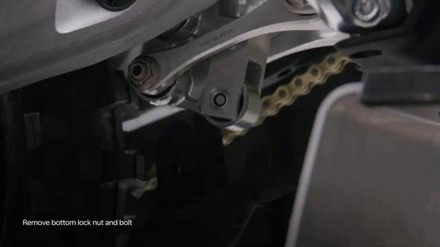

### 11. Push subframe away and hold

Push the subframe away and hold it as shown in the video.

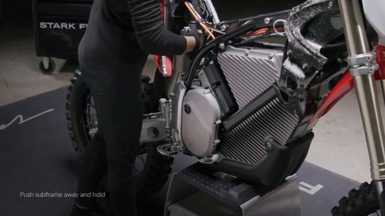

### 12. Ensure the subframe rests in the subframe slots

Ensure the subframe rests in the subframe slots.

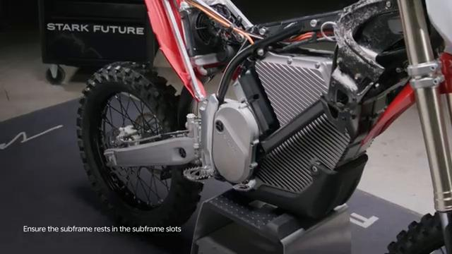

### 13. Loosen swingarm clamp bolt

Loosen the swingarm clamp bolt.

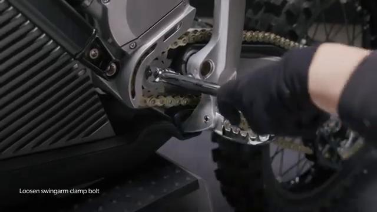

### 14. Remove side plate bolts

Remove the side plate bolts.

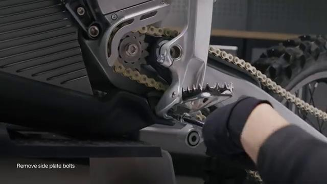

### 15. Remove side plate

Remove the left side plate.

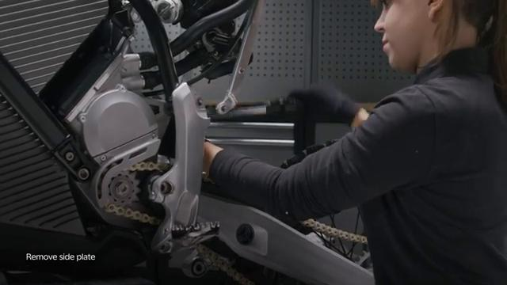

## Installation Procedure

### 16. Install chain guide on the side plate

Install the chain guide on the side plate.

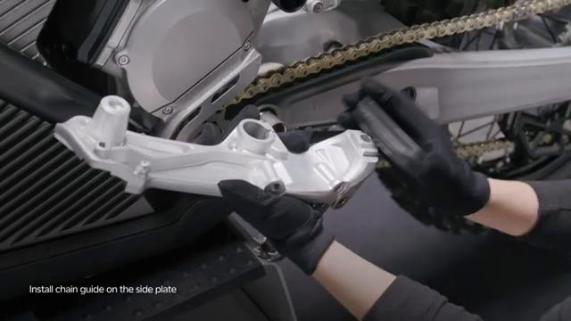

### 17. Tighten top bolt to 45 Nm

Tighten the top bolt to **45 Nm**.

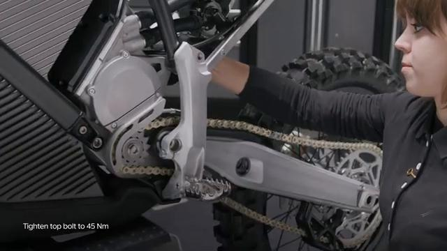

### 18. Tighten bottom bolt to 40 Nm

Tighten the bottom bolt to **40 Nm**.

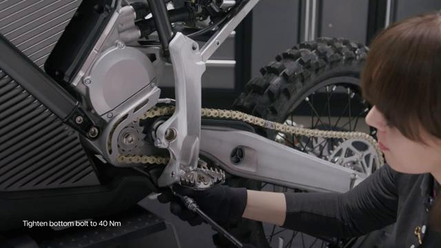

### 19. Tighten swingarm axle clamp to 35 Nm

Tighten the swingarm axle clamp to **35 Nm**.

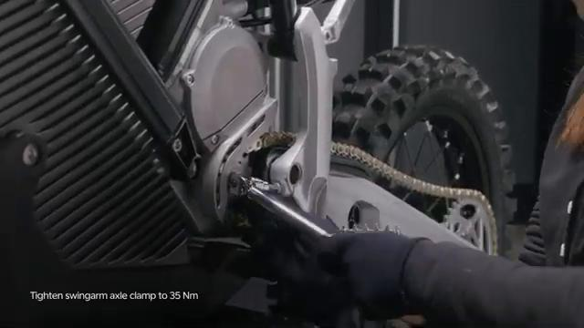

### 20. Push subframe away and hold again

Push the subframe away and hold it again while refitting the mounting hardware.

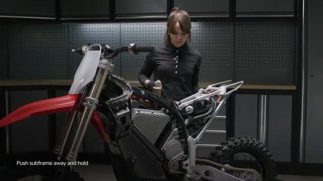

### 21. Insert top bolt

Insert the top bolt.

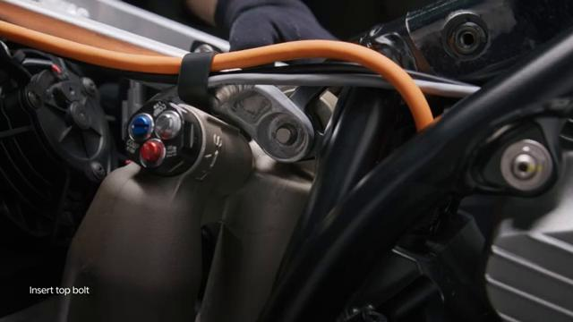

### 22. Tighten lock nut to 40 Nm

Tighten the lock nut to **40 Nm**.

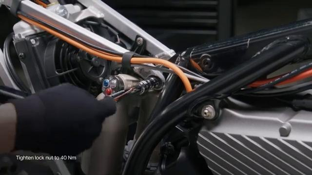

### 23. Insert bottom bolt

Insert the bottom bolt.

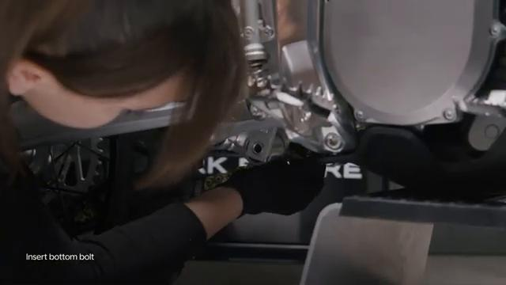

### 24. Tighten lock nut to 40 Nm again

Tighten the lower lock nut to **40 Nm**.

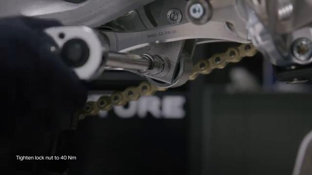

### 25. Tighten lower rear fender bolts

Tighten the lower rear fender bolts.

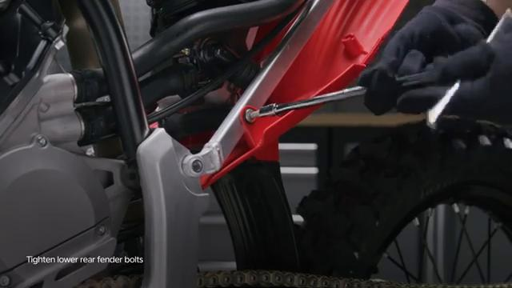

### 26. Tighten rear center bolt to 8 Nm

Tighten the rear center bolt to **8 Nm**.

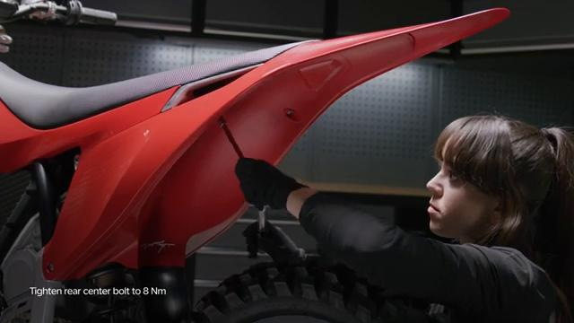

### 27. Tighten side bolts to 40 Nm

Tighten the side bolts to **40 Nm**.

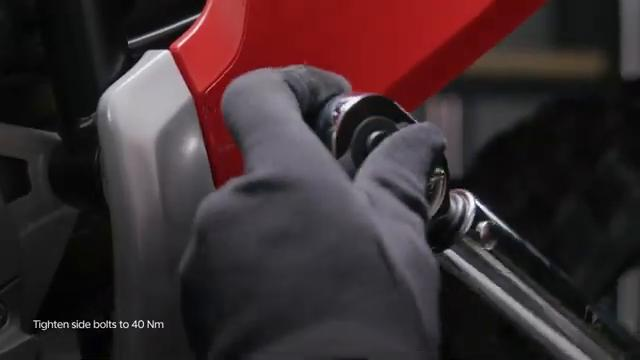

### 28. Tighten front bolts to 5 Nm

Tighten the front bolts to **5 Nm**.

## Torque Summary

| Component | Torque |
| --- | ---: |
| Tighten top bolt | 45 Nm |
| Tighten bottom bolt | 40 Nm |
| Tighten swingarm axle clamp | 35 Nm |
| Tighten lock nuts | 40 Nm |
| Tighten rear center bolt | 8 Nm |
| Tighten side bolts | 40 Nm |
| Tighten front bolts | 5 Nm |

Verified torque items:

- Tighten the top bolt: **45 Nm** from the original Stark Future tutorial video text overlay.
- Tighten the bottom bolt: **40 Nm** from the original Stark Future tutorial video text overlay.
- Tighten the swingarm axle clamp: **35 Nm** from the original Stark Future tutorial video text overlay.
- Tighten the lock nuts: **40 Nm** from the original Stark Future tutorial video text overlay.
- Tighten the rear center bolt: **8 Nm** from the original Stark Future tutorial video text overlay.
- Tighten the side bolts: **40 Nm** from the original Stark Future tutorial video text overlay.
- Tighten the front bolts: **5 Nm** from the original Stark Future tutorial video text overlay.

## Critical Checks Before Riding

- Confirm the side plate, chain guide, lower rear fender, shock mount hardware, and swingarm clamp are fully seated.
- Recheck all torque-critical hardware before riding.
- Make sure the subframe is seated correctly in the subframe slots.
- Inspect the bike visually for any missing hardware before returning it to service.
